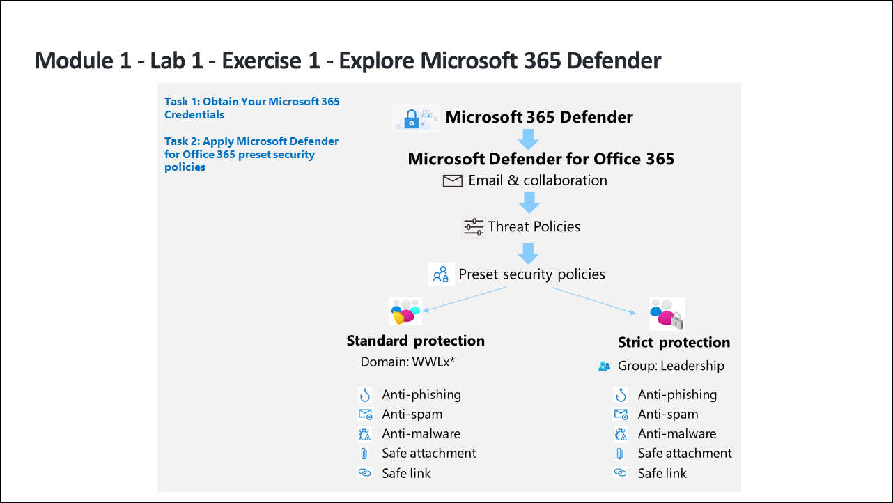

# Lab Scenario Preview: SC-200: Mitigate threats using Microsoft 365 Defender

## Lab 01: Explore Microsoft 365 Defender

### Lab overview

In this lab you will  start by assigning preset security policies in EOP and Microsoft Defender for Office 365.

## Objective
  
After completing this lab, you will be able to:

- Create a Group
- Apply Microsoft Defender for Office 365 preset security policies
- Prepare the Microsoft 365 Defender workspace

## Architecture Diagram

 

Once you understand the lab's content, you can start the Hands-on Lab by clicking the **Launch** button located in the top right corner. This will lead you to the lab environment and guide. You can also preview the full lab guide [here](https://experience.cloudlabs.ai/#/labguidepreview/882707b3-adba-47d1-a5df-7d3d96ef5fca) if you want to go through detailed guide prior to launching lab environment.
