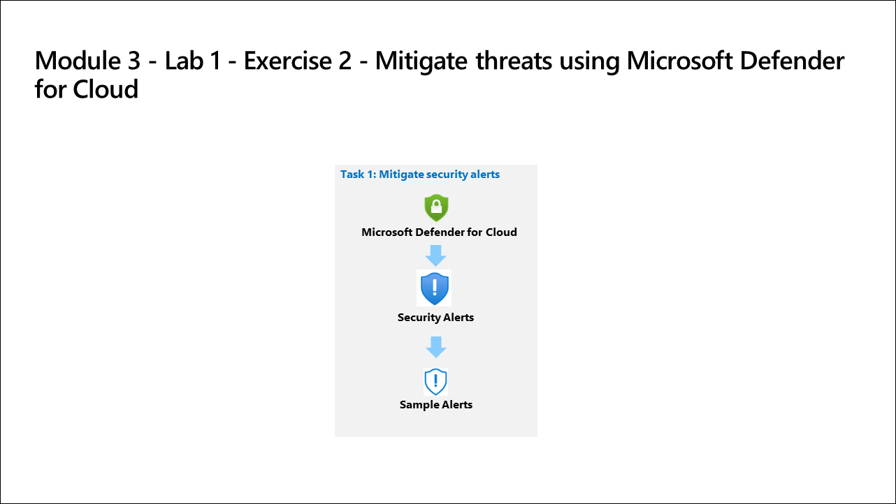

# Lab Scenario Preview: SC-200: Mitigate threats using Microsoft Defender for Cloud

## Lab 03: Mitigate threats using Microsoft Defender for Cloud

### Lab overview

In this lab, you will respond to security alerts generated by Microsoft Defender for Cloud.

## Objective
  
  After completing this lab, you will be able to:

- Explore Regulatory Compliance
- Explore Security posture and recommendations
- Mitigate security alerts
  
## Architecture Diagram

 
