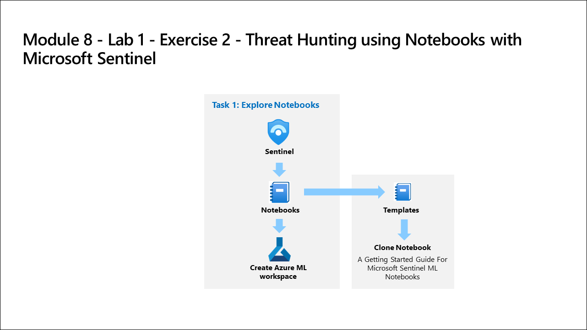

# Lab Scenario Preview: SC-200: Perform threat hunting in Microsoft Sentinel

## Module 10 - Lab 1 - Exercise 2 - Threat Hunting using Notebooks with Microsoft Sentinel

### Lab overview

You are a Security Operations Analyst working at a company that implemented Microsoft Sentinel. You need to explore the benefits of threat hunting with Microsoft Sentinel Notebooks.

## Objective
  
After completing this lab, you will be able to explore Notebooks

## Architecture Diagram

 

Once you understand the lab's content, you can start the Hands-on Lab by clicking the **Launch** button located in the top right corner. This will lead you to the lab environment and guide. You can also preview the full lab guide [here](https://experience.cloudlabs.ai/#/labguidepreview/1da53001-e467-49ba-9bf9-1b1a0fe8ec05) if you want to go through detailed guide prior to launching lab environment.

