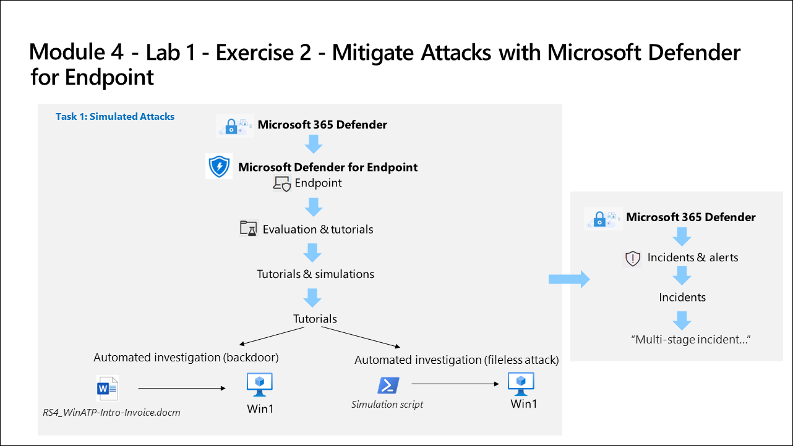

# Lab Scenario Preview: SC-200: Mitigate threats using Microsoft Defender for Endpoint

## Module 4 - Lab 1 - Exercise 2 - Mitigate Attacks with Microsoft Defender for Endpoint

### Lab overview

In this lab, you will explore the Defender for Endpoint attack mitigation capabilities and run two simulated attacks.

## Objective
  
After completing this lab, you will be able to:

- Simulated Attacks
- Investigate the Attacks

## Architecture Diagram

 

Once you understand the lab's content, you can start the Hands-on Lab by clicking the **Launch** button located in the top right corner. This will lead you to the lab environment and guide. You can also preview the full lab guide [here](https://experience.cloudlabs.ai/#/labguidepreview/c82136f1-15cb-40a7-b835-361279af9837) if you want to go through detailed guide prior to launching lab environment.

