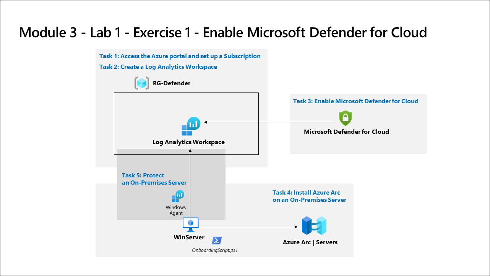

# Lab Scenario Preview: SC-200: Mitigate threats using Microsoft Defender for Cloud

## Module 5 - Lab 1 - Exercise 1 - Enable Microsoft Defender for Cloud

### Lab overview

In this lab, you will enable Microsoft Defender for Cloud.

## Objective
  
  After completing this lab, you will be able to:

- Create a Log Analytics Workspace
- Enable Microsoft Defender for Cloud
- Install Azure Arc on an On-Premises Server.
- Protect an On-Premises Server

## Architecture Diagram

   

Once you understand the lab's content, you can start the Hands-on Lab by clicking the **Launch** button located in the top right corner. This will lead you to the lab environment and guide. You can also preview the full lab guide [here](https://experience.cloudlabs.ai/#/labguidepreview/cf95083f-8b3d-4aea-ad25-69b9984199a5) if you want to go through detailed guide prior to launching lab environment.
