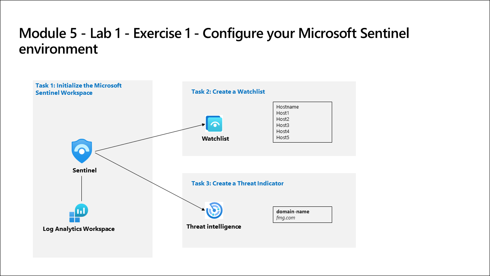

# Lab Scenario Preview: SC-200: Configure your Microsoft Sentinel environment

## Lab 05: Configure your Microsoft Sentinel environment

### Lab overview

In this lab, you will set up the Microsoft Sentinel environment to meet the company requirement to minimize cost, meet compliance regulations, and provide the most manageable environment for your security team to perform their daily job responsibilities.

## Objective
  
  After completing this lab, you will be able to:

- Create a Log Analytics Workspace
- Initialize the Microsoft Sentinel Workspace
- Create a Watchlist
- Create a Threat Indicator
  
## Architecture Diagram

   

Once you understand the lab's content, you can start the Hands-on Lab by clicking the **Launch** button located in the top right corner. This will lead you to the lab environment and guide. You can also preview the full lab guide [here](https://experience.cloudlabs.ai/#/labguidepreview/94dc4e65-1d16-43de-bcfe-fcb89ec87a7e) if you want to go through detailed guide prior to launching lab environment.
