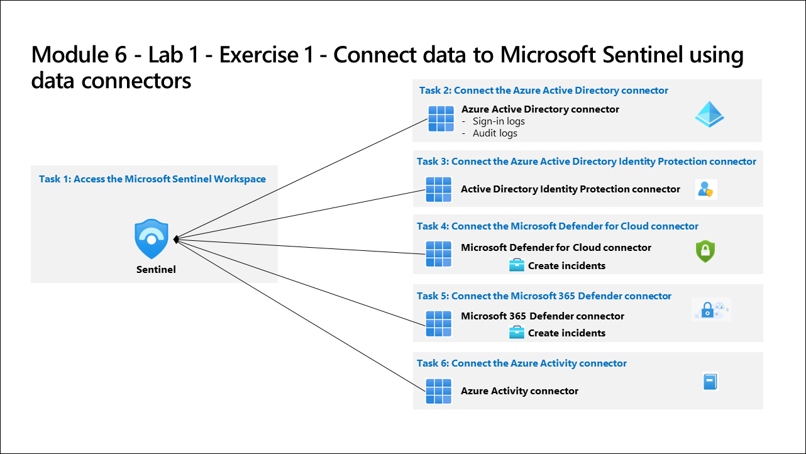

# Lab Scenario Preview: SC-200: Connect logs to Microsoft Sentinel

## Module 8 - Lab 1 - Exercise 1 - Connect data to Microsoft Sentinel using data connectors

### Lab overview

In this lab, you will be using the Microsoft Sentinel data connectors to integrate the log data from various sources. You need to write a connector plan for management that maps each of the organization's data sources to the proper Microsoft Sentinel data connector.

## Objective
  
After completing this lab, you will be able to integrate log data from various data sources within the organization into Microsoft Sentinel using appropriate data connectors.
  
## Architecture Diagram

 

Once you understand the lab's content, you can start the Hands-on Lab by clicking the **Launch** button located in the top right corner. This will lead you to the lab environment and guide. You can also preview the full lab guide [here](https://experience.cloudlabs.ai/#/labguidepreview/67795e6f-3d1c-437c-bbc7-561aafb6434e) if you want to go through detailed guide prior to launching lab environment.
