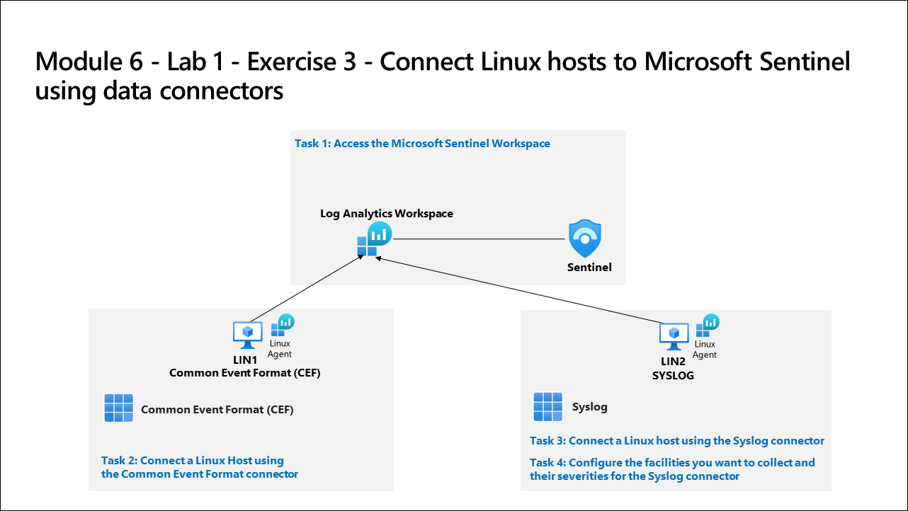

# Lab Scenario Preview: SC-200: Connect logs to Microsoft Sentinel

## Module 8 - Lab 1 - Exercise 3 - Connect Linux hosts to Microsoft Sentinel using data connectors

### Lab overview

In this lab, you will learn how to connect data from Linux virtual machines using the Common Event Formatting (CEF) via Legacy Agent and Syslog connectors.

## Objective
  
After completing this lab, you will be able to:

- Connect a Linux Host using the Common Event Format connector
- Connect a Linux host using the Syslog connector
- Configure the facilities you want to collect and their severities for the Syslog connector

## Architecture Diagram

  

Once you understand the lab's content, you can start the Hands-on Lab by clicking the **Launch** button located in the top right corner. This will lead you to the lab environment and guide. You can also preview the full lab guide [here](https://experience.cloudlabs.ai/#/labguidepreview/67795e6f-3d1c-437c-bbc7-561aafb6434e) if you want to go through detailed guide prior to launching lab environment.
