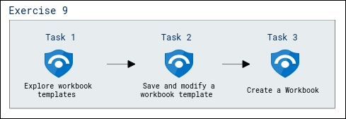

# Lab Scenario Preview: SC-200: Create detections and perform investigations using Microsoft Sentinel

## Module 9 - Lab 1 - Exercise 10 - Create workbooks

### Lab overview

In this lab, you will create custom workbooks across your data.

## Objective
  
After completing this lab, you will be able to:

- Explore workbook templates
- Save and modify a workbook template
- Create a Workbook
  
## Architecture Diagram

  

Once you understand the lab's content, you can start the Hands-on Lab by clicking the **Launch** button located in the top right corner. This will lead you to the lab environment and guide. You can also preview the full lab guide [here](https://experience.cloudlabs.ai/#/labguidepreview/49924c87-5f52-439d-9718-efde380d255b) if you want to go through detailed guide prior to launching lab environment.

