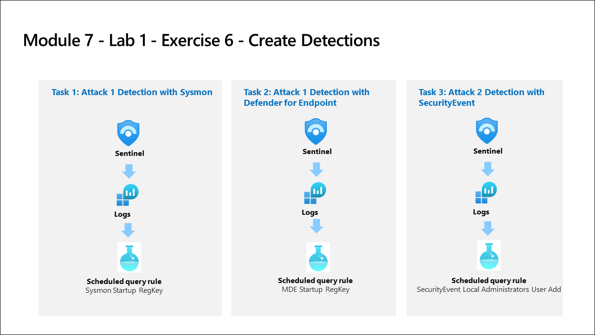

# Lab Scenario Preview: SC-200: Create detections and perform investigations using Microsoft Sentinel

## Module 9 - Lab 1 - Exercise 7 - Create Detections

### Lab overview

In this lab, you will create  detections for the attacks with Microsoft Defender for Endpoint configured and with the Security Events connector and Sysmon installed

## Objective
  
After completing this lab, you will:

- Attack 1 Detection with Defender for Endpoint
- Attack 2 Detection with SecurityEvent
    
## Architecture Diagram

  

Once you understand the lab's content, you can start the Hands-on Lab by clicking the **Launch** button located in the top right corner. This will lead you to the lab environment and guide. You can also preview the full lab guide [here](https://experience.cloudlabs.ai/#/labguidepreview/4b9b75e4-2805-4c4f-9b90-408c75761b79) if you want to go through detailed guide prior to launching lab environment.

