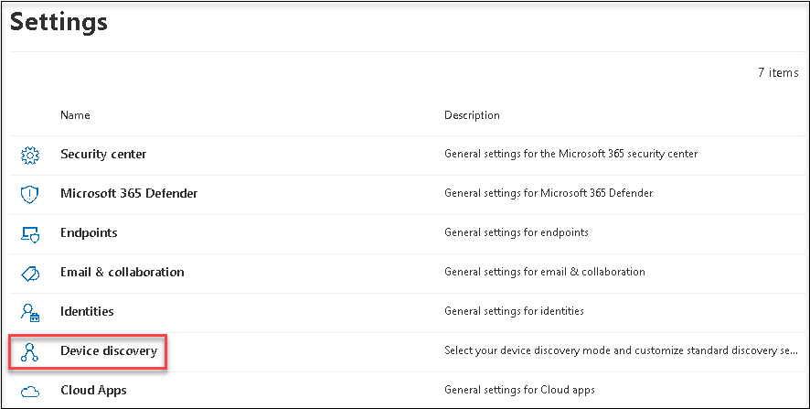
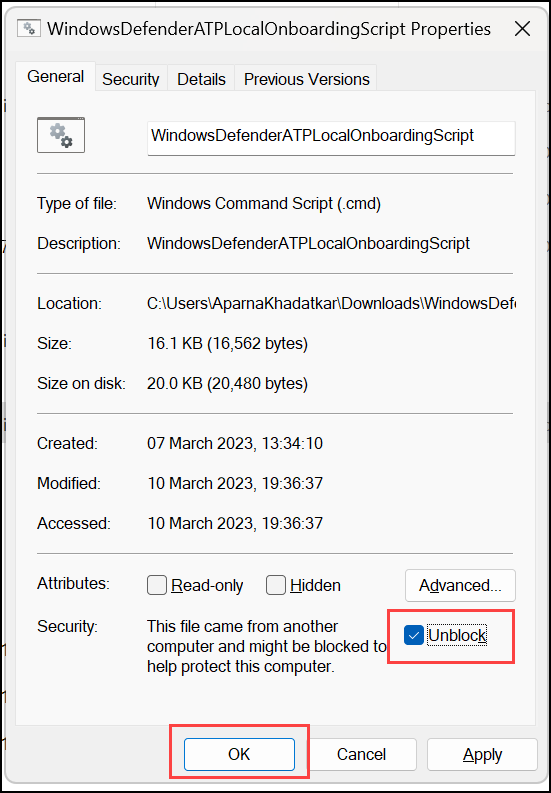
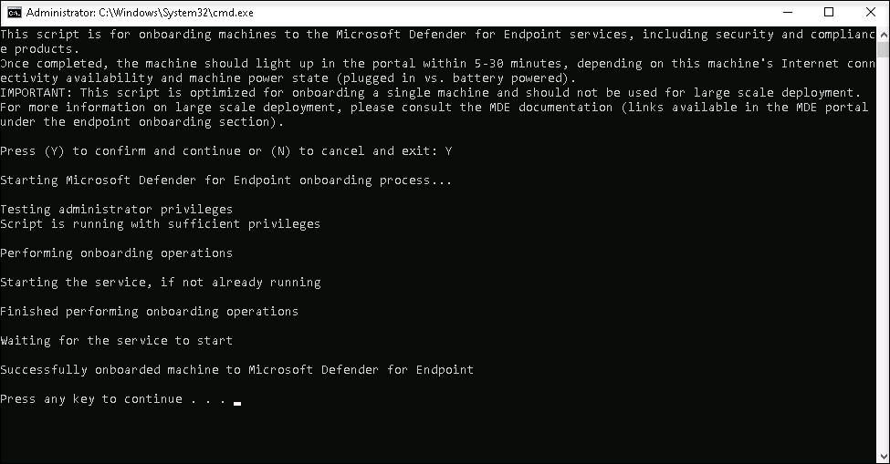
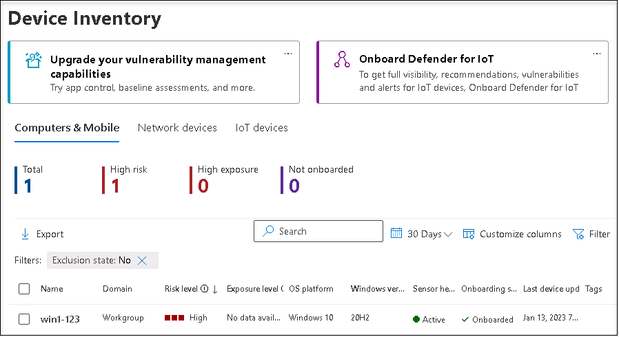

# Module 2 - Lab 1 - Exercise 1 - Deploy Microsoft Defender for Endpoint

## Lab scenario

You are a Security Operations Analyst working at a company that is implementing Microsoft Defender for Endpoint. Your manager plans to onboard a few devices to provide insight into required changes to the Security Operations (SecOps) team response procedures.

You start by initializing the Defender for the Endpoint environment. Next, you onboard the initial devices for your deployment by running the onboarding script on the devices. You configure security for the environment. Lastly, you create Device groups and assign the appropriate devices.

>**Important:**  The lab Virtual Machines are used through different modules. SAVE your virtual machines. If you exit the lab without saving, you will be required to re-run some configurations again.

## Estimated timing: 60 minutes

### Task 1: Preparing the Microsoft 365 Defender workspace

1. On the **Microsoft 365 Defender** portal(https://security.microsoft.com/), from the navigation menu, select **Settings** from the left.

1. On the **Settings** page select **Microsoft 365 Defender**. You are going to see an image of a coffee mug and a message that reads: *Hang on! We're preparing new spaces for your data and connecting them.*. It will take several minutes to finish, so leave the page open but make sure it finishes since it is required for the next Lab. 

    >**Note:** If you get the error message "We didn't plan it will fail, but something went wrong." retry the step later or do it before the next Lab.

1. When the new space completes successfully, you are going to see the Microsoft 365 Defender settings for Account, Email notifications, Preview features and Streaming API.

### Task 2: Initialize Microsoft Defender for Endpoint

In this task, you will perform the initialization of the Microsoft Defender for the Endpoint portal.

1. If you are not already at the Microsoft 365 Defender portal, start the Microsoft Edge browser.

1. In the Edge browser, go to the Microsoft 365 Defender portal at (https://security.microsoft.com).

1. In the **Sign in** dialog box, copy and paste * Email/Username: <inject key="AzureAdUserEmail"></inject> and then select Next.

1. In the **Enter password** dialog box, copy and paste * Password: <inject key="AzureAdUserPassword"></inject> and then select **Sign in**.

1. On the **Microsoft 365 Defender** portal, from the navigation menu, select **Settings** from the left.

1. On the **Settings** page select **Device discovery**. 

    

    >**Note:** If you do not see the **Device discovery** option under **Settings**, log out by selecting the top-right circle with your account initials and select **Sign out**. Other options that you might want to try are to refresh the page with Ctrl+F5 or wait for 10-15 minutes or open the page InPrivate. Login again with the **Tenant Email** credentials.

1. In the Discovery setup make sure **Standard discovery (recommended)** is selected. 
    >**Hint:** If you do not see the option, refresh the page.

### Task 3: Onboard a Device

In this task, you will onboard a device to Microsoft Defender for Endpoint using an onboarding script.

1. If you are not already at the Microsoft 365 Defender portal in your browser, start the Microsoft Edge browser and go to (https://security.microsoft.com) and log in with the **Tenant Email** credentials.

1. Select **Settings** from the left menu bar, then from the Settings page select **Endpoints**.

1. Select **Onboarding** in the Device management section.

    >**Note:** You can also perform device onboarding from the **Assets** section of the left menu bar. Expand Assets and select Devices. On the Device Inventory page, with Computers & Mobile selected, scroll down to **Onboard devices.** This takes you to the **Settings > Endpoints** page.

1. In the "1. Onboard a device" area make sure "Local Script (for up to 10 devices)" is displayed in the Deployment method drop-down and select the **Download onboarding package** button. 

1. Under the *Downloads* pop-up, highlight the "WindowsDefenderATPOnboardingPackage.zip" file with your mouse and select the folder icon **Show in folder**. **Hint:** In case you don't see it, the file should be in the c:\users\admin\downloads directory.

1. Right-click the downloaded zip file and select **Extract All...**, make sure that **Show extracted files when complete** is checked and select **Extract**.

1. Right-click on the extracted file "WindowsDefenderATPLocalOnboardingScript.cmd" and select **Properties**. Select the **Unblock** checkbox in the bottom right of the Properties windows and select **OK**.

    

1. Right-click on the extracted file **WindowsDefenderATPLocalOnboardingScript.cmd** again and choose **Run as Administrator**.  **Hint:** If you encounter the Windows SmartScreen window, select on **More info**, and choose **Run anyway**. 
    
1. When the "User Account Control" window is shown, select **Yes** to allow the script to run and answer **Y** to the question presented by the script and press **Enter**. When complete you should see a message in the command screen that says *Successfully onboarded machine to Microsoft Defender for Endpoint*.

1. Press any key to continue. This will close the Command Prompt window.

    

1. Back in the Onboarding page from the Microsoft 365 Defender portal, under the section "2. Run a detection test", copy the detection test script by selecting the **Copy** button.  

1. In the windows search bar of the virtual machine, type **CMD** and choose **Run as Administrator** on the right pane for the Command Prompt app. 

1. When the "User Account Control" window is shown, select **Yes** to allow the app to run. 

1. Paste the script by right-clicking in the **Administrator: Command Prompt** windows and press **Enter** to run it. **Note:** The window closes automatically after running the script.

1. In the Microsoft 365 Defender portal, in the left-hand menu, under the **Assets** area, select **Devices**. If the device is not shown, complete the next task and come back to check it back later. It can take up to 60 minutes for the first device to be displayed in the portal.

     

    >**Note:** If you have completed the onboarding process and don't see devices in the Devices list after an hour, it might indicate an onboarding or connectivity problem.
    
    > **Congratulations** on completing the task! Now, it's time to validate it. Here are the steps:

- Navigate to the Lab Validation Page, from the upper right corner in the lab guide section.
- Hit the Validate button for the corresponding task. If you receive a success message, you can proceed to the next task. 
- If not, carefully read the error message and retry the step, following the instructions in the lab guide.
- If you need any assistance, please contact us at labs-support@spektrasystems.com. We are available 24/7 to help you out.

### Task 4: Configure Roles

In this task, you will configure roles for use with device groups.

1. Sign in to the [Azure portal](https://portal.azure.com).

1. In the **Sign in** dialog box, copy and paste in the **Username** provided in the environment details page (odl_user_DID@xxxxx.onmicrosoft.com) and then select Next.

1. In the **Enter password** dialog box, copy and paste in the Password and then select **Sign in**.

1. On the **Stay signed in?** dialog box, select the Don’t show this again check box and then select **No**.

1. In the Search bar of the Azure portal, type **Azure Active Directory**, then select Azure Active Directory.

1. Select **Groups** and then click on **New group**.

1. Enter the below details for New group page :

   |Setting|Value|
    |---|---|
    |Group Type| **Microsoft 365** |
    |Group Name| **Sg-IT** |
    |Azure AD roles can be assigned to the group| **Yes** |

1. Click on **No owners selected** and select the **ODL_user** from the list and then click on **select**.

1. Click on **No members selected** and select the **ODL_user** from the list and then click on **select**.

   **Note**: Make sure you have selected **Group type** as Microsoft 365.

1. Select **Create** and click on **Yes**. 

1. In the Microsoft 365 Defender portal select **Settings** from the left menu bar, then select **Endpoints**. 

1. Select **Roles** under the permissions area.

1. Select the **Turn on roles** button.

1. Select **+ Add Role**. by clicking three dots

1. In the Add role dialog enter the following:

    |General setting|Value|
    |---|---|
    |Role name|**Tier 1 Support**|
    |Permissions|Live Response capabilities - Advanced|

1. Select the **Assigned user groups** tab on the top. Select **sg-IT** and then select **Add selected groups**. Make sure it appears under *Azure AD user groups with this role*.

1. Select **Submit**. If you receive an error while saving the role, refresh the page and try again.

### Task 5: Configure Device Groups

In this task, you will configure device groups that allow for access control and automation configuration.

1. In the Microsoft 365 Defender portal select **Settings** from the left menu bar, then select **Endpoints**. 

1. Select **Device groups** under the permissions area.

1. Select **+ Add device group** icon.

1. Enter the following information on the General tab:

    |General setting|Value|
    |---|---|
    |Device group name|**Regular**|
    |Remediation level| Full-remediate threats automatically|

1. Select **Next**.

1. On the Devices tab, for the OS condition select **Windows 10** and select **Next**.

1. On the Preview devices tab, select **Next**.

1. For the User access tab, select **sg-IT** and then select **Add selected groups** button. Make sure it appears under **Azure AD user groups with access to this device group**.

1. Select **submit***

1. Select **Done**.

1. Device group configuration has changed. Select **Apply changes** to check matches and recalculate groupings.

1. You are going to have two device groups now; the **Regular** you just created and the **Ungrouped devices (default)** with the same remediation level.

## Proceed to Exercise 2
