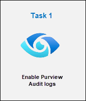
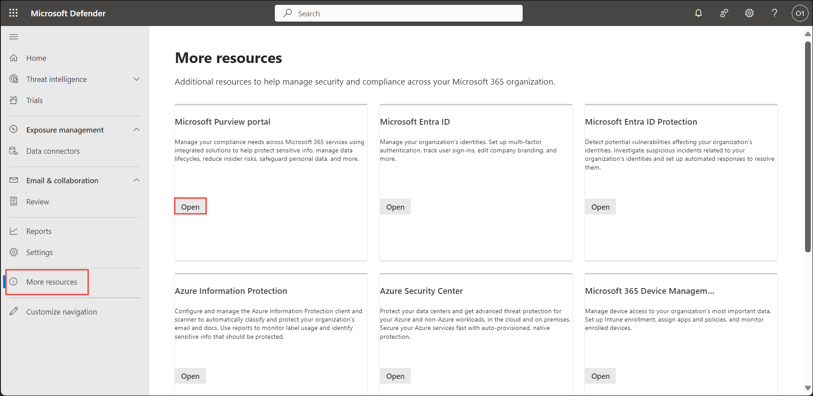
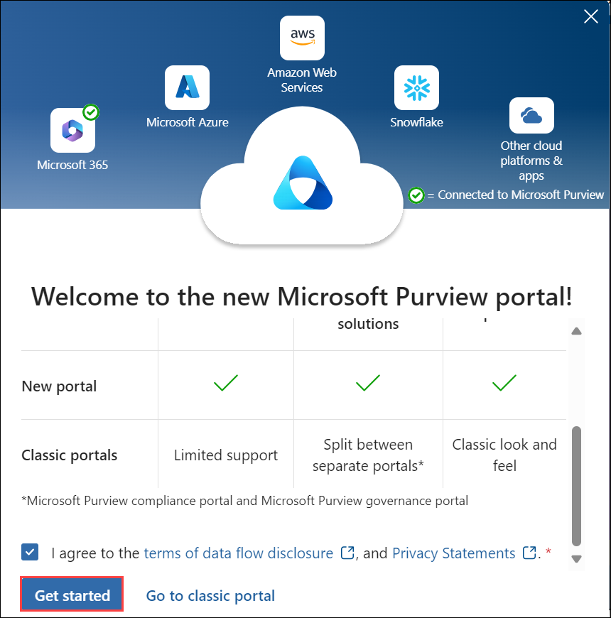
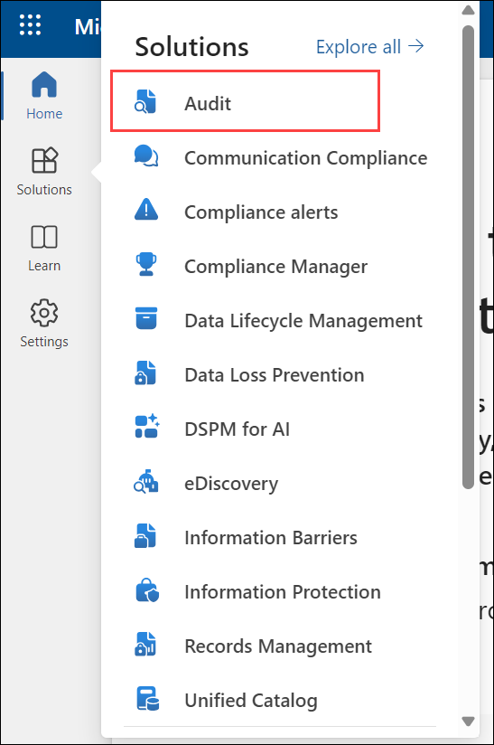

# Module 3 - Lab 1 - Exercise 1 - Explore Microsoft Purview Audit logs

## Lab scenario

You're a Security Operations Analyst working at a company that is implementing Microsoft Defender XDR and Microsoft Purview. You're assisting colleagues on the the IT compliance team with configuring both Purview Audit (Standard) and Audit (Premium). Their objective is to ensure that all access and modifications to patient data in our network of healthcare facilitie sare accurately logged to meet health data protection regulations.

## Lab objectives
In this lab, you will perform:

- Task 1: Enable Purview Audit logs

## Architecture Diagram

  

### Estimated timing: 15 minutes

### Task 1: Enable Purview Audit logs

In this task, you'll assign preset security policies for Exchange Online Protection (EOP) and Microsoft Defender for Office 365 in the Microsoft 365 security portal.

1. In the Microsoft Edge browser, go to the Microsoft Defender XDR portal at (<https://security.microsoft.com>).

1. In the **Sign in** dialog box, copy, and paste in the tenant Email account for the admin username provided by your lab hosting provider and then select **Next**.

1. In the **Enter password** dialog box, copy, and paste in the admin's tenant password provided by your lab hosting provider and then select **Sign in**.

1. From the navigation menu, expand *Operational technology* and select **More resources**.

1. In the **More resources** pane, select the **Open** button om the *Microsoft Purview portal* tile.

   

1. When the Microsoft Purview portal opens, a message about the *new Microsoft Purview portal* will appear on the screen. Select the option to agree with the terms of data flow disclosure and the privacy statement, then select **Get started**.

    

1. Select **Solutions** from the left sidebar, then select **Audit**.

   

1. On the **Search** page, select the blue **Start recording user and admin activity** bar to enable audit logging.

    

1. Once you select this option, the blue bar should disappear from this page.

    >**Note:**
    > It might take 60 minutes to start recording activities.

### Review
 In this lab, you have completed the following:
   - Enabled Purview Audit logs

## You have successfully completed the lab.
