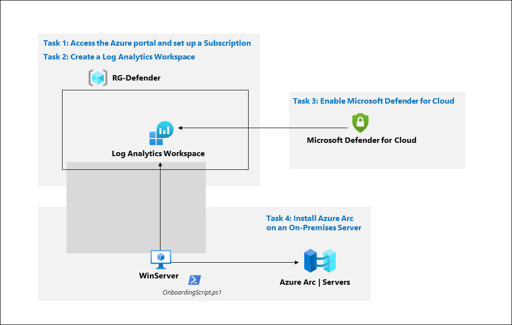
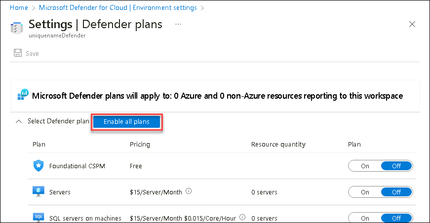
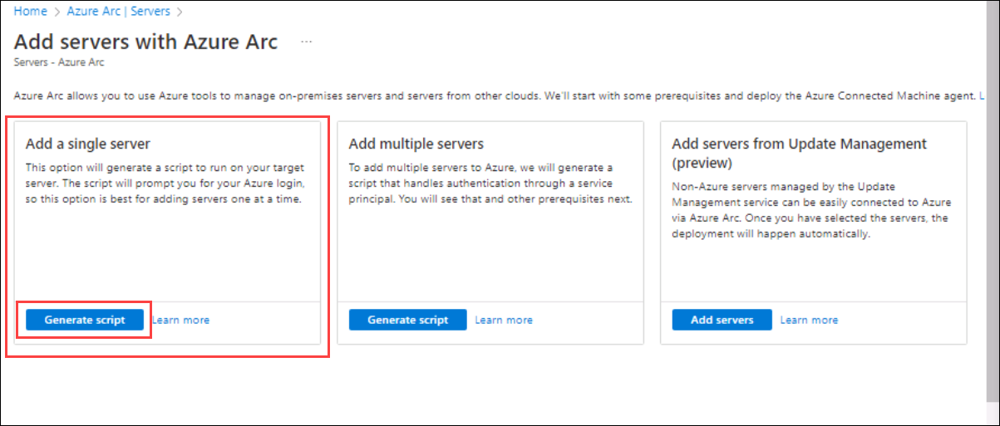
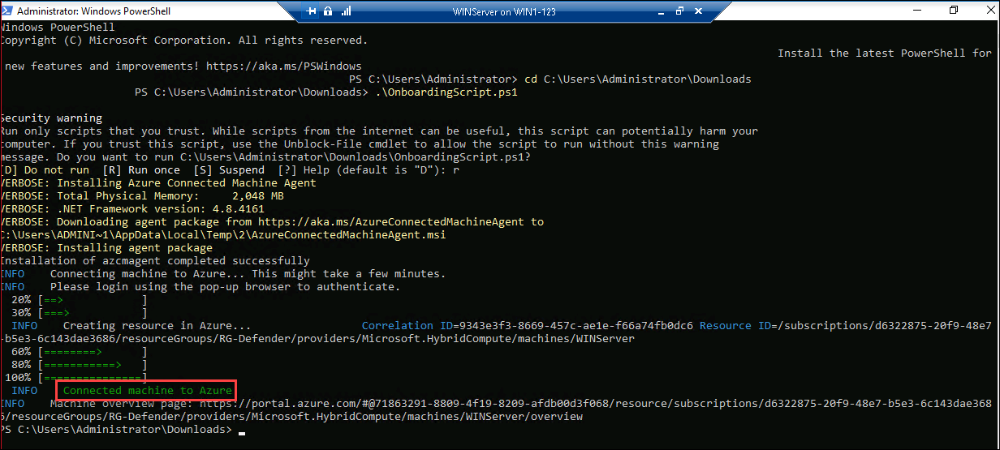

# Module 3 - Lab 1 - Exercise 1 - Enable Microsoft Defender for Cloud

## Lab scenario

You're a Security Operations Analyst working at a company that is implementing cloud workload protection with Microsoft Defender for Cloud.  In this lab, you will enable Microsoft Defender for Cloud.

## Lab objectives
In this lab, you will perform the following:
- Task 1: Access the Azure portal and set up a Subscription
- Task 2: Create a Log Analytics Workspace
- Task 3: Enable Microsoft Defender for Cloud
- Task 4: Install Azure Arc on an On-Premises Server
- Task 5: Protect an On-Premises Server

## Estimated timing: 40 minutes

## Architecture Diagram

  
  
### Task 1: Access the Azure portal and set up a Subscription

In this task, you will set up an Azure Subscription required to complete this lab and future labs.

1. On the lab Virtual machine, Open the Microsoft Edge browser or open a new tab if already open.

1. In the Edge browser, navigate to the Azure portal at (https://portal.azure.com).

1. In the **Sign in** dialog box, copy and paste Email/Username: <inject key="AzureAdUserEmail"></inject> and then select Next.

1. In the **Enter password** dialog box, copy and paste Password: <inject key="AzureAdUserPassword"></inject> and then select **Sign in**.

1. In the Search bar of the Azure portal, type *Subscription*, then select **Subscriptions**. 

1. Make sure the **"MOC HOL xxxx"** subscription is shown.

### Task 2: Create a Log Analytics Workspace

In this task, you will create a Log Analytics workspace for use with Microsoft Defender for Cloud.

1. In the Search bar of the Azure portal, type **Log Analytics**, then select **Log Analytics workspaces**.

1. Select **+Create** from the command bar.

1. Select Resource Group **RG-Defender** from the drop down.

1. For the Name, enter something unique like **uniquenameDefender**.

1. Select the default Region 

1. Select **Review + Create**.

1. Once the workspace validation has passed, select **Create**. Wait for the new workspace to be provisioned, this may take a few minutes.

### Task 3: Enable Microsoft Defender for Cloud

In this task, you will enable and configure Microsoft Defender for Cloud.

1. In the Search bar of the Azure portal, type *Defender*, then select **Microsoft Defender for Cloud**.

1. click the left menu and click on **Getting started**

1. On the **Getting Started** page, under the **Upgrade** tab, make sure your subscription is selected and then select the **Upgrade** button at the bottom of the page. Wait for the *Trial started* notification to appear, it takes about 2 minutes. **Hint:** You can click the bell button on the top bar to review your Azure portal notifications.

    

1. In the left menu for Microsoft Defender for Cloud, under Management, select **Environment settings**.

1. Select the **"Azure HOL XXXX"** subscription (or equivalent name in your Language). 

1. Review the Azure resources that are now protected with the Defender for Cloud plans.

1. Select the **Settings & monitoring** tab from the Settings area (next to Save).

1. Review the monitoring extensions. Confirm that **Log Analytics agent/Azure Monitor agent** is **Off**. Close the Settings & monitoring page by selecting the 'X' on the upper right of the page.

1. Close the settings page by selecting the 'X' on the upper right of the page to go back to the **Environment settings** and select the '>' to the left of your subscription.

1. Select the Log Analytics workspace you created earlier *uniquenameDefender* to review the available options and pricing.

1. Select **Enable all plans** (to the right of Select Defender plan) and then select **Save**. Wait for the *"Microsoft Defender plan for workspace uniquenameDefender was saved successfully!"* notification to appear.

    

    >**Note:** If the page is not being displayed, refresh your Edge browser and try again.

1. Close the Defender plans page by selecting the 'X' on the upper right of the page to go back to the **Environment settings**

### Task 4: Install Azure Arc on an On-Premises Server

In this task, you will install Azure Arc on an on-premises server to make onboarding easier.

>**Important:** The next steps are done on a different machine than the one you were previously working on. Look for the Virtual Machine name references.

1. Click on the Start button, search for **Hyper-V** from the bottom windows search bar, and select to open.

1. Click on WIN1    

1. Select and right-click on the **WINServer** virtual machine from the virtual machine section in the middle and select start, then again right-click on the **WINServer** virtual machine and select **connect**.

   >**Note:** To enable the clipboard Right-click on WIN1-xxxx and select Hyper-V Settings click on **enhanced session mode** and check the **use enhanced mode** click on apply Then restart your virtual machine, once vm starts you will get a configuration pop-up click on show more options and select local resources and make sure the clipboard is selected

1. It asks you to press ctrl+alt+dlt, Go-to **actions** in the top of VM toolbar and click on **ctrl+alt+dlt** (**Skip if not asked**)

1. Select connect and enter the **Password** as `Password.1!!` when prompted.

1. Open the Microsoft Edge browser and navigate to the Azure portal at https://portal.azure.com.

1. In the **Sign in** dialog box, copy, and paste in the **Tenant Email** account provided by your lab hosting provider and then select **Next**.
**NOTE**: You can use the clipboard in the toolbox of VM to copy and paste

1. In the **Enter password** dialog box, copy and paste in the **Tenant Password** provided by your lab hosting provider and then select **Sign in**.
**NOTE**: You can use the clipboard in the toolbox of VM to copy and paste

1. In the Search bar of the Azure portal, type *Arc*, then select **Azure Arc**.

1. On the left menu, In the navigation pane under **Infrastructure** select **Machines**

1. Select **+ Add/Create**.

1. Select **Generate script** in the "Add a single server" section.

    

1. Select the Resource group you created earlier. **Hint:**RG-Defender**

    **Note:** If you haven't already created a resource group, open another tab create the resource group, and start over.

1. For *Region*, select **(US) East Us** from the drop-down list. 

1. Review the *Server details* and *Connectivity method* options. Keep the default values and select **Next** to get to the Tags tab.

1. Select **Next** to get to the Download and run script tab.

1. Scroll down and select the **Download** button. Hint: if your browser blocks the download take action in the browser to allow it. In Edge Browser, select the 3 dots "..." and then select **Keep**. 

1. Right-click the Windows Start button and select **Windows PowerShell (Admin)**.

1. Enter: **cd C:\Users\Administrator\Downloads**

1. Type **Set-ExecutionPolicy -ExecutionPolicy Unrestricted** and press enter.

1. Enter **A** for Yes to All and press enter.

1. Type **.\OnboardingScript.ps1** and press enter.

1. Enter **R** to Run once and press enter (this may take a couple of minutes).

1. While running the script, we will receive a pop-up for authentication. In the **Sign in** dialog box, copy, and paste in the **Tenant Email** account provided by your lab hosting and **Enter password** dialog box, copy and paste in the **Tenant Password** provided by your lab hosting.

1. After the message *" Connected machine to Azure"* appears in the Windows PowerShell window, go to the Azure portal page where you downloaded the script and select **Close**. Close the **Add servers with Azure Arc** to go back to the Azure Arc **Servers** page.

    

1. Select **Refresh** until the WINServer server name appears.

    **Note:** This could take a few minutes.

    > **Congratulations** on completing the task! Now, it's time to validate it. Here are the steps:
    > - Navigate to the Lab Validation Page, from the upper right corner in the lab guide section.
    > - Hit the Validate button for the corresponding task. You can proceed to the next task if you receive a success message.
    > - If not, carefully read the error message and retry the step, following the instructions in the lab guide.
    > - If you need any assistance, please contact us at labs-support@spektrasystems.com. We are available 24/7 to help you out.

### Task 5: Protect an On-Premises Server

In this task, you will manually install the required agent on the Windows Server.

1. On the WIN1 Virtual machine, go to **Microsoft Defender for Cloud** and select the **Getting Started** page.

1. Select the **Get Started** tab.

1. Scroll down and select **Configure** under the *Add non-Azure servers* section.

1. Select **Upgrade** next to the workspace you created earlier.  This might take a few minutes, wait until you see the notification *"Defender plans for workspace were saved successfully"*.

1. Select **+ Add Servers** next to the workspace you created earlier.

1. Select **Log Analytics agent instructions**

1. Select **Download Windows Agent (64 bit)**.

1. Select **Open file** to run the downloaded *MMASetup-AMD64.exe* file.

1. Select **Next** until the wizard page for **Agent Setup Options** appears, Select **Connect the Agent to Azure Log Analytics (OMS)**, then select **Next**.

1. Copy and paste the **Workspace ID** and **Primary Key** values in the **Workspace Key** text box from the Azure portal into the wizard page fields as appropriate and select **Next**.

1. Continue with the Install. Select **Finish** when complete.

1. Go to the "Microsoft Defender for Cloud" portal and select **Inventory** from general section.

1. The Server should appear in the list. You may have to select **Refresh** to see the update and it will take a few minutes.

    

1. You can move on to the next lab and return later to the **Microsoft Defender for Cloud**. Your server will appear in the **Inventory** section.

    > **Congratulations** on completing the task! Now, it's time to validate it. Here are the steps:
    > - Navigate to the Lab Validation Page, from the upper right corner in the lab guide section.
    > - Hit the Validate button for the corresponding task. You can proceed to the next task if you receive a success message.
    > - If not, carefully read the error message and retry the step, following the instructions in the lab guide.
    > - If you need any assistance, please contact us at labs-support@spektrasystems.com. We are available 24/7 to help you out.

### Review
In this lab, you have completed the following:
- Able to access the Azure portal and set up a Subscription.
- Created a Log Analytics Workspace
- Enabled Microsoft Defender for Cloud
- Installed Azure Arc on an On-Premises Server.
- Protected an On-Premises Server

# Proceed to Exercise 2
