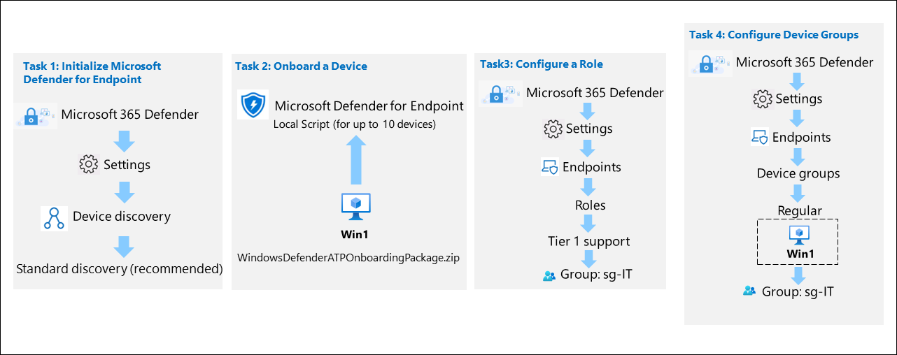
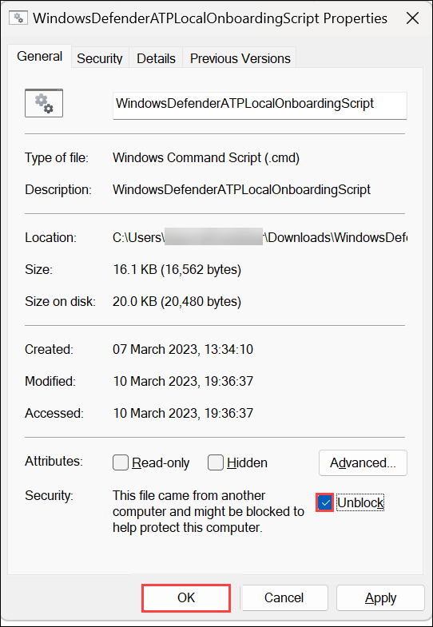

# Module 4 - Lab 1 - Exercise 1 - Deploy Microsoft Defender for Endpoint

## Lab scenario

You are a Security Operations Analyst working at a company that is implementing Microsoft Defender for Endpoint. Your manager plans to onboard a few devices to provide insight into required changes to the Security Operations (SecOps) team response procedures.

You start by initializing the Defender for the Endpoint environment. Next, you onboard the initial devices for your deployment by running the onboarding script on the devices. You configure security for the environment. Lastly, you create Device groups and assign the appropriate devices.

>**Important:**  The lab Virtual Machines are used through different modules. SAVE your virtual machines. If you exit the lab without saving, you will be required to re-run some configurations again.

## Lab objectives
In this lab, you will perform the following:
- Task 1: Initialize Microsoft Defender for Endpoint
- Task 2: Onboard a Device
- Task 3: Configure Roles
- Task 4: Configure Device Groups

## Estimated timing: 60 minutes

## Architecture Diagram

   

### Task 1: Initialize Microsoft Defender for Endpoint

In this task, you will perform the initialization of the Microsoft Defender for the Endpoint.

1. If you are not already at the Microsoft Defender XDR portal, start the Microsoft Edge browser.

1. In the Edge browser, go to the Microsoft Defender XDR portal at (https://security.microsoft.com).

1. In the **Sign in** dialog box, copy and paste * Email/Username: <inject key="AzureAdUserEmail"></inject> and then select Next.

1. In the **Enter password** dialog box, copy and paste * Password: <inject key="AzureAdUserPassword"></inject> and then select **Sign in**.

1. Navigate to **Assets** from the left panel click on **Devices** and, wait for **few minutes** to get loaded once loading is completed refresh the page.

1. On the **Microsoft Defender XDR** portal, from the navigation menu, select **Settings** from the left.

1. On the **Settings** page select **Device discovery**. 

    

    >**Note:** If you do not see the **Device discovery** option under **Settings**, log out by selecting the top-right circle with your account initials and select **Sign out**. Other options that you might want to try are to refresh the page with Ctrl+F5 wait for 30-45 minutes or open the page InPrivate. Login again with the **Tenant Email** credentials.

1. In the Discovery setup make sure **Standard discovery (recommended)** is selected. 

    >**Hint:** If you do not see the option, refresh the page.

### Task 2: Onboard a Device

In this task, you will onboard a device to Microsoft Defender for Endpoint using an onboarding script.

1. If you are not already at the Microsoft Defender XDR portal in your browser, start the Microsoft Edge browser go to (https://security.microsoft.com) and log in with the **Tenant Email** credentials.

1. Select **Settings** from the left menu bar, then from the Settings page select **Endpoints**.

1. Select **Onboarding** in the Device Management section.

    >**Note:** You can also perform device onboarding from the **Assets** section of the left menu bar. Expand Assets and select Devices. On the Device Inventory page, with Computers & Mobile selected, scroll down to **Onboard devices.** This takes you to the **Settings > Endpoints** page.

1. In the "1. Onboard a device" area make sure "Local Script (for up to 10 devices)" is displayed in the Deployment method drop-down and select the **Download onboarding package** button. 

1. Under the *Downloads* pop-up, highlight the "WindowsDefenderATPOnboardingPackage.zip" file with your mouse and select the folder icon **Show in folder**. **Hint:** In case you don't see it, the file should be in the c:\users\admin\downloads directory.

1. Right-click the downloaded zip file and select **Extract All...**, make sure that **Show extracted files when complete** is checked and select **Extract**.

1. Right-click on the extracted file "WindowsDefenderATPLocalOnboardingScript.cmd" and select **Properties**. Select the **Unblock** checkbox in the bottom right of the Properties windows and select **OK**.

    

1. Right-click on the extracted file **WindowsDefenderATPLocalOnboardingScript.cmd** again and choose **Run as administrator**. **Hint:** If you encounter the Windows SmartScreen window, select on **More info**, and choose **Run anyway**. 
    
1. When the "User Account Control" window is shown, select **Yes** to allow the script to run and answer **Y** to the question presented by the script and press **Enter**. When complete you should see a message in the command screen that says *Successfully onboarded machine to Microsoft Defender for Endpoint*.

1. Press any key to continue. This will close the Command Prompt window.

    

### Task 3: Configure Roles

In this task, you will configure roles for use with device groups.

1. Sign in to the [Azure portal](https://portal.azure.com).

1. In the **Sign in** dialog box, copy and paste * Email/Username: <inject key="AzureAdUserEmail"></inject> and then select Next.

1. In the **Enter password** dialog box, copy and paste * Password: <inject key="AzureAdUserPassword"></inject> and then select **Sign in**.

1. On the **Stay signed in?** dialog box, select the Don’t show this again check box and then select **No**.

1. In the Search bar of the Azure portal, type **Microsoft Entra ID**, then select Microsoft Entra ID.

1. Select **Groups** and then click on **New group**.

1. Enter the below details for the New group page:

   |Setting|Value|
    |---|---|
    |Group Type| **Microsoft 365** |
    |Group Name| **Sg-IT** |

1. Click on **No owners selected** and select the **ODL_user <inject key="DeploymentID" enableCopy="false"/>** from the list and then click on **Select**.

1. Click on **No members selected** and select the **ODL_user <inject key="DeploymentID" enableCopy="false"/>** from the list and then click on **Select**.

   **Note**: Make sure you have selected **Group type** as Microsoft 365.

1. Select **Create.**

1. In the Microsoft Defender XDR portal select **Settings** from the left menu bar, then select **Endpoints**. 

1. Select **Roles** under the permissions area.

1. Select the **Turn on roles** button.

1. Select **+ Add Role**. by clicking three dots.

1. In the Add role dialog enter the following:

    |General setting|Value|
    |---|---|
    |Role name|**Tier 1 Support**|
    |Permissions|Live Response capabilities - Advanced|

1. Select **Next**.

1. Select the **Assigned user groups** tab on the top. Select **sg-IT** and then select **Add selected groups**. Make sure it appears under *Azure AD user groups with this role*.

1. Select **Submit** and **Done**. If you receive an error while saving the role, refresh the page and try again.

### Task 4: Configure Device Groups

In this task, you will configure device groups that allow for access control and automation configuration.

1. In the Microsoft Defender XDR portal select **Settings** from the left menu bar, then select **Endpoints**. 

1. Select **Device groups** under the permissions area.

1. Select **+ Add device group** icon.

1. Enter the following information on the General tab:

    |General setting|Value|
    |---|---|
    |Device group name|**Regular**|
    |Remediation level| Full-remediate threats automatically|

1. Select **Next**.

1. On the Devices tab, for the OS condition select **Windows 10** and select **Next**.

1. On the Preview devices tab, select **Next**.

1. For the User access tab, select **sg-IT** and then select **Add selected groups** button. Make sure it appears under **Azure AD user groups with access to this device group**.

1. Select **Submit**.

1. Select **Done**.

1. Device group configuration has changed. Select **Apply changes** to check matches and recalculate groupings.

1. You are going to have two device groups now; the **Regular** you just created and the **Ungrouped devices (default)** with the same remediation level.

### Review
In this lab, you have completed the following:
- Prepared the Microsoft Defender XDR workspace
- Initialized Microsoft Defender for Endpoint
- Onboarded a Device
- Configured Roles
- Configured Device Groups

## Select **Next** to continue to Lab 2.
