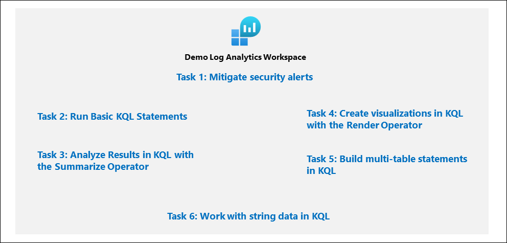
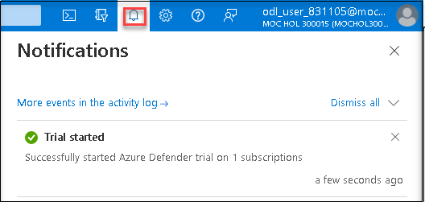
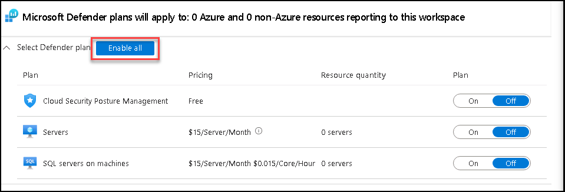
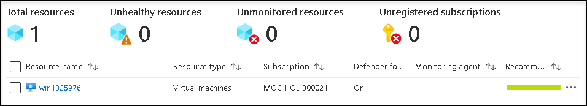
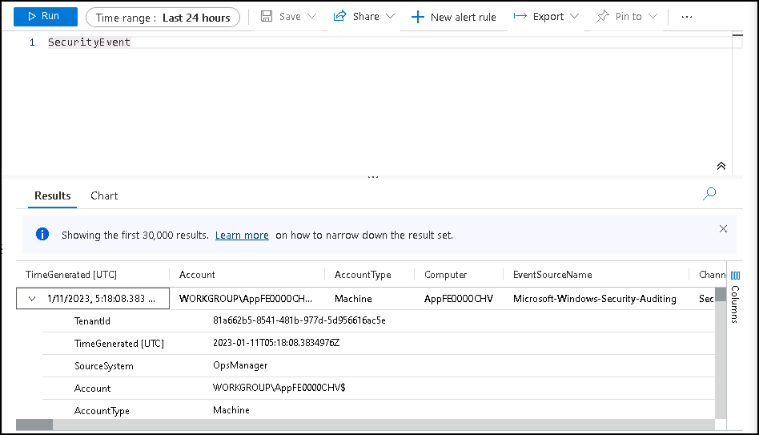
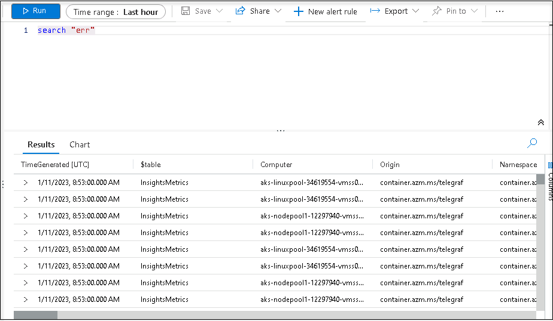

# Module 4 - Lab 1 - Exercise 1 - Create queries for Microsoft Sentinel using Kusto Query Language (KQL)

## Lab scenario
You are a Security Operations Analyst working at a company that is implementing Microsoft Sentinel. You are responsible for performing log data analysis to search for malicious activity, display visualizations, and perform threat hunting. To query log data, you use the Kusto Query Language (KQL).

>**Important:** This lab involves entering many KQL scripts into Microsoft Sentinel. The scripts were provided in a file at the beginning of this lab. An alternate location to download them is:  https://github.com/MicrosoftLearning/SC-200T00A-Microsoft-Security-Operations-Analyst/tree/master/Allfiles

## Lab objectives
 In this lab, you will perform the following:

- Task 1: Create a Log Analytics Workspace
- Task 2: Initialize the Microsoft Sentinel Workspace.
- Task 3: Connect the Windows security event connector.
- Task 4: Enable Microsoft Defender for Cloud
- Run Basic KQL Statements
- Task 5: Protect an On-Premises Server.
- Task 6: Access the KQL testing area.
- Task 7: Run Basic KQL Statements
- Task 8: Analyze Results in KQL with the Summarize Operator
- Task 9: Create visualizations in KQL with the Render Operator
- Task 10: Build multi-table statements in KQL
- Task 11: Work with string data in KQL

## Estimated timing: 90 minutes

## Architecture Diagram

  

### Task 1: Create a Log Analytics Workspace

In this task, you will create a Log Analytics workspace for use with Microsoft Defender for Cloud.

1. In the Edge browser, open the Azure portal at (https://portal.azure.com).

1. In the **Sign in** dialog box, copy and paste Email/Username: <inject key="AzureAdUserEmail"></inject> and then select Next.

1. In the **Enter password** dialog box, copy and paste Password: <inject key="AzureAdUserPassword"></inject> and then select **Sign in**.

1. In the Search bar of the Azure portal, type **Log Analytics**, then select **Log Analytics workspaces**.

1. Select **+Create** from the command bar.

1. Select "create new Resource Group" give the name **RG-Defender**.

1. For the Name, enter something unique like **uniquenameDefender**.
1. Select the default Region 

1. Select **Review + Create**.

1. Once the workspace validation has passed, select **Create**. Wait for the new workspace to be provisioned, this may take a few minutes.

    > **Congratulations** on completing the task! Now, it's time to validate it. Here are the steps:
    > - Navigate to the Lab Validation Page, from the upper right corner in the lab guide section.
    > - Hit the Validate button for the corresponding task. You can proceed to the next task if you receive a success message.
    > - If not, carefully read the error message and retry the step, following the instructions in the lab guide.
    > - If you need any assistance, please contact us at labs-support@spektrasystems.com. We are available 24/7 to help you out.
    
### Task 2: Initialize the Microsoft Sentinel Workspace.

1. In the Search bar of the Azure portal, type *Sentinel*, then select **Microsoft Sentinel**.

1. Next, In Add Microsoft Sentinel to a workspace page.

1. Select your existing workspace that was created in the previous lab, then select **Add**. This could take a few minutes.

### Task 3: Connect the Windows security event connector.

1. On the search bar type **Microsoft sentinel** and select it

1. select the created workspace

1. On the left menu search for data connectors and click on it

1. You can see there are no connectors installed yet so go to the content hub on the same page

1. On the content hub page search for **Windows security event** and select, Install

1. Once you receive the notification of successful installation go back to the Data connector page and click on refresh

1. You can see **Security events Via Legacy agent** and **windows security events via AMA**

1. Select **Security events Via Legacy agent** and click on **open connector page**

1. Under configuration choose **Install agent on Azure Windows Virtual Machine** and select **Download & install agent for Azure Windows Virtual machines** 

1. Select the **WIN 1** virtual machine and click on connect

1. Then come back to Configuration and scroll down a bit you can find **Select which events to stream** Click on **All Events**

1. Click on apply changes now if you refresh the data connector page you can see the status connected for **Security events Via Legacy agent**

### Task 4: Enable Microsoft Defender for Cloud

In this task, you will enable and configure Microsoft Defender for Cloud.

1. In the Search bar of the Azure portal, type *Defender*, then select **Microsoft Defender for Cloud**.

1. click the left menu and click on **Getting started**

1. On the **Getting Started** page, under the **Upgrade** tab, make sure your subscription is selected, and then select the **Upgrade** button at the bottom of the page. Wait for the *Trial started* notification to appear, it takes about 2 minutes. **Hint:** You can click the bell button on the top bar to review your Azure portal notifications.

    

1. In the left menu for Microsoft Defender for Cloud, under Management, select **Environment settings**.

1. Select the **"MOC HOL XXXX"** subscription (or equivalent name in your Language). 

1. Review the Azure resources that are now protected with the Defender for Cloud plans.

1. Select the **Settings & monitoring** tab from the Settings area (next to Save).

1. Review the monitoring extensions. Confirm that **Log Analytics agent/Azure Monitor agent** is **Off**. Close the Settings & monitoring page by selecting the 'X' on the upper right of the page.

1. Close the settings page by selecting the 'X' on the upper right of the page to go back to the **Environment settings** and select the '>' to the left of your subscription.

1. Select the Log Analytics workspace you created earlier *uniquenameDefender* to review the available options and pricing.

1. Select **Enable all** (to the right of Select Defender plan) and then select **Save**. Wait for the *"Microsoft Defender plan for workspace uniquenameDefender was saved successfully!"* notification to appear.

    

    >**Note:** If the page is not being displayed, refresh your Edge browser and try again.

1. Close the Defender plans page by selecting the 'X' on the upper right of the page to go back to the **Environment settings**

### Task 5: Protect an On-Premises Server.

In this task, you will manually install the required agent on the Windows Server.

1. On the WIN1 Virtual machine, Go to **Microsoft Defender for Cloud** and select the **Getting Started** page.

1. Select the **Get Started** tab.

1. Scroll down and select **Configure** under the *Add non-Azure servers* section.

1. Select **Upgrade** next to the workspace you created earlier.  This might take a few minutes, wait until you see the notification *"Defender plans for workspace were saved successfully"*.

1. Select **+ Add Servers** next to the workspace you created earlier.

1. Select **Log Analytics agent instructions**

1. Select **Download Windows Agent (64 bit)**.

1. Select **Open file** to run the downloaded *MMASetup-AMD64.exe* file.

   >**Note** If it is already installed it asks for "Repair" or "remove" select **Repair** then click on next then click on **install**

1. Select **Next** until the wizard page for **Agent Setup Options** appears, Select **Connect the Agent to Azure Log Analytics (OMS)**, then select **Next**.

1. Copy and paste the **Workspace ID** and **Primary Key** values in the **Workspace Key** text box from the Azure portal into the wizard page fields as appropriate and select **Next**.

1. Continue with the Install. Select **Finish** when complete.

1. Go to the "Microsoft Defender for Cloud" portal and select **Inventory** from the general section.

1. The Server should appear in the list. You may have to select **Refresh** to see the update and it will take a few minutes.

    

    > **Congratulations** on completing the task! Now, it's time to validate it. Here are the steps:
    > - Navigate to the Lab Validation Page, from the upper right corner in the lab guide section.
    > - Hit the Validate button for the corresponding task. You can proceed to the next task if you receive a success message.
    > - If not, carefully read the error message and retry the step, following the instructions in the lab guide.
    > - If you need any assistance, please contact us at labs-support@spektrasystems.com. We are available 24/7 to help you out.

### Task 6: Access the KQL testing area.

In this task, you will access a Log Analytics environment where you can practice writing KQL statements.

1. Go-to Microsoft sentinel and select your log analytics workspace.

1. On the left menu click on **logs** close if any tutorial window pops up

1. Explore the available tables listed in the tab on the left side of the screen.

1. In the query editor, enter the following query and select the **Run** button. You should see the query results in the bottom window.

    ```KQL
    SecurityEvent
    ```

1. Next to the first record, select the **>** to expand the information for the row.

    

### Task 7: Run Basic KQL Statements

In this task, you will build basic KQL statements.

>**Important:**  For each query, clear the previous statement from the Query Window or open a new Query Windows by selecting **+** after the last opened tab (up to 25).

1. Change the **Time range** to **Last hour** in the Query Window.

    

1. The following statement demonstrates the **search** operator, which searches all columns in the table for the value. In the Query Window enter the following statement and select **Run**: 

    ```KQL
    search "err"
    ```
    

1. The following statement demonstrates **search** across tables listed within the **in** clause. In the Query Window enter the following statement and select **Run**: 

    ```KQL
    search in (SecurityEvent,SecurityAlert,A*) "err"
    ```

1. Change back the **Time range** to **Last 24 hours** in the Query Window.

1. The following statements demonstrate the **where** operator, which filters on a specific predicate. In the Query Window enter the following statements and run each query separately: 
    >**Note:** You should select **Run** after entering each query from the code blocks below.

    ```KQL
    SecurityEvent  
    | where TimeGenerated > ago(1h)
    ```

    ```KQL
    SecurityEvent  
    | where TimeGenerated > ago(1h) and EventID == "4624"
    ```

    ```KQL
    SecurityEvent  
    | where TimeGenerated > ago(1h)
    | where EventID == 8002
    | where AccountType =~ "user"
    ```

    ```KQL
    SecurityEvent  
    | where TimeGenerated > ago(1h) and EventID in (8002, 4688)
 
    ```

1. The following statement demonstrates the use of the **let** statement to declare *variables*. In the Query Window enter the following statement and select **Run**: 

    ```KQL
    let timeOffset = 1h;
    let discardEventId = 4688;
    SecurityEvent
    | where TimeGenerated > ago(timeOffset*2) and TimeGenerated < ago(timeOffset)
    | where EventID != discardEventId
    ```

1. The following statement demonstrates the use of the **let** statement to declare a *dynamic list*. In the Query Window enter the following statement and select **Run**: 

    ```KQL
    let suspiciousAccounts = datatable(account: string) [
      @"\administrator", 
      @"NT AUTHORITY\SYSTEM"
    ];
    SecurityEvent  
    | where TimeGenerated > ago(1h)
    | where Account in (suspiciousAccounts)
    ```

    >**Tip:** You can re-format the query easily by selecting the ellipsis (...) in the Query window and selecting **Format query**.

1. The following statement demonstrates the use of the **let** statement to declare a *dynamic table*. In the Query Window enter the following statement and select **Run**: 

    ```KQL
    let LowActivityAccounts =
        SecurityEvent 
        | summarize cnt = count() by Account 
        | where cnt < 1000;
    LowActivityAccounts
    ```

1. Change the **Time range** to **Last hour** in the Query Window. This will limit our results for the following statements.

1. The following statement demonstrates the **extend** operator, which creates a calculated column and adds it to the result set. In the Query Window enter the following statement and select **Run**: 

    ```KQL
    SecurityEvent  
    | where TimeGenerated > ago(1h)
    | where ProcessName != "" and Process != ""
    | extend StartDir =  substring(ProcessName,0, string_size(ProcessName)-string_size(Process))
    ```

1. The following statement demonstrates the **order by** operator, which sorts the rows of the input table by one or more columns in ascending or descending order. The **order by** operator is an alias to the **sort by** operator. In the Query Window enter the following statement and select **Run**: 

    ```KQL
    SecurityEvent  
    | where TimeGenerated > ago(1h)
    | where ProcessName != "" and Process != ""
    | extend StartDir =  substring(ProcessName,0, string_size(ProcessName)-string_size(Process))
    | order by StartDir desc, Process asc
    ```

1. The following statements demonstrate the **project** operator, which selects the columns to include in the order specified. In the Query Window enter the following statement and select **Run**: 

    ```KQL
    SecurityEvent  
    | where TimeGenerated > ago(1h)
    | where ProcessName != "" and Process != ""
    | extend StartDir =  substring(ProcessName,0, string_size(ProcessName)-string_size(Process))
    | order by StartDir desc, Process asc
    | project Process, StartDir
    ```

1. The following statements demonstrate the **project-away** operator, which selects the columns to exclude from the output. In the Query Window enter the following statement and select **Run**: 

    ```KQL
    SecurityEvent  
    | where TimeGenerated > ago(1h)
    | where ProcessName != "" and Process != ""
    | extend StartDir =  substring(ProcessName,0, string_size(ProcessName)-string_size(Process))
    | order by StartDir desc, Process asc
    | project-away ProcessName
    ```

### Task 8: Analyze Results in KQL with the Summarize Operator

In this task, you will build KQL statements to aggregate data. **Summarize** groups the rows according to the **by** group columns, and calculates aggregations over each group.

1. The following statement demonstrates the **count()** function, which returns a count of the group. In the Query Window enter the following statement and select **Run**: 

    ```KQL
    SecurityEvent  
    | where TimeGenerated > ago(1h) and EventID == '4688'  
    | summarize count() by Process, Computer
    ```

1. The following statement demonstrates the **count()** function, but in this example, we name the column as *cnt*. In the Query Window enter the following statement and select **Run**: 

    ```KQL
    SecurityEvent  
    | where TimeGenerated > ago(1h) and EventID == '4624'  
    | summarize cnt=count() by AccountType, Computer
    ```

1. The following statement demonstrates the **dcount()** function, which returns an approximate distinct count of the group elements. In the Query Window enter the following statement and select **Run**: 

    ```KQL
    SecurityEvent  
    | where TimeGenerated > ago(1h)
    | summarize dcount(IpAddress)
    ```

1. The following statement is a rule to detect Invalid password failures across multiple applications for the same account. In the Query Window enter the following statement and select **Run**:

    ```KQL
    let timeframe = 30d;
    let threshold = 1;
    SigninLogs
    | where TimeGenerated >= ago(timeframe)
    | where ResultDescription has "Invalid password"
    | summarize applicationCount = dcount(AppDisplayName) by UserPrincipalName, IPAddress
    | where applicationCount >= threshold
    ```

1. The following statement demonstrates the **arg_max()** function, which returns one or more expressions when the argument is maximized. The following statement will return the most current row from the SecurityEvent table for the computer SQL10.NA.contosohotels.com. The * in the arg_max function requests all columns for the row. In the Query Window enter the following statement and select **Run**: 

    ```KQL
    SecurityEvent  
    | where Computer == "SQL10.na.contosohotels.com"
    | summarize arg_max(TimeGenerated,*) by Computer
    ```

1. The following statement demonstrates the **arg_min()** function, which returns one or more expressions when the argument is minimized. In this statement, the oldest SecurityEvent for the computer SQL10.NA.contosohotels.com will be returned as the result set. In the Query Window enter the following statement and select **Run**: 

    ```KQL
    SecurityEvent  
    | where Computer == "SQL10.na.contosohotels.com"
    | summarize arg_min(TimeGenerated,*) by Computer
    ```

1. The following statements demonstrate the importance of understanding results based on the order of the *pipe*. In the Query Window enter the following queries and run each query separately: 

    1. **Query 1** will have Accounts for which the last activity was a login. The SecurityEvent table will first be summarized and return the most current row for each Account. Then only rows with EventID equals 4624 (login) will be returned.

        ```KQL
        SecurityEvent  
        | summarize arg_max(TimeGenerated, *) by Account
        | where EventID == '4624'  
        ```

    1. **Query 2** will have the most recent login for Accounts that have logged in. The SecurityEvent table will be filtered to only include EventID = 4624. Then these results will be summarized for the most current login row by Account.

        ```KQL
        SecurityEvent  
        | where EventID == '4624'  
        | summarize arg_max(TimeGenerated, *) by Account
        ```

    >**Note:**  You can also review the "Total CPU" and "Data used for processed query" by selecting the "Query details" link on the lower right and compare the data between both statements.

1. The following statement demonstrates the **make_list()** function, which returns a *list* of all the values within the group. This KQL query will first filter the EventID with the where operator. Next, for each Computer, the results are a JSON array of Accounts. The resulting JSON array will include duplicate accounts. In the Query Window enter the following statement and select **Run**: 

    ```KQL
    SecurityEvent  
    | where TimeGenerated > ago(1h)
    | where EventID == '4624'  
    | summarize make_list(Account) by Computer
    ```

1. The following statement demonstrates the **make_set()** function, which returns a set of *distinct* values within the group. This KQL query will first filter the EventID with the where operator. Next, for each Computer, the results are a JSON array of unique Accounts. In the Query Window enter the following statement and select **Run**: 

    ```KQL
    SecurityEvent  
    | where TimeGenerated > ago(1h)
    | where EventID == '4624'  
    | summarize make_set(Account) by Computer
    ```

### Task 9: Create visualizations in KQL with the Render Operator

In this task, you will use generate visualizations with KQL statements.

1. The following statement demonstrates the **render** operator (which renders results as a graphical output), using a **barchart** visualization. In the Query Window enter the following statement and select **Run**: 

    ```KQL
    SecurityEvent  
    | where TimeGenerated > ago(1h)
    | summarize count() by Account
    | render barchart
    ```

1. The following statement demonstrates the **render** operator visualizing results with a time series. The **bin()** function rounds all values in a timeframe and groups them, used frequently in combination with **summarize**. If you have a scattered set of values, the values are grouped into a smaller set of specific values. Combining the generated results and pipe them to a **render** operator with a **timechart** provides a time series visualization. In the Query Window enter the following statement and select **Run**: 

    ```KQL
    SecurityEvent  
    | where TimeGenerated > ago(1h)
    | summarize count() by bin(TimeGenerated, 1m)
    | render timechart
    ```

### Task 10: Build multi-table statements in KQL

In this task, you will build multi-table KQL statements.

1. Change the **Time range** to **Last hour** in the Query Window. This will limit our results for the following statements.

1. The following statement demonstrates the **union** operator, which takes two or more tables and returns all their rows. Understanding how results are passed and impacted with the pipe character is essential. In the Query Window enter the following statements and select **Run** for each query separately to see the results: 

    1. **Query 1** will return all rows of SecurityEvent and all rows of SigninLogs.

        ```KQL
        SecurityEvent  
        | union SigninLogs  
        ```

    1. **Query 2** will return one row and column, which is the count of all rows of SigninLogs and all rows of SecurityEvent.

        ```KQL
        SecurityEvent  
        | union SigninLogs  
        | summarize count() 
        ```

    1. **Query 3** will return all rows of SecurityEvent and one (last) row for SigninLogs. The last row for SigninLogs will have the summarized count of the total number of rows.

        ```KQL
        SecurityEvent  
        | union (SigninLogs | summarize count() | project count_)
        ```

1. The following statement demonstrates the **union** operator support to union multiple tables with wildcards. In the Query Window enter the following statement and select **Run**: 

    ```KQL
    union Security*  
    | summarize count() by Type
    ```

1. The following statement demonstrates the **join** operator, which merges the rows of two tables to form a new table by matching values of the specified column(s) from each table. In the Query Window enter the following statement and select **Run**: 

    ```KQL
    SecurityEvent  
    | where EventID == "4624" 
    | summarize LogOnCount=count() by EventID, Account
    | project LogOnCount, Account
    | join kind = inner( 
     SecurityEvent  
    | where EventID == "4634" 
    | summarize LogOffCount=count() by EventID, Account
    | project LogOffCount, Account
    ) on Account
    ```

    >**Important:** The first table specified in the join is considered the Left table. The table after the **join** operator is the right table. When working with columns from the tables, the $left.Column name and $right.Column name is to distinguish which tables column are referenced. The **join** operator supports a full range of types: flouter, inner, innerunique, leftanti, leftantisemi, leftouter, leftsemi, rightanti, rightantisemi, rightouter, rightsemi.

### Task 11: Work with string data in KQL

In this task, you will work with structured and unstructured string fields with KQL statements.

1. The following statement demonstrates the **extract** function, which gets a match for a regular expression from a source string. You have the option to convert the extracted substring to the indicated type. In the Query Window, enter the following statement and select **Run**: 

    ```KQL
    print extract("x=([0-9.]+)", 1, "hello x=45.6|wo") == "45.6"
    ```

1. The following statements use the **extract** function to pull out the Account Name from the Account field of the SecurityEvent table. In the Query Window enter the following statement and select **Run**: 

    ```KQL
    SecurityEvent  
    | where EventID == '4688' and AccountType == 'User' 
    | extend Account_Name = extract(@"^(.*\\)?([^@]*)(@.*)?$", 2, tolower(Account))
    | summarize LoginCount = count() by Account_Name
    | where Account_Name != ""
    | where LoginCount < 10
    ```

1. The following statement demonstrates the **parse** operator, which evaluates a string expression and parses its value into one or more calculated columns. Use for structuring unstructured data. In the Query Window enter the following statement and select **Run**: 

    ```KQL
    let Traces = datatable(EventText:string)
    [
    "Event: NotifySliceRelease (resourceName=PipelineScheduler, totalSlices=27, sliceNumber=23, lockTime=02/17/2016 08:40:01, releaseTime=02/17/2016 08:40:01, previousLockTime=02/17/2016 08:39:01)",
    "Event: NotifySliceRelease (resourceName=PipelineScheduler, totalSlices=27, sliceNumber=15, lockTime=02/17/2016 08:40:00, releaseTime=02/17/2016 08:40:00, previousLockTime=02/17/2016 08:39:00)",
    "Event: NotifySliceRelease (resourceName=PipelineScheduler, totalSlices=27, sliceNumber=20, lockTime=02/17/2016 08:40:01, releaseTime=02/17/2016 08:40:01, previousLockTime=02/17/2016 08:39:01)",
    "Event: NotifySliceRelease (resourceName=PipelineScheduler, totalSlices=27, sliceNumber=22, lockTime=02/17/2016 08:41:01, releaseTime=02/17/2016 08:41:00, previousLockTime=02/17/2016 08:40:01)",
    "Event: NotifySliceRelease (resourceName=PipelineScheduler, totalSlices=27, sliceNumber=16, lockTime=02/17/2016 08:41:00, releaseTime=02/17/2016 08:41:00, previousLockTime=02/17/2016 08:40:00)"
    ];
    Traces  
    | parse EventText with * "resourceName=" resourceName ", totalSlices=" totalSlices:long * "sliceNumber=" sliceNumber:long * "lockTime=" lockTime ", releaseTime=" releaseTime:date "," * "previousLockTime=" previousLockTime:date ")" *  
    | project resourceName, totalSlices, sliceNumber, lockTime, releaseTime, previousLockTime
    ```

1. The following statement demonstrates working with **dynamic** fields, which are special since they can take on any value of other data types. In this example, The DeviceDetail field from the SigninLogs table is of type **dynamic**. In the Query Window enter the following statement and select **Run**: 

    ```KQL
    SigninLogs | extend OS = DeviceDetail.operatingSystem
    ```

1. The following example shows how to break out packed fields for SigninLogs. In the Query Window enter the following statement and select **Run**: 

    ```KQL
    SigninLogs | extend OS = DeviceDetail.operatingSystem, Browser = DeviceDetail.browser
    | extend CAPol0Name = tostring(ConditionalAccessPolicies[0].displayName), CAPol0Result = tostring(ConditionalAccessPolicies[0].result)
    | extend CAPol1Name = tostring(ConditionalAccessPolicies[1].displayName), CAPol1Result = tostring(ConditionalAccessPolicies[1].result)
    | extend CAPol2Name = tostring(ConditionalAccessPolicies[2].displayName), CAPol2Result = tostring(ConditionalAccessPolicies[2].result)
    | extend StatusCode = tostring(Status.errorCode), StatusDetails = tostring(Status.additionalDetails)
    | extend Date = startofday(TimeGenerated), City = tostring(LocationDetails.city)
    | summarize count() by Date, Identity, UserDisplayName, UserPrincipalName, IPAddress, City, ResultType, ResultDescription, StatusCode, StatusDetails, CAPol0Name, CAPol0Result, CAPol1Name, CAPol1Result, CAPol2Name, CAPol2Result
    | sort by Date
    ```

    >**Important:** Although the dynamic type appears JSON-like, it can hold values that the JSON model does not represent because they do not exist in JSON. Therefore, in serializing dynamic values into a JSON representation, values that JSON cannot represent are serialized into string values. 

1. **[Read-Only]** The following statements demonstrate operators to manipulate JSON stored in string fields. Many logs submit data in JSON format, which requires you to know how to transform JSON data into fields that can be queried. In the Query Window enter the following statement and select **Run**: 

    ```KQL
    SigninLogs | extend Location =  todynamic(LocationDetails)
    | extend City =  Location.city
    | extend City2 = Location["city"]
    | project Location, City, City2
    ```

1.  The following statement demonstrates the **mv-expand** operator, which turns dynamic arrays into rows (multi-value expansion).

    ```KQL
    SigninLogs | mv-expand Location = todynamic(LocationDetails)
    ```

1. **[Read-Only]** The following statement demonstrates the **mv-apply** operator, which applies a subquery to each record and returns the union of the results of all subqueries.

    ```KQL
    SigninLogs  
    | mv-apply Location = todynamic(LocationDetails) on 
    ( where Location.countryOrRegion == "ES")
    ```

1. A **function** is a log query that can be used in other log queries with the saved name as a command. To create a **function**, after running your query, select the **Save** button and then select **Save As function** from the drop-down. Enter the name your want (for example: *PrivLogins*) in the **Function name** box and enter a **Legacy category** (for example: *General*) and select **Save**. The function will be available in KQL by using the function's alias:

    >**Note:** You will not be able to do this in the lab demo environment used for this lab since your account has only Reader permissions, but it is an important concept to make your queries more efficient and effective. 

    ```KQL
    PrivLogins  
    ```

## Review
In this lab, you have completed the following:
- Created a Log Analytics Workspace
- Initialized the Microsoft Sentinel Workspace.
- Connected the Windows security event connector.
- Enabled Microsoft Defender for Cloud
- Ran Basic KQL Statements
- Protected an On-Premises Server.
- Able to access the KQL testing area.
- Ran Basic KQL Statements
- Analyzed Results in KQL with the Summarize Operator
- Created visualizations in KQL with the Render Operator
- Built multi-table statements in KQL
- Worked with string data in KQL

## You have successfully completed the lab.
