# Module 5 - Lab 1 - Exercise 1 - Enable Microsoft Defender for Cloud

## Lab scenario

You're a Security Operations Analyst working at a company that is implementing cloud workload protections with Microsoft Defender for Cloud. In this lab, you enable Microsoft Defender for Cloud.

>**Important:** The lab exercises for Learning Path #5 are in a *standalone* environment. If you exit the lab before completing it, you will be required to re-run the configurations again.

## Lab objectives
 In this lab, you will perform the following:
- Task 1: Enable Microsoft Defender for Cloud
- Task 2: Understanding the Microsoft Defender for Cloud Dashboard
- Task 3: Install Azure Arc on an On-Premises Server

### Estimated timing: 15 minutes

## Architecture Diagram

  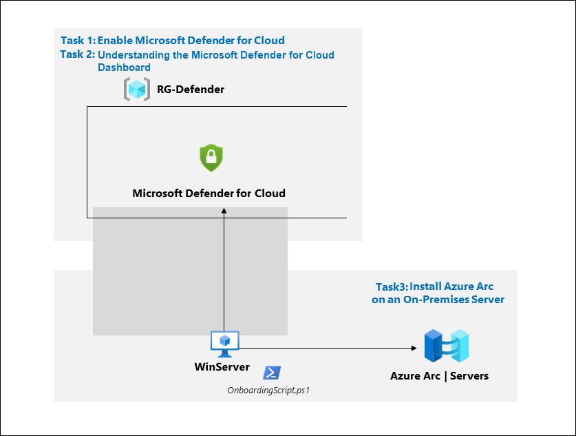

### Task 1: Enable Microsoft Defender for Cloud

In this task, you'll enable and configure Microsoft Defender for Cloud.

1. In the Search bar of the Microsoft Azure portal, type *Defender*, then select **Microsoft Defender for Cloud**.

   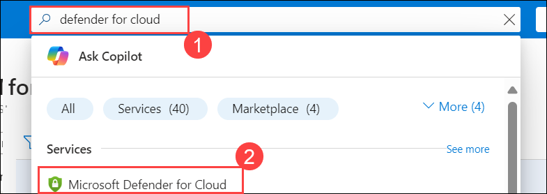

1. In the left navigation menu for Microsoft Defender for Cloud, expand the *Management* section , and select **Environment settings**.

   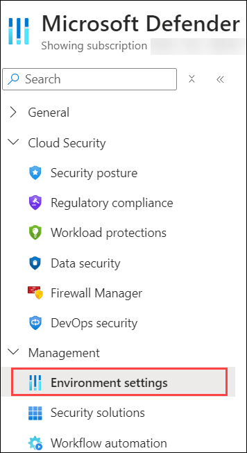

1. Select the **Expand all** button to view all subscriptions and resources.

1. Select the your subscription (or equivalent name in your Language).

   

1. Review the Azure resources that are now protected with the Defender for Cloud plans.

    >**Important:** If all Defender plans are *Off*, select **Enable all plans**. Select the *$200/month Microsoft Defender for APIs Plan 1* and then select **Save**. Select **Save** at the top of the page and wait for the *"Defender plans (for your) subscription were saved successfully!"* notifications to appear.

1. Select the **Settings & monitoring** tab from the Settings area (next to Save).

    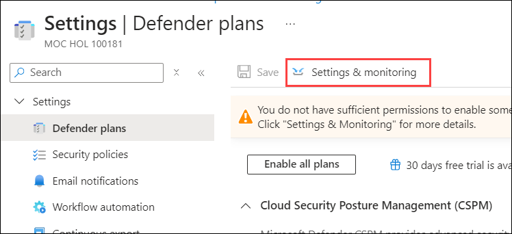

1. Review the monitoring extensions. It includes configurations for Virtual Machines, Containers, and Storage Accounts.

1. Close the "Settings & monitoring" page by selecting the 'X' on the upper right of the page.

   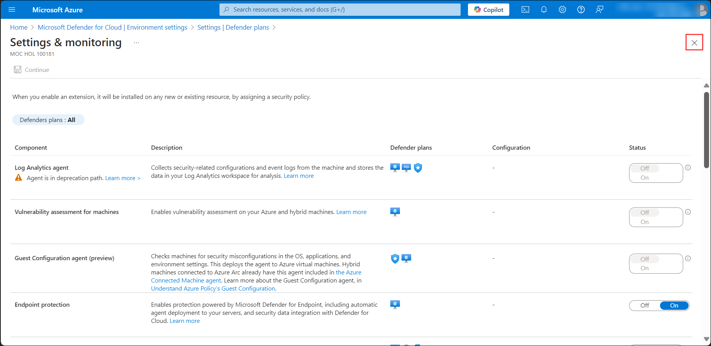

1. Close the settings page by selecting the 'X' on the upper right of the page to go back to the **Environment settings**.

<!---1. Select the Log analytics workspace you created earlier *uniquenameDefender* to review the available options and pricing.

1. Select **Enable all plans** (to the right of Select Defender plan) and then select **Save**. Wait for the *"Microsoft Defender plan for workspace uniquenameDefender were saved successfully!"* notification to appear.

    >**Note:** If the page is not being displayed, refresh your Edge browser and try again.

1. Close the Defender plans page by selecting the 'X' on the upper right of the page to go back to the **Environment settings**. --->

### Task 2: Understanding the Microsoft Defender for Cloud Dashboard

In this task, you will explore the Microsoft Defender for Cloud dashboard to familiarize yourself with its interface, features, and how it provides insights into your cloud environment's security posture.

1. In the Search bar of the Microsoft Azure portal, type *Defender*, then select **Microsoft Defender for Cloud**.

1. In the left navigation menu for Microsoft Defender for Cloud, under the *General* section, select **Overview**.

   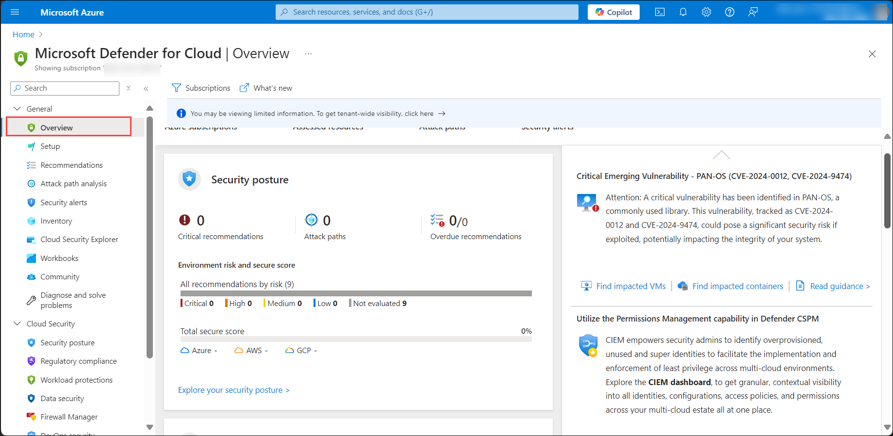

1. The Overview blade provides a unified view into the security posture and includes multiple independent cloud security pillars such as Security posture, Regulatory compliance, Workload protections, Firewall Manager, Inventory, and Information Protection (preview). Each of these pillars also has its dedicated dashboard allowing deeper insights and actions around that vertical, providing easy access and better visibility for security professionals.

    >**Note:** The top menu bar allows you to view and filter subscriptions by selecting the Subscriptions button. In this lab, we will use only one but selecting different/additional subscriptions will adjust the interface to reflect the security posture of the selected subscriptions

1. Click on the **What’s new** icon link – a new tab opens with the latest release notes where you can stay current on the new features, bug fixes, and more.

    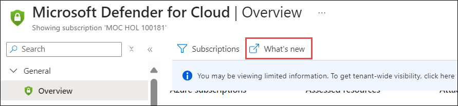

    >**Note:** The high-level numbers at the top menu; This view allows you to see a summary of your subscriptions, active recommendations, and security alerts alongside connected cloud accounts.

1. From the top menu bar, select **Azure subscriptions**. This will bring you into the environment settings where you can select from the available subscriptions.

   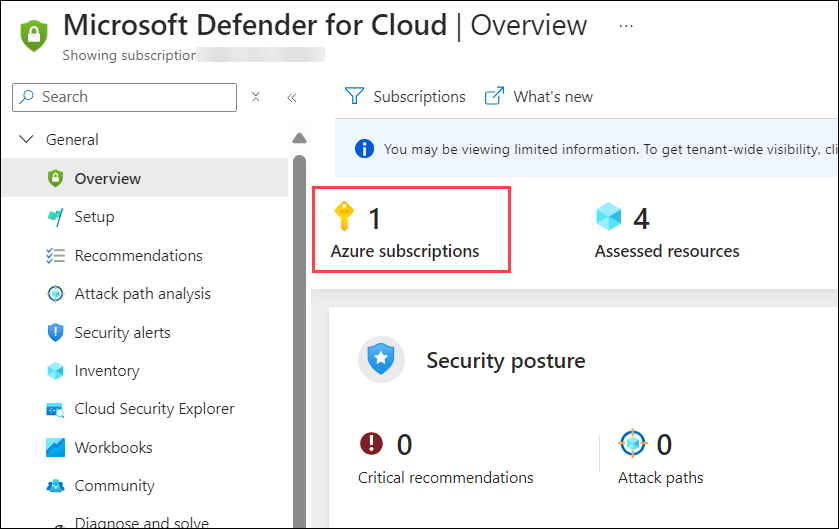

1. Return to the **Overview** page, and review the **Security posture** tile. You can see your current *Secure score* along with the number of completed controls and recommendations. Selecting this tile will redirect you to a drill-down view across subscriptions.

1. On the **Regulatory compliance** tile, you can get insights into your compliance posture based on continuous assessment of both Azure and hybrid cloud environments. This tile shows the following standards which are Microsoft Cloud Security benchmark, and Lowest compliance regulatory standard. To view the data we first need to add Security policies.

   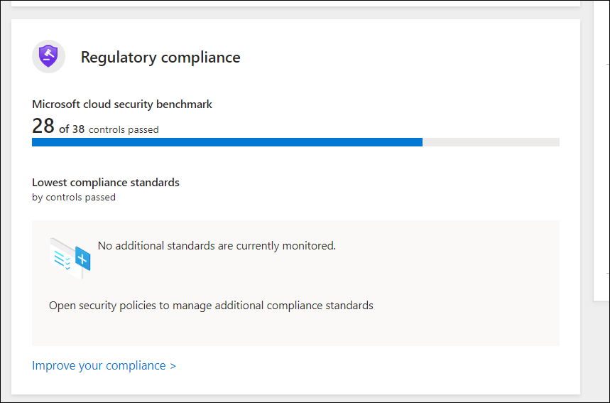

1. Selecting this tile will redirect you to the **Regulatory compliance** dashboard – where you can add additional standards and explore the current ones.

1. We will continue exploring *Microsoft Defender for Cloud* **Security posture** and **Regulatory compliance** in the next exercise.

### Task 3: Install Azure Arc on an On-Premises Server

In this task, you install Azure Arc on an on-premises server to make onboarding easier.

>**Important:** The next steps are done in a different machine than the one you were previously working. Look for the Virtual Machine name references.

In this task, you will install Azure Arc and connect a non-Azure Windows virtual machine to Microsoft Sentinel.  

   >**Important:** The next steps are done in a different machine than the one you were previously working. Look for the Virtual Machine name references.

   >**Important:** The *Windows Security Events via AMA* data connector requires Azure Arc for non-Azure devices. 

 1. In the lab virtual machine, search for **Hyper-V Manager** from task bar and select to open.

    

 1. Select **WIN1-<inject key="DeploymentID" enableCopy="false"/>**, then select **WIN2**. Right-click on the **WIN2** virtual machine and choose **Start**, then click **Continue**. After that, right-click on the **WIN2** virtual machine again and select **Connect**.

    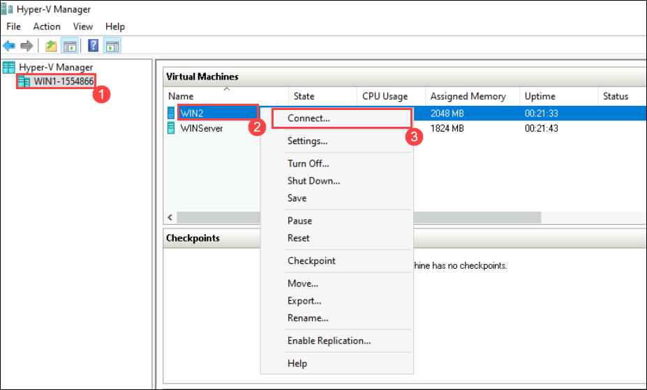
 
 1. Inside **WIN2** Click on **connect**.
 
    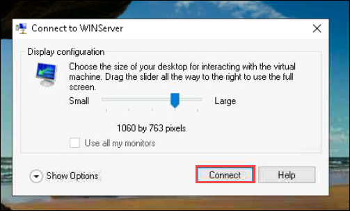

 1. Enter the **Password** as `Password.1!!` when prompted then hit on **Enter**.

     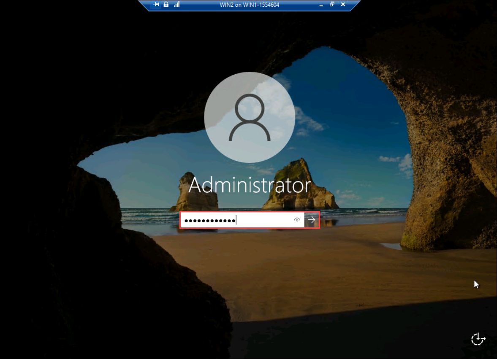

 1. Open the Microsoft Edge browser inside **WIN2**.

 1. Open a browser and log into the Azure Portal at https://portal.azure.com with the credentials you have been using in the previous labs.

1. In the **Sign in** dialog box, copy and paste **Email/Username: <inject key="AzureAdUserEmail"></inject>** and then select Next.

1. In the **Enter password** dialog box, copy and paste **Password: <inject key="AzureAdUserPassword"></inject>** and then select **Sign in**.

1. In the Search bar of the Azure portal, type **Azure arc (1)**, then select **Azure Arc (2)**.

   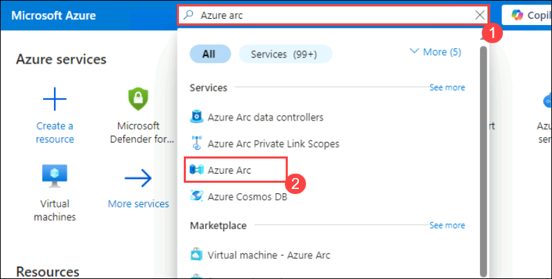

1. In the navigation pane under **Azure Arc resources** select **Machines**

1. Select **+ Add/Create**, then select **Add a machine**.

   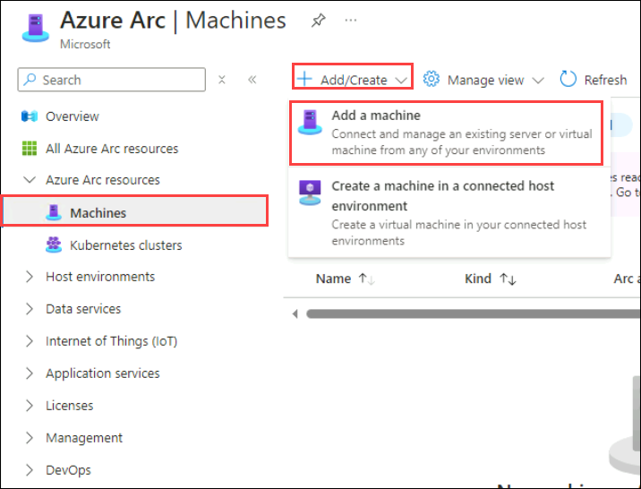

1. Select **Generate script** from the "Add a single server" section.

   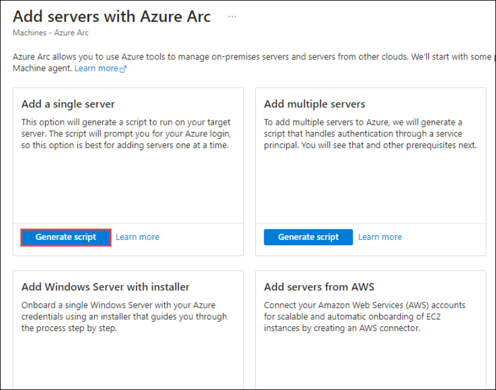

1. In the **Add a server with Azure Arc** page, select the **RG-Defender** Resource group under Project details.
 
1. For *Region*, select **(US) East Us** from the drop-down list.

    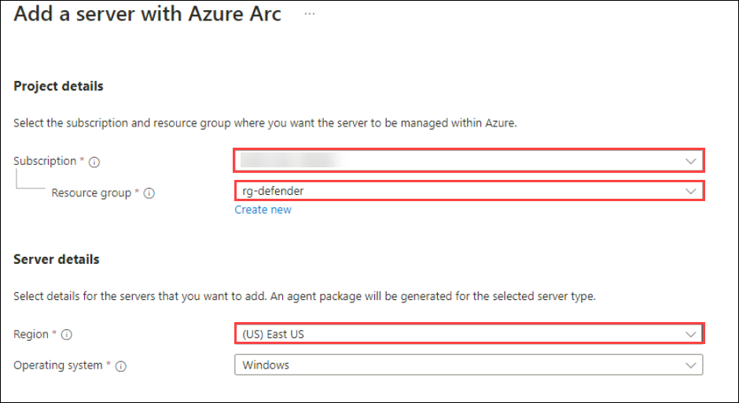

1. Review the Server details and Connectivity method options. Keep the default values and select **Next** to get to the Tags tab.

1. Review the default available tags. Select **Next** to get to the Download and run script tab.

   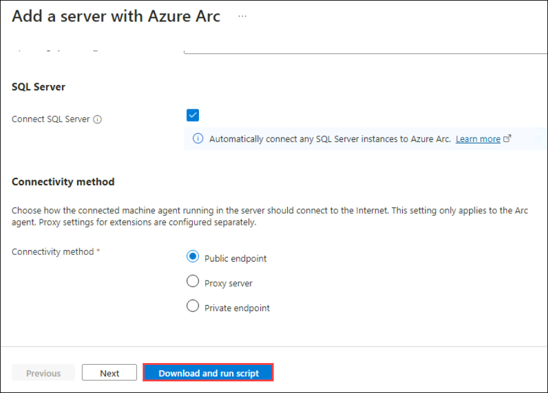

1. Scroll down and select the **Download** button. **Hint:** if your browser blocks the download, take action in the browser to allow it.

   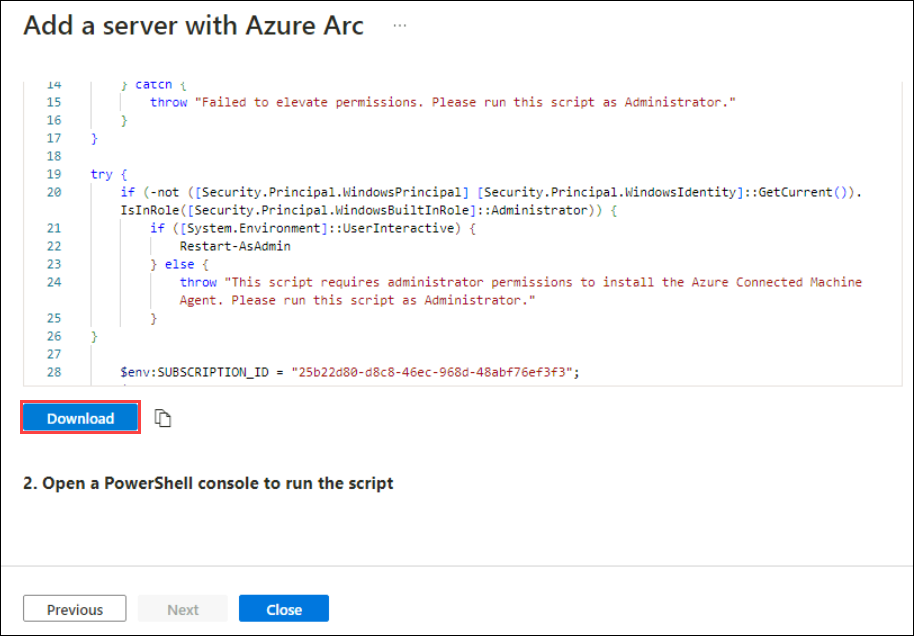

1. In Microsoft Edge Browser, select the ellipsis button (...) if needed and then select **Keep**.

   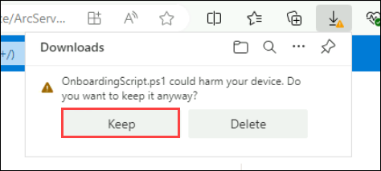
    
1. Right-click the Windows Start button and select **Windows PowerShell (Admin)**.

   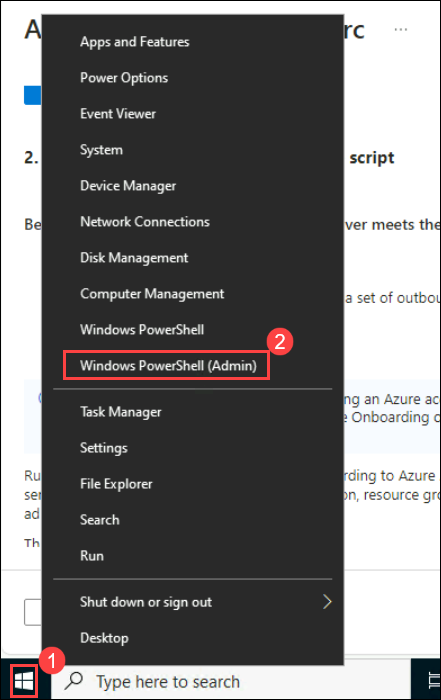

1. Enter *Administrator* for "Username" and *Passw0rd!* for "Password" if you get a UAC prompt.

1. Enter: cd C:\Users\Administrator\Downloads

    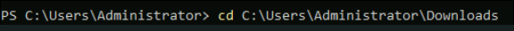

    >**Important:** If you do not have this directory, most likely means that you are in the wrong machine. Go back to the beginning of Task 4 and change to WINServer and start over.

1. Type *Set-ExecutionPolicy -ExecutionPolicy Unrestricted* and press enter.

1. Enter **A** for Yes to All and press enter.

    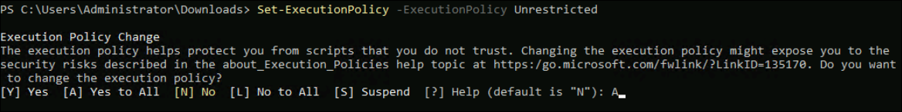

1. Type *.\OnboardingScript.ps1* and press enter. 

    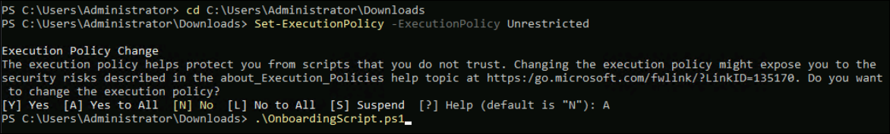

    >**Important:** If you get the error *"The term .\OnboardingScript.ps1 is not recognized..."*, make sure you are doing the steps for Task 4 in the WINServer virtual machine. Other issue might be that the name of the file changed due to multiple downloads, search for *".\OnboardingScript (1).ps1"* or other file numbers in the running directory.

1. Enter **R** to Run once and press enter (this may take a couple minutes).

    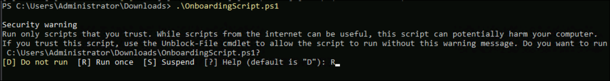

1. The setup process opens a new Microsoft Edge browser tab to authenticate the Azure Arc agent. Select your admin account, wait for the message "Authentication complete" and then go back to the Windows PowerShell window.

    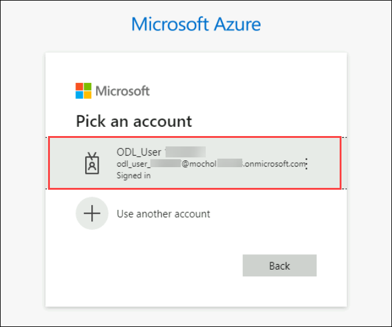

1. When the installation finishes, go back to the Azure portal page where you downloaded the script and select **Close**. Close the **Add servers with Azure Arc** to go back to the Azure Arc **Machines** page.

    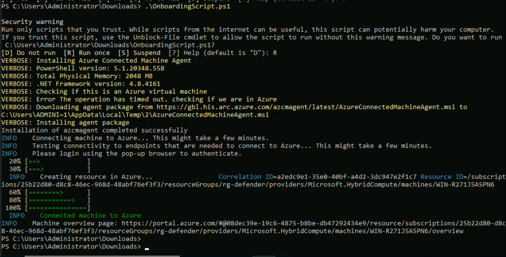

1. Select **Refresh** until WINServer server name appears and the Status is *Connected*.
  
    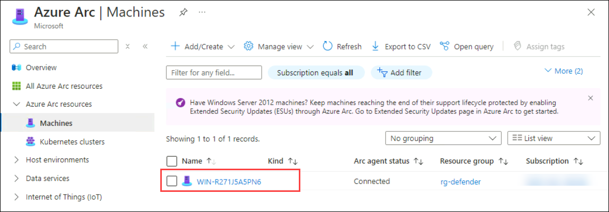

    >**Note:** This could take a couple of minutes.

    > **Congratulations** on completing the task! Now, it's time to validate it. Here are the steps:
    > - Hit the Validate button for the corresponding task. You can proceed to the next task if you receive a success message.
    > - If not, carefully read the error message and retry the step, following the instructions in the lab guide.
    > - If you need any assistance, please contact us at labs-support@spektrasystems.com. We are available 24/7 to help you out.

      <validation step="18d5bcdd-1127-45e5-a67e-66311175135e" />

## Select **Next** to continue to Lab 2.
