# Module 5 - Lab 1 - Exercise 2 - Mitigate threats using Microsoft Defender for Cloud

## Lab scenario

You're a Security Operations Analyst working at a company that implemented Microsoft Defender for Cloud. You need to respond to security alerts generated by Microsoft Defender for Cloud.

>**Important:** The lab exercises for Learning Path #5 are in a *standalone* environment. If you exit the lab before completing it, you will be required to re-run the configurations again.

## Lab objectives

In this lab, you will perform the following:
- Task 1: Explore Regulatory Compliance
- Task 2: Explore Security posture and recommendations
- Task 3: Mitigate security alerts
  
## Estimated timing: 20 minutes

## Architecture Diagram

  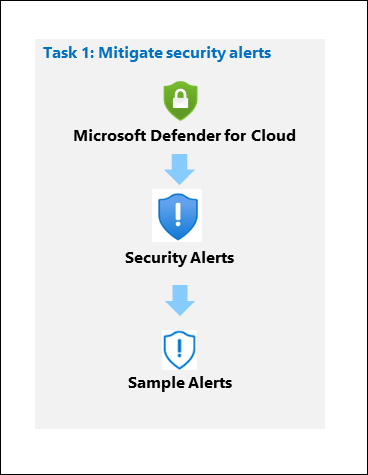
  
### Task 1: Explore Regulatory Compliance

In this task, you will load sample security alerts and review the alert details.  

1. In the Search bar of the Azure portal, type *Defender*, then select **Microsoft Defender for Cloud**.

1. Under *Cloud Security*, select **Regulatory compliance** in the portal menu.

1. Select **Manage compliance standards** on the toolbar.

1. Select your subscription.

   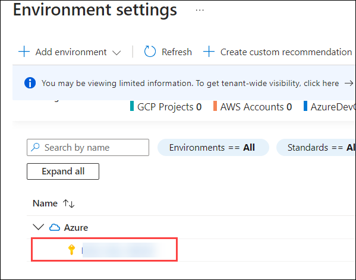

1. On the **Defender plans** page enable **Defender CSPM** and Click on **Save**.
 
   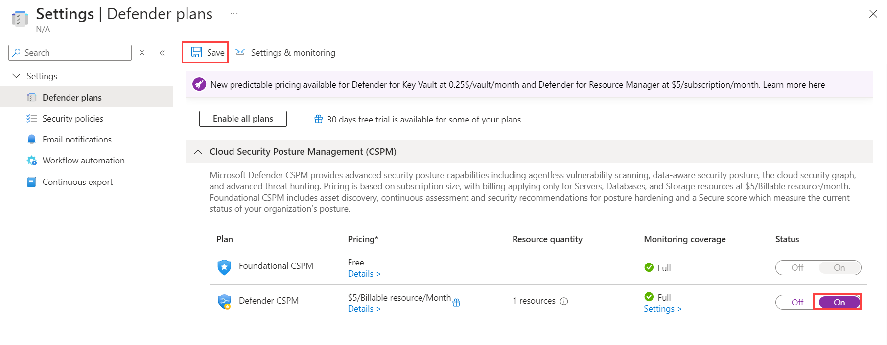

1. On the left menu Under *Policy settings*, select **Security policies** in the portal menu.

1. Review the **Microsoft security benchmark** available to you by default.

   

1. Select Microsoft Defender for Cloud below the search box to return to the main blade.

### Task 2: Explore Security posture and recommendations (Read-Only)

In this task, you'll review cloud security posture management.  The Secure Score information can take 24 hours to recalculate. It's recommended to do this task again in 24 hours.

1. Under *Cloud Security*, select **Security posture** from the left menu items.

   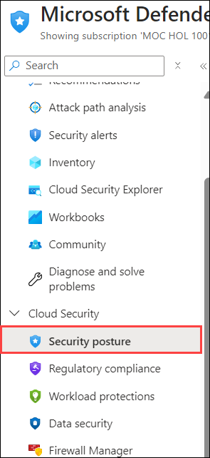

1. The *Secure score* defaults to the *Azure environment*.

1. Under the *Environment* tab, select **View recommendations >** link.

   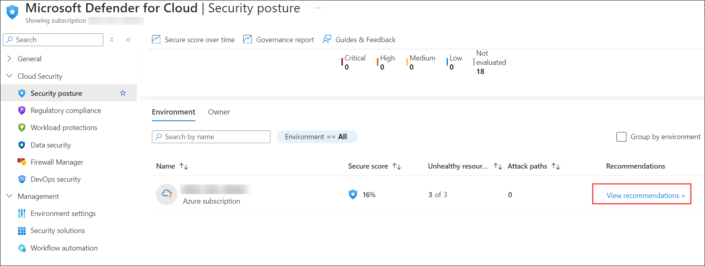

1. Select **Add filter** and then select **Resource type**.

   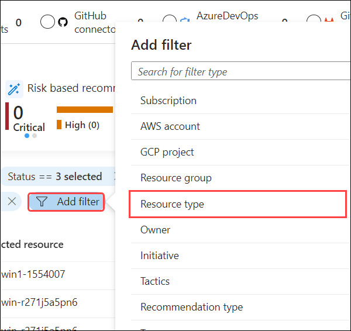

1. Select the **Machines - Azure Arc** checkbox and then select the **Apply** button.

   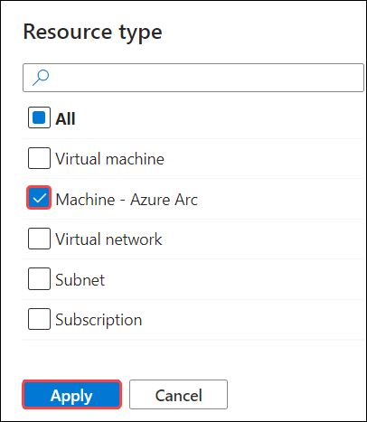

    >**Note:** If you don't see **Machines - Azure Arc** listed, make sure you have completed Learning Path 3 - Lab 1 - Exercise 1 Task 4..

1. Select any recommendation where the status isn't *"Completed"*.

1. Review the recommendation and in the **Take action** tab scroll down to **Delegate** and select **Assign owner & set due date**.

   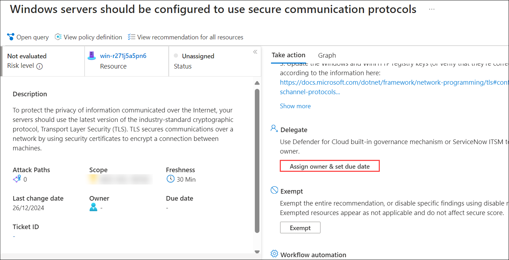

1. In the **Create assignment** window, leave *Type* set to *Defender for Cloud* and expand the **Assignment details**.

   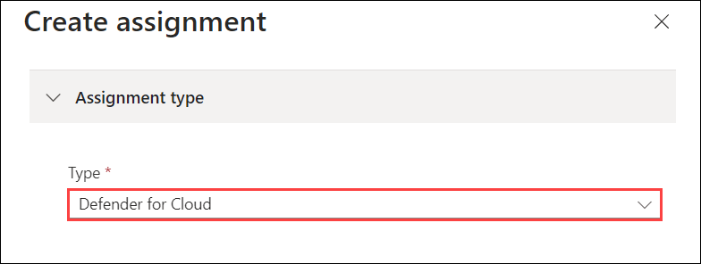

1. In the `Set owner` *Email address* box, enter **<inject key="AzureAdUserEmail"></inject>** . **Hint:** You can copy it from the instructions in the *Resources* tab.

1. Explore the *Set remediation timeframe* and *Set email notifications* options and select **Create (2)**.

   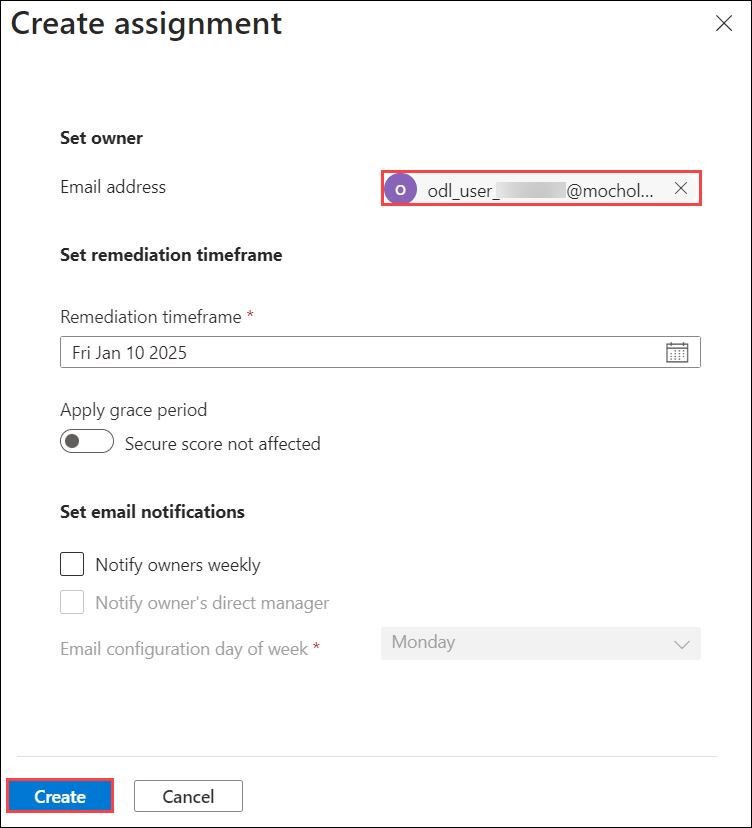

    >**Note:** If you see the error *Failed to create requested assignments*, try again later.

1. Close the recommendation page by selecting the 'X' on the upper right of the window.

### Task 3: Mitigate security alerts

In this task, you'll load sample security alerts and review the alert details.

1. Under *General*, select **Security alerts** in the portal menu.

1. Select **Sample alerts** from the command bar. **Hint:** you may need to select the ellipsis (...) button from the command bar.

   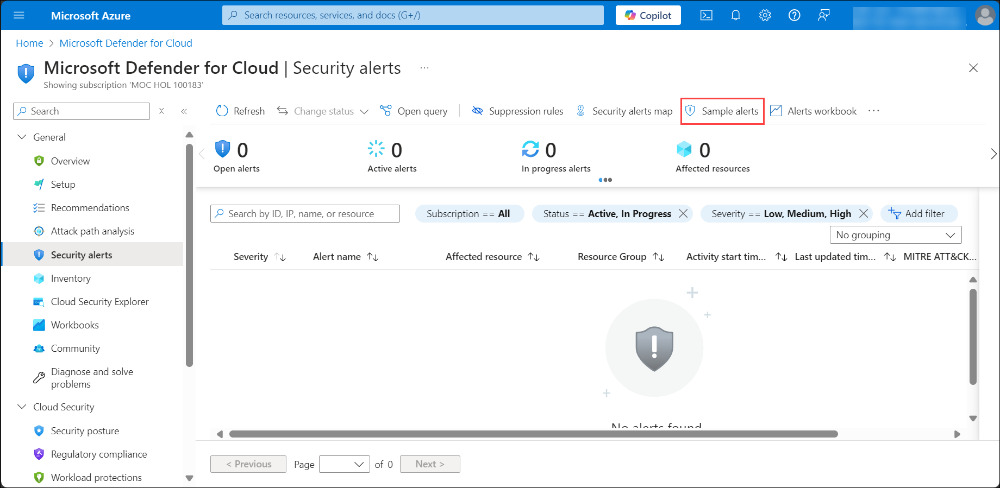

1. In the Create sample alerts (Preview) pane make sure your subscription is selected and that all sample alerts are selected in the *Defender for Cloud plans* area.

1. Select **Create sample alerts**.  

    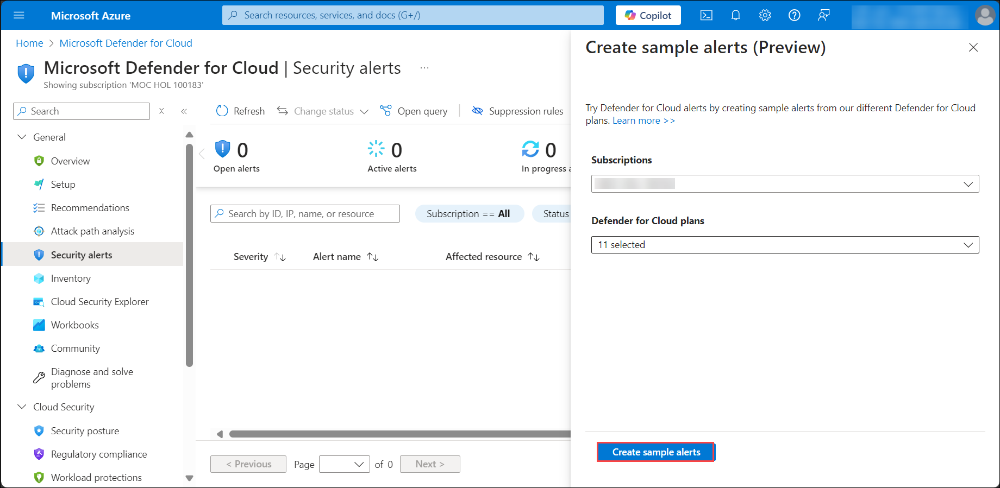

    >**Note:** This sample alert creation process may take a few minutes to complete, wait for the *"Successfully created sample alerts"* notification.

1. Once completed, select **Refresh** (if needed) to see the alerts appear under the *Security alerts* area.

1. Choose an interesting alert with a *Severity* of *High* and perform the following actions:

    - Select the alert checkbox and the alert detail pane should appear. Select **View full details**.

      

    - Review and read the *Alert details* tab.

    - Select the **Take action** tab..

       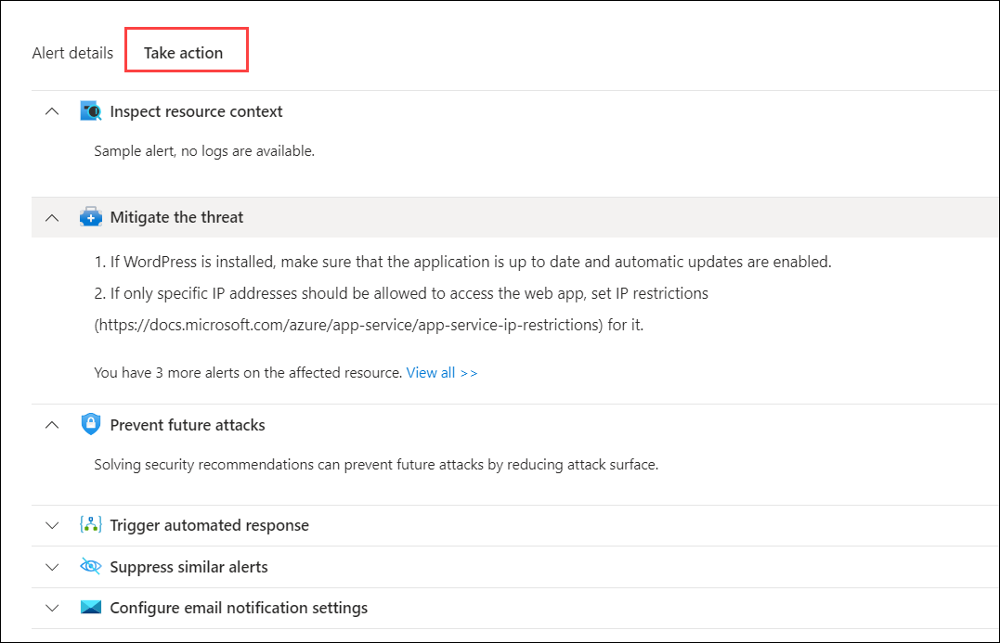

    - Review the *Take action* information. Notice the sections available to take action depending on the type of alert: Inspect resource context, Mitigate the threat, Prevent future attacks, Trigger automated response and Suppress similar alerts.

## Review

In this lab, you have completed the following:
- Explored Regulatory Compliance
- Explored Security posture and recommendations
- Mitigated security alerts

## You have successfully completed the lab. 