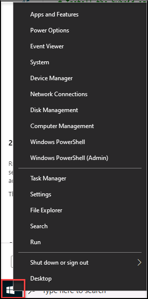

# Module 6 - Lab 1 - Exercise 2 - Connect Windows devices to Microsoft Sentinel using data connectors
 
### Task 1: Create a Windows Virtual Machine in Azure

In this task, you will create a Windows virtual machine in Azure.  

 1. Login to WIN1 virtual machine with the password as provided in the environment tab.

 1. In the Edge browser, navigate to the Azure portal at https://portal.azure.com.

 1. In the **Sign in** dialog box, copy, and paste in the **Tenant Email** account provided by your lab hosting provider and then select **Next**.

 1. In the **Enter password** dialog box, copy, and paste in the **Tenant Password** provided by your lab hosting provider and then select **Sign in**.

 1. Select **+ Create a Resource**. **Hint:** If you were already in the Azure Portal, you might need to select *Microsoft Azure* from the top bar to go Home.

 1. In the **Search services and marketplace** box, enter *Windows 10* and select **Microsoft Window 10** from the drop-down list.

 1. Open the *Plan* drop-down list and select **Windows 10 Enterprise, version 21H2**. Select **Start with a pre-set configuration** to continue.

 1. On **Create a virtual machine** page select create new on *Resource group*, enter RG-AZWIN01 as Name and select **OK**.

    >**Note:** This will be a new resource group for tracking purposes. 

  1. In *Virtual machine name*, enter AZWIN01.

  1. Leave **(US) East US** as the default value for *Region*.

  1. Scroll down and review the *Size* for the virtual machine. If it appears empty, select **See all sizes**, choose the first VM size under *Most used by Azure users* and click **Select**.

  1. Enter a *Username* as **azureuser**.

  1. Enter a *Password* as **Password.1!!**

  1. Scroll down to the bottom of the page and select the checkbox below *Licensing* to confirm you have the eligible license.

  1. Select **Review + create** and wait until the validation is passed.

  1. Select **Create**. Wait for the Resource to be created, this may take a few minutes.

### Task 2: Connect an Azure Windows virtual machine

In this task, you will connect an Azure Windows virtual machine to Microsoft Sentinel.

 1. In the Search bar of the Azure portal, type *Sentinel*, then select **Microsoft Sentinel**.

 1. Select your Microsoft Sentinel Workspace you created earlier.

 1. Select **Data Connector** from configuration area.

 1. From the Data Connectors Tab, search for the **Windows Security Events via AMA(Preview)** connector and select it from the list.

 1. Select the **Open connector page** on the connector information blade.

 1. In the **Configuration** section, select the **+Create data collection rule**.

 1. Enter **AZWIN01DCR** for Rule Name, then select **Next: Resources**.

 1. Select **+Add resource(s)**.

 1. Expand **RG-AZWIN01**, then select **AZWIN01**.

 1. Select **Apply**.

 1. Select **Next: Collect**, then **Next: Review + create**.

 1. Select **Create**.

 1. Wait a minute and then select **Refresh** to see the new data collection rule listed.

### Task 3: Connect a non-Azure Windows Machine

In this task, you will install Azure Arc and connect a non-Azure Windows virtual machine to Microsoft Sentinel.  

   >**Important:** The next steps are done in a different machine than the one you were previously working. Look for the Virtual Machine name references.

   >**Important:** The *Windows Security Events via AMA* data connector requires Azure Arc for non-Azure devices. 

 1. In the lab virtual machine, search for **Hyper-V Manager** from the bottom windows search bar and select to open.

 1. Select and right-click on the **WIN2** virtual machine and select start, then again right-click on the **WIN2** virtual machine and select **connect**.

 1. Enter the **Password** as `Password.1!!` when prompted.

 1. Open the Microsoft Edge browser.

 1. Open a browser and log into the Azure Portal at https://portal.azure.com with the credentials you have been using in the previous labs.

 1. In the **Sign in** dialog box, copy, and paste in the **Tenant Email** account provided by your lab hosting provider and then select **Next**.

 1. In the **Enter password** dialog box, copy and paste in the **Tenant Password** provided by your lab hosting provider and then select **Sign in**.

 1. In the Search bar of the Azure portal, type *Arc*, then select **Azure Arc**.

 1. In the navigation pane under **Infrastructure** select **Servers**

 1. Select **+ Add**.

 1. Select **Generate script** in the "Add a single server" section.

     

 1. Select **Next** to get to the Resource details tab.

 1. Select the Resource group you created earlier. **Hint:** *RG-Defender*

    >**Note:** If you haven't already created a resource group, open another tab and create the resource group and start over.

 1. Review the *Server details* and *Connectivity method* options. Keep the default values and select **Next** to get to the Tags tab.

 1. Select **Next** to get to the Download and run script tab.

 1. Scroll down and select the **Download** button. **Hint:** if your browser blocks the download, take action in the browser to allow it. In Edge Browser, select the ellipsis button (...) if needed and then select **Keep**. 

 1. Right-click the Windows Start button and select **Windows PowerShell (Admin)**.

     

     >**Note:** You may need to search for **Windows PowerShell**. In the search box type in **PowerShell**. You should see the **Windows PowerShell App** appear. Select the **Run as Administrator** option.

 1. In case you get a UAC prompt, enter *Administrator* for "Username" and *Passw0rd!* for "Password", else skip to the next step.

 1. Enter: **cd C:\Users\Administrator\Downloads**

 1. Type **Set-ExecutionPolicy -ExecutionPolicy Unrestricted** and press enter.

 1. Enter **A** for Yes to All and press enter.

 1. Type *.\OnboardingScript.ps1* and press enter.  

    >**Important:** If you get the error *"The term .\OnboardingScript.ps1 is not recognized..."*, make sure you are doing the steps for Task 3 on the WIN2 virtual machine. Another issue might be that the name of the file changed due to multiple downloads, search for *".\OnboardingScript (1).ps1"* or other file numbers in the running directory.

 1. Enter **R** to Run once and press enter (this may take a couple of minutes).

 1. The setup process will open a new Edge browser tab to authenticate the Azure Arc agent. Select your admin account, wait for the message "Authentication complete" and then go back to the Windows PowerShell window.

 1. When the installation finishes, go back to the Azure portal page where you downloaded the script and select **Close**. Close the **Add servers with Azure Arc** to go back to the Azure Arc **Servers** page.

 1. Select **Refresh** until **WIN2**  name appears.

    >**Note:** This could take a few minutes.

 1. In the Search bar of the Azure portal, type *Sentinel*, then select **Microsoft Sentinel**.

 1. Select your Microsoft Sentinel Workspace you created earlier.

 1. From the Data Connectors Tab, search for the **Windows Security Events via AMA** connector and select it from the list.

 1. Select the **Open connector page** on the connector information blade.

 1. In the *Configuration* section, select the **+Create data collection rule**.

 1. Enter **WIN2** for Rule Name, then select **Next: Resources**.

 1. Select **+Add resource(s)**.

 1. Expand **rg-defender** (or the Resource Group you are created), then select **WIN2**.

 1. Select **Apply**.

 1. Select **Next: Collect**, then **Next: Review + create**.

 1. Select **Create**.

1. Wait a few minutes and then select **Refresh** to see the new data collection rule listed.

### Task 4: Onboard Microsoft Defender for Endpoint Device

 In this task, you will onboard a device to Microsoft Defender for Endpoint.

 >**Important:** The next steps are done on a different machine than the one you were previously working on. Look for the Virtual Machine name references.

1. Login to WIN1 virtual machine with the password as provided in the environment tab.  

1. In the Edge browser, go to the Microsoft 365 Defender portal at (https://security.microsoft.com) and log in with the **Tenant Email** credentials if you are not currently in the portal.

1. Select **Settings** from the left menu bar, then from the Settings page select **Endpoints**.

      >**Note:** If you do not see the **Endpoints** option under **Settings**, log out by selecting the top-right circle with your account initials and selecting **Sign out**. Other options that you might want to try is to refresh the page with Ctrl+F5 or open the page InPrivate. Login again with the **Tenant Email** credentials.

1. Select **Onboarding** in the Device management section.

 1. In the "1. Onboard a device" area make sure "Local Script (for up to 10 devices)" is displayed in the Deployment method drop-down and select the **Download onboarding package** button. 

1. Under the *Downloads* pop-ipup, highlight the "WindowsDefenderATPOnboardingPackage.zip" file with your mouse and select the folder icon **Show in folder**. **Hint:** In case you don't see it, the file should be in the c:\users\admin\downloads directory.

1. Right-click the downloaded zip file and select **Extract All...**, make sure that *Show extracted files when complete* is checked and select **Extract**.

1. Right-click on the extracted file "WindowsDefenderATPLocalOnboardingScript.cmd" and select **Properties**. Select the **Unblock** checkbox in the bottom right of the Properties windows and select **OK**.

1. Right-click on the extracted file "WindowsDefenderATPLocalOnboardingScript.cmd" again and choose **Run as Administrator**.  **Hint:** If you encounter the Windows SmartScreen window, select on **More info**, and choose **Run anyway**. 
    
1. When the "User Account Control" window is shown, select **Yes** to allow the script to run and answer **Y** to the question presented by the script and press **Enter**. When complete you should see a message in the command screen that says *Successfully onboarded machine to Microsoft Defender for Endpoint*.

1. Press any key to continue. This will close the Command Prompt window.

1. Back in the Onboarding page from the Microsoft 365 Defender portal, under the section "2. Run a detection test", copy the detection test script by selecting the **Copy** button.  

1. In the windows search bar of the WIN1 virtual machine, type **CMD** and choose to **Run as Administrator** on the right pane for the Command Prompt app. 

1. When the "User Account Control" window is shown, select **Yes** to allow the app to run. 

1. Paste the script by right-clicking in the **Administrator: Command Prompt** windows and press **Enter** to run it. **Note:** The window closes automatically after running the script.

1. In the Microsoft 365 Defender portal, in the left-hand menu, under the **Assets** area, select **Devices**. If the device is not shown, complete the next task and come back to check it back later. It can take up to 60 minutes for the first device to be displayed in the portal.

    >**Note:** If you have completed the onboarding process and don't see devices in the Devices list after an hour, it might indicate an onboarding or connectivity problem.

## Proceed to Exercise 3
