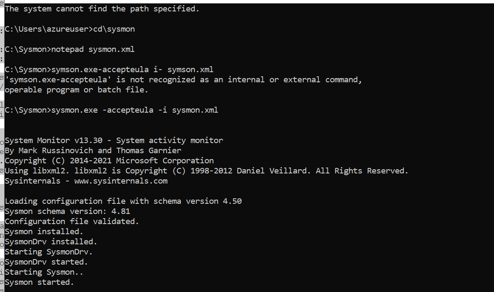
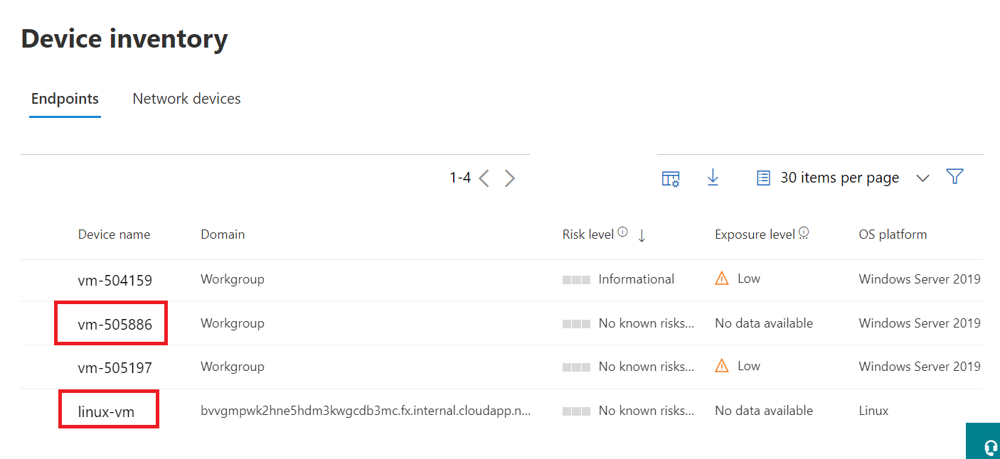

# Module 6 - Lab 1 - Exercise 2 - Connect Windows devices to Microsoft Sentinel using data connectors
 
### Task 1: Connect an Azure Windows virtual machine.

In this task, you will connect an Azure Windows virtual machine to Microsoft Sentinel.

1. In the Search bar of the Azure portal, type **Sentinel**, then select **Microsoft Sentinel**.

1. Select your Microsoft Sentinel Workspace you created earlier.

1. From the Data Connectors Tab, search for the **Security Events via Legacy Agent** connector and select it from the list.

1. Select **Open connector page** on the connector information blade.

1. Select the **Install agent on Azure Windows Virtual Machine** option.

1. Select **Download & install agent for Azure Windows Virtual machines**.

1. Select the **WIN2-DID** virtual machine in the list that was pre-created by the Lab provider, then select **Connect**. Wait until the *connecting...* message disappears.

1. Close the window by selecting the 'x' to go back to **Virtual machines** view. You should now see the virtual machine has a *Log Analytics Connection* to "This workspace".

### Task 2: Connect a non-Azure Windows Machine.

In this task, you will connect a non-Azure Windows virtual machine to Microsoft Sentinel.

1. Login to WIN2 virtual machine as Admin with the password: **Pa55w.rd**.  

1. Open the Microsoft Edge browser.

1. Open a browser and log into the Azure Portal at https://portal.azure.com with the credentials you've been using in the previous labs.

1. In the Search bar of the Azure Portal, type *Sentinel*, then select **Microsoft Sentinel**.

1. Select your Microsoft Sentinel Workspace.

1. In the Configuration area select **Data connectors**. In the Data Connectors page, search for the **Security Events via Legacy Agent** connector and select it from the list.

1. Select **Open connector page** on the connector information blade.

1. In the Select which events to stream area, select **All Events**, then select **Apply Changes**.

1. Select the **Install agent on a non-Azure Windows Machine**.

1. Select **Download & install agent for non-Azure Windows machines**. 

1. Select the link for **Download Windows Agent (64 bit)**.

1. Open the *MMASetup-AMD64.exe* file that is downloaded and select **Yes** to allow the executable to run in the User Account Control window that appears.

1. Select **Next** on the Welcome dialog.

1. Select **I Agree** on the Microsoft Software License Terms page.  On the Destination prompt select **Next**.

1. On the Agent Setup Options prompt, select **Connect the agent to Azure Log Analytics (OMS)** option, then select **Next**.

1. In the browser with Microsoft Sentinel open, copy the **Workspace ID** from the Agents Management page and paste into the Workspace ID in the dialog. 

1. In the browser with Microsoft Sentinel open, copy the **Primary key** from the Agents Management page and paste into the Workspace key in the dialog. 

1. Select **Next**.

1. Select **Next** on the Microsoft Update page.

1. Then select **Install**.  When complete select **Finish**.

### Task 3: Install and collect Sysmon logs.

In this task, you will install and collect Sysmon logs.

   **Important:** You should still be connected to the WIN2 virtual machine. The following instructions will install Sysmon with the default configuration. You should research community-based configurations for Sysmon to be used on production machines.

1. Open a new tab in the browser, go to https://docs.microsoft.com/sysinternals/downloads/sysmon

1. Download Sysmon from the page by selecting **Download Sysmon**.

1. Hover the *Sysmon.zip* and select the folder icon. Right-click the downloaded file and select **Extract All...** enter *C:\Sysmon* under **Files will be extracted to this folder** and select **Extract**. 

1. In the Windows Taskbar for WIN2 search box, enter *command*.  The search results will show Command Prompt app.  Right-click on the Command Prompt app and select **Run as Administrator**.  Select **Yes** to allow the app to run in the User Account Control window that appears.

1. Enter *cd \sysmon*

1. Type *notepad sysmon.xml* to create a new file. Select **Yes** to confirm the file creation.

1. Open a new tab in the browser, go to: https://github.com/SwiftOnSecurity/sysmon-config/blob/master/sysmonconfig-export.xml

1. Select the **Raw** button and copy the contents of that file from GitHub to the sysmon.xml notepad file you just created. Select **File** and then select **Save** to save the file.

1. In the command prompt type the following and press enter:
    **sysmon.exe -accepteula -i sysmon.xml**

    **Note:**  Verify that "Configuration file validated" and "Sysmon started" messages appear in the output. If that is not the case, verify that the data is properly copied and the sysmon.xml has been saved.

    

1. In the browser, navigate back to the Azure portal at https://portal.azure.com 

1. In the Search bar of the Azure portal, type *Sentinel*, then select **Microsoft Sentinel** and select your Microsoft Sentinel Workspace you created earlier.

1. In Microsoft Sentinel, select **Settings** from the Configuration area and then select **Workspace settings >** tab.

1. Make sure your Microsoft Sentinel Workspace is selected.

1. Select **Agents configuration** from the Settings area.

1. Select the **Windows Event logs** tab.

1. Select **Add windows event log** button.

1. Type **Microsoft-Windows-Sysmon/Operational** in the Log name field.

1. Select **Apply**.

### Task 4: Onboard Microsoft Defender for Endpoint Device.

In this task, you will on-board a device to Microsoft Defender for Endpoint.

   **IMPORTANT:** If you completed the labs in the first module of this course AND saved your Virtual Machines you have already performed this task. This means that if you’re using the same virtual machine from that lab exercise you can skip this task.

1. Login to WIN1 virtual machine as Admin with the password: **Pa55w.rd**.  

1. In the Edge browser, go to the Microsoft 365 Defender portal at (https://security.microsoft.com) and login with the **Tenant Email** credentials if you are not currently in the portal.

1. Select **Settings** from the left menu bar, then from the Settings page select **Endpoints**.

1. Select **Onboarding** in the Device management section.

1. Select **Download Package**.

1. Extract the downloaded .zip file.

1. Run the Windows Command Prompt as **Administrator** and agree to any User Account Control prompts that appear.

1. Run the WindowsDefenderATPLocalOnboardingScript.cmd file that you just extracted as administrator. **Note** By default the file should be in the c:\users\admin\downloads directory. Answer Y to questions presented by the script. 

1. From the Onboarding page in the portal, copy the detection test script and run it in an open command window.  You may have to open a new **Administrator: Command Prompt** window by typing *CMD* in the windows search bar and choose to **Run as Administrator**.

1. In the Microsoft 365 Defender portal in the Endpoints area, select **Device inventory**. You should now see your device in the list, If not wait for some time and refresh the page.

    

## Proceed to Exercise 3
