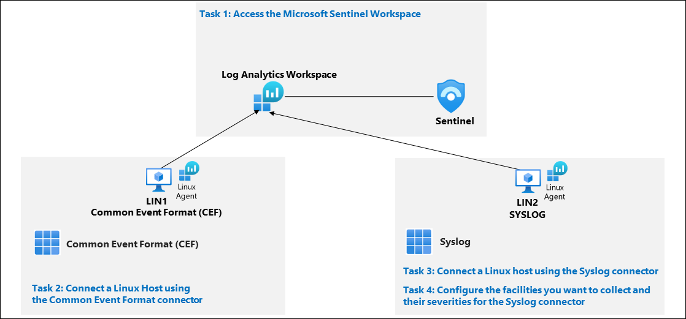
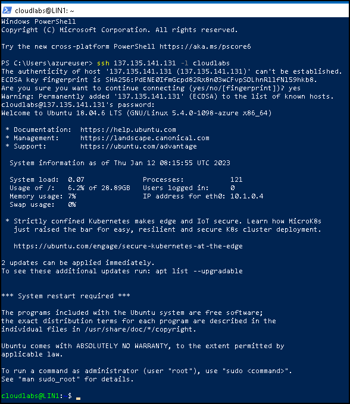
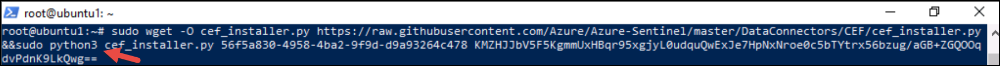
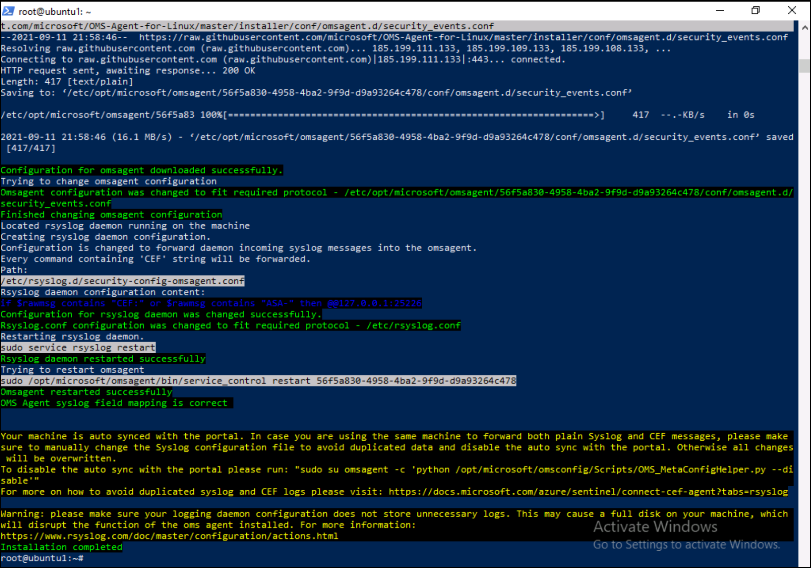
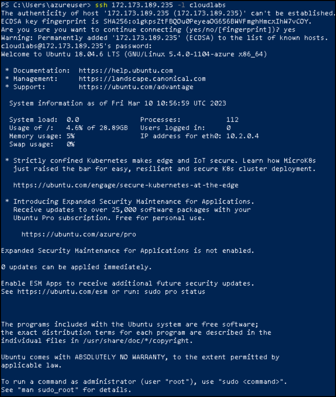

# Module 6 - Lab 1 - Exercise 3 - Connect Linux hosts to Microsoft Sentinel using data connectors

## Lab scenario

You are a Security Operations Analyst working at a company that implemented Microsoft Sentinel. You must learn how to connect log data from the many data sources in your organization. The next source of data is Linux virtual machines using the Common Event Formatting (CEF) via Legacy Agent and Syslog connectors.

>**Important:** There are steps within the next Tasks that are done in different virtual machines. Look for the Virtual Machine name references.

## Lab objectives
 In this lab, you will perform the following: 
- Connect a Linux Host using the Common Event Format connector
- Connect a Linux host using the Syslog connector
- Configure the facilities you want to collect and their severities for the Syslog connector

## Estimated timing: 40 minutes

## Architecture Diagram

  

### Task 1: Access the Microsoft Sentinel Workspace

In this task, you will access your Microsoft Sentinel workspace.

1. Start the Microsoft Edge browser.

1. In the Edge browser, navigate to the Azure portal at https://portal.azure.com.

1. In the **Sign in** dialog box, copy and paste * Email/Username: <inject key="AzureAdUserEmail"></inject> and then select Next.

1. In the **Enter password** dialog box, copy and paste * Password: <inject key="AzureAdUserPassword"></inject> and then select **Sign in**.

1. In the Search bar of the Azure portal, type *Sentinel*, then select **Microsoft Sentinel**.

1. Select the Microsoft Sentinel Workspace you created in a previous lab.

### Task 2: Connect a Linux Host using the Common Event Format connector

In this task, you will connect a Linux host to Microsoft Sentinel with the Common Event Format (CEF) connector.

1. Select **Data connectors** from the Configuration area in Microsoft Sentinel.

1. Go to content hub and search **Common Event Format** and click on install

1. From the Data Connectors tab, search for the **Common Event Format (CEF) via Legacy agent** connector and select it from the list.

1. Select the **Open connector page** on the connector information blade.

1. Under configuration Copy the command shown in **1.2 Install the CEF collector on the Linux machine** and paste it on the Notepad.

1. Back to the Azure portal, In the Search bar of the Azure portal, type **virtual machine**, then select **Virtual machine**.

1. Open LIN1 Linux virtual machine and copy the **Public IP address** of LIN1 and paste on the notepad.

1. Go back to the WIN1 virtual machine. launch Windows PowerShell as Administrator by right clicking the Start menu icon and selecting **Windows PowerShell (Admin)**. Select **Yes** to allow the app to run in the User Account Control window that appears.

1. Enter the following PowerShell command, adjusting for your specific Linux server information, and press enter:

    ```PowerShell
    ssh insert your Linux IP address here -l insert Linux user name here
    ```
    
     >**Note**: Replace **insert your linux IP address** here with pasted on the notepad Public Ip address of **LIN1** and **insert linux username here** with **Admin Username** provided under Resource group: **LIN1** in the **Environment Details** page of the lab guide.

1. Enter **yes** to confirm the connection and then type the user's **password provided under Resource group: LIN1** in the Environment tab and press enter. Your screen should look something like this:

   

1. You are now ready to paste in the **1.2 Install the CEF collector on the Linux machine** from the earlier step. Make sure that the script from Azure is in the clipboard. In PowerShell right-click the top bar and choose **Edit** and then **Paste**. Once pasted add a **3** to the word *python* as shown below:

   
   
    >**Note:** You can also copy from the notepad you have pasted earlier.

1. Once the script is pasted in and adjusted press enter. The script will run against your Linux server remotely. When the script processes properly it should look like this screen:

   

### Task 3: Connect a Linux host using the Syslog connector

In this task, you will connect a Linux host to Microsoft Sentinel with the Syslog connector.

1. Go back to the Edge browser. 

1. In the Search bar of the Azure portal, type **Sentinel**, then select **Microsoft Sentinel**.

1. Select the Microsoft Sentinel Workspace you created in a previous lab.

1. Go-to content hub in data connector window search for **syslog** and install it.
  
1. From the **Data Connectors tab**, search for the **Syslog** connector and select it from the list.

1. Select the **Open connector page** on the connector information blade.

1. Under **Configuration**, open the **Install agent on a non-Azure Linux Machine** section.

1. Select the link for **Download & install agent for non-Azure Linux machine**. 

    >**Note:** Your Log Analytics workspace should show **2 Windows computers connected**. This corresponds to WIN2 and AZWIN01 virtual machines connected earlier.

1. Select the tab for **Linux servers**.

    >**Note:** Your Log Analytics workspace should show **1 Linux computers connected**. This corresponds to the LIN1 (ubuntu1) virtual machine connected earlier with the CEF connector.

1. Select **Log Analytics agent instructions**.

1. Copy the command in the **Download and onboard agent for Linux** area to the clipboard and paste it into the notepad.
   
1. Open LIN2 Linux virtual machine and copy the Public IP address of **LIN2** paste on the notepad.

1. Go back to the WIN1 virtual machine, and launch a NEW Windows PowerShell as Administrator by right-clicking the Start menu icon and selecting **Windows PowerShell (Admin)**. Select **Yes** to allow the app to run in the User Account Control window that appears.

   >**Note:** You can reuse the Windows PowerShell window if the **Installation completed** for the last task by entering **exit** to close the connection to LIN1.

1. Enter the following PowerShell command, adjusting for your specific Linux server information, and press enter:

    ```PowerShell
    ssh insert-your-linux-IP-address-here -l insert-linux-user-name-here
    ```

    >**Note**: Replace **insert your linux IP address here** with pasted on the notepad Public Ip address of **LIN2** and **insert linux username here** with **Admin Username** provided under Resource group: **LIN2** in the Environment tab
   
1. Enter **yes** to confirm the connection and then type the user's **password provided under Resource group: LIN2** in the Environment tab and press enter. Your screen should look something like this:

   

1. You are now ready to paste in the **Download and onboard agent for Linux** from the earlier step. Make sure that the script from Azure is in the clipboard. In PowerShell right-click the top bar and choose **Edit** and then **Paste**. 

   >**Note:** You can also copy from the notepad you have pasted earlier.

1. Once the script is pasted in press enter. The script will run against your Linux server remotely. You have completed the task. No further labs in this course rely on this connection.

### Task 4: Configure the facilities you want to collect and their severities for the Syslog connector

In this task, you will configure the Syslog collection facilities.

1. Go back to the Edge browser where you have your Microsoft Sentinel Portal open and close the "Log Analytics workspace" page and the "Syslog" data connector page by selecting the 'x' in the top right corner twice.

1. In Microsoft Sentinel portal, select **Settings** from *Configuration* area and then select **Workspace settings** from the settings blade.

1. On the left menu Select **Legacy agents management** from the **Classic** area.

1. Select the **Syslog** tab.

1. Select the **+ Add facility** button.

1. Select **auth** from the drop-down menu for **Facility name**.

1. Select the **+ Add facility** button again.

1. Select **authpriv** from the drop-down menu for **Facility name**.

1. Select **Apply**.  You have completed this task.

   >**Note:** If you have not performed task 5 in exercise 1 because Licenses take some time to reflect then please go back to page 2 and perform task 5 to successfully complete this lab.

## Review 
In this lab, you have completed the following:
- Connected to a Linux Host using the Common Event Format connector
- Connect to a Linux host using the Syslog connector
- Configured the facilities you want to collect and their severities for the Syslog connector

## You have successfully completed this lab.
