# Module 7 - Lab 1 - Exercise 9 - Use Repositories in Microsoft Sentinel

## Lab scenario

You are a Security Operations Analyst working at a company that implemented Microsoft Sentinel. You already created Scheduled and Microsoft Security Analytics rules.  You need to centralize analytical rules in an Azure DevOps repository.  Then connect Sentinel to the Azure DevOps repository and import the content. 

## Objectives

After you complete this Exercise, you will be able to:

-   Task 1: Create and export an analytical rule
-   Task 2: Create our Azure DevOps environment
-   Task 3: Connect Sentinel to Azure DevOps.

### Task 1: Create and export an analytical rule

In this task, you will enable Entity behavior analytics in Microsoft Sentinel.

1. log in to the WIN1 virtual machine with the password provided in the environment tab.

1. In the Edge browser, navigate to the Azure portal at https://portal.azure.com.

   >**Note:** If prompted to sign in, In the **Sign in** dialog box, copy and paste the **Username** and **Password** from the Environment tab and select **Sign in**.

1. In the Search bar of the Azure portal, type *Sentinel*, then select **Microsoft Sentinel**.

1. Select your Microsoft Sentinel Workspace.

1. Select **Analytics (1)** from the Configuration area then click on **+ Create (2)** drop down and then select **Scheduled query rule (3)**.

    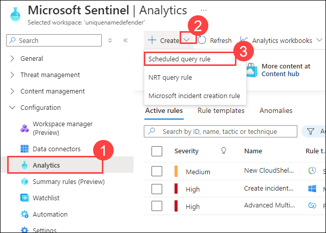

1. In the Analytics rule wizard, on the General tab, 

    - Enter the Name **Rule from Azure DevOps (1)**.

    - For MITRE ATT&CK, select **Persistence (2)**.

    - For Severity, select **Low (3)**.

    - Select **Next: Set rule logic > (4)** button:

      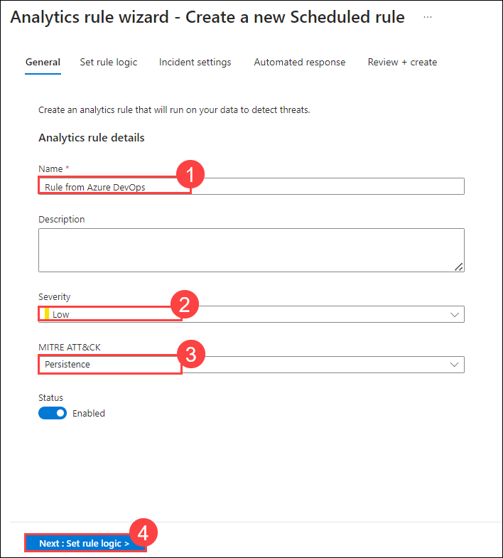

1. For the rule query, paste the following KQL statement:

    >**Warning:** When using the Paste function on the virtual machine extra (pipe) characters could be added. Make sure you use Notepad first to paste the following query.

    ```KQL
    SecurityEvent | where EventID == 4732
    ```

    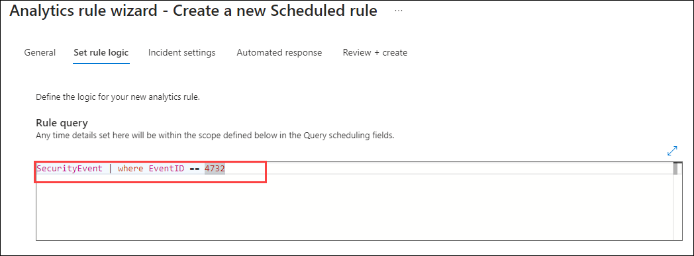    

1. Select **View query results**. You should not receive any results or errors. If you receive an error, please review that the query appears just like the previous KQL statement. Close the *Logs* window by selecting the upper right **X** and select **OK** to discard to save changes to go back to the wizard.

1. Scroll down and under *Query scheduling* set the following:

    |Setting|Value|
    |---|---|
    |Run Query every|5 minutes **(1)**|
    |Look data from the last|1 Day **(2)**|

    >**Note:** We are purposely generating many incidents for the same data. This enables the Lab to use these alerts.

1. Under the *Alert threshold* area, leave the value unchanged since we want the alert to register every event.

1. Under the *Event grouping* area, leave the **Group all events into a single alert (3)** as the selected option since we want to generate a single alert every time it runs, as long as the query returns more results than the specified alert threshold above then click on **Next:Incident settings> (4).**

    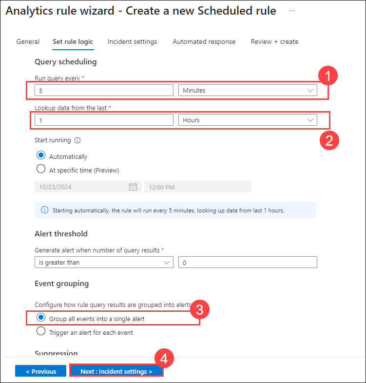

1. Select the **Review+Create >** button.
 
1. Select **Save**.

1. Select the rule just created **(1)**, click on the elipse **(...) (2)** then select **Export (3)** from the toolbar.

   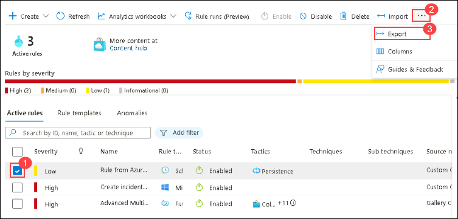

### Task 2: Create our Azure DevOps environment

In this task, you will test create and populate an Azure DevOps repository.

1. Open another tab in the browser.

1. Navigate to https://aexprodcus1.vsaex.visualstudio.com/me?mkt=en-US.

1. On the *We need a few more details* page, select **Continue**.

1. On the *Get started with Azure DevOps* page, select **Create new organization** and the select **Continue**.

    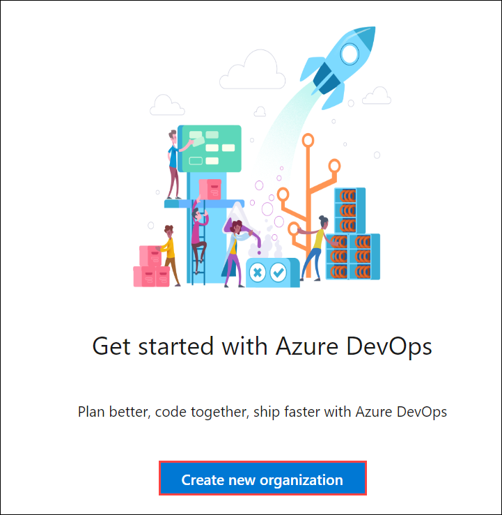

1. On the *Almost done...* page, *Enter characters you see*, then **Continue**.

    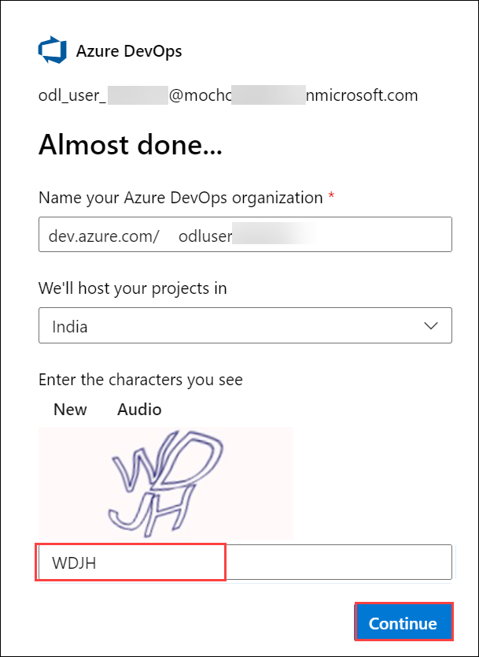

1. On the *Create a project to get started* page, enter **MySentinelContent (1)** as project name and then select **Create project (2)**.

    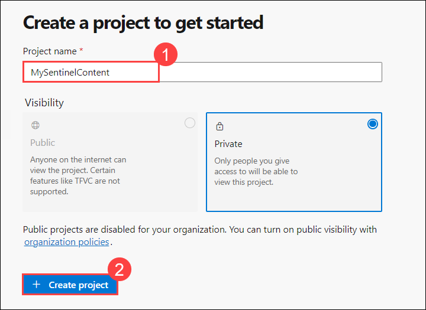

1. Navigate to **Repos (1)** on the left pane.

1. At the bottom of the page in the area *Initialize the main branch with a README or gitignore*, select **Initialize (2)**.

    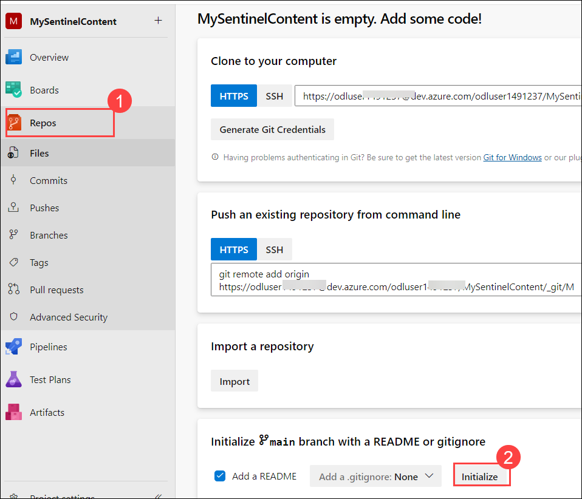

1. The page should show the Files for the Repo. the only file is README.md.

1. On the Files (right side of the page) blade, the toolbar includes options ***Set up build, Clone, and :**

1. Select **: (1)** to show more options and then select **Upload Files (2)**.

    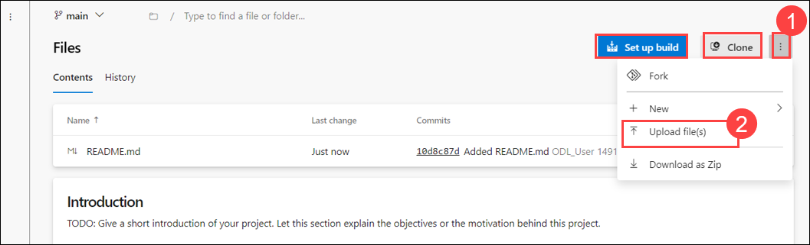

1. Select **Browse (1)** then select the file **Azure_Sentinel_analytic_rule.json (2)** from your *Downloads* directory and then click **Open (3)**

   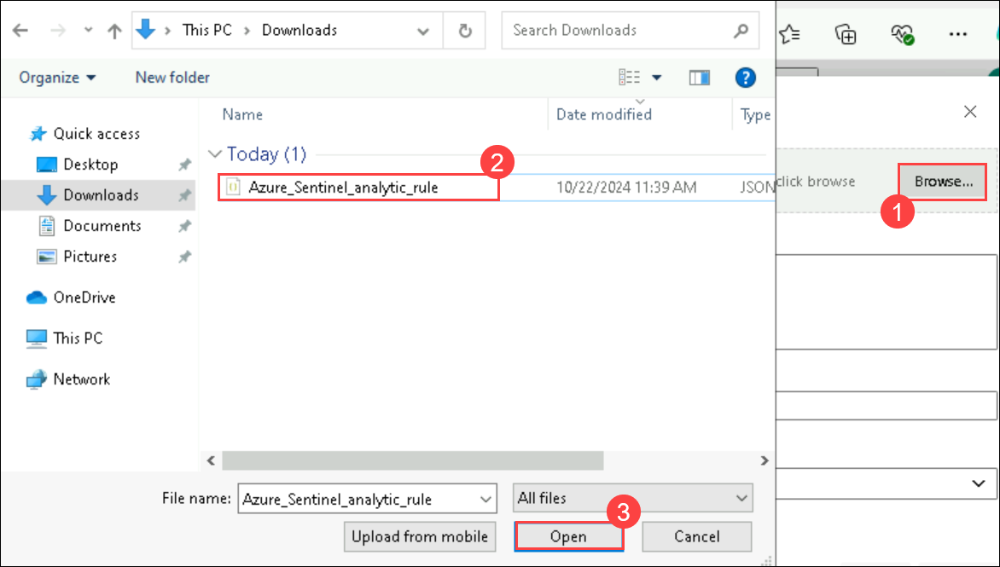

1. Select **Commit**.

1. Select **Azure DevOps** on the top left corner of the page. This displays your organization and projects.

    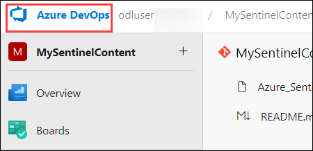

1. Select **Organization settings** from the bottom left of the page.

1. Select **Policies** in the *Security* area.

1. Turn **On** *Third-party application access via OAuth* in the *Application connection policies* area.

    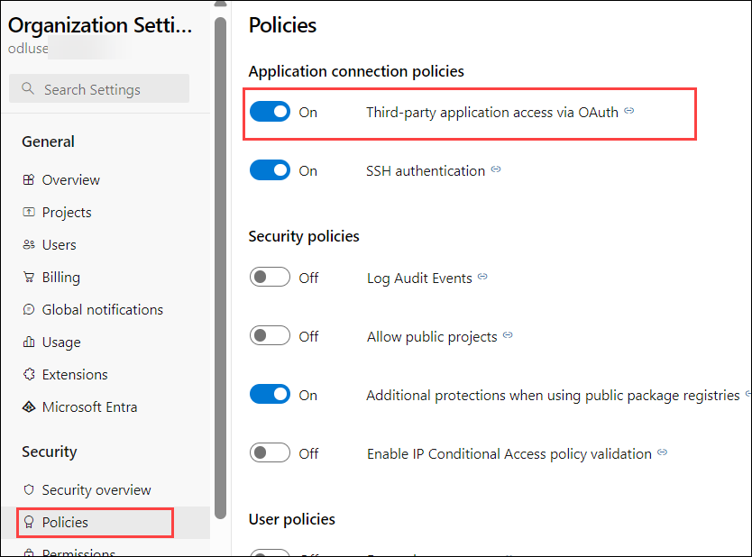

### Task 3: Connect Sentinel to Azure DevOps.

1. Navigate to the **Azure Portal** and search for **Microsoft Sentinel.**

1. Select your Sentinal workspace.

1. In Microsoft Sentinel, select **Repositories (Preview) (1)** in the *Content Management* section and select **Add new (2)** from the toolbar.

    

1. For the name enter **My Content (1)**.

1. For Source control, select **Azure DevOps (2)**.

1. Select **Authorize (3)**. Scroll down the permissions request and then select **Accept**.

    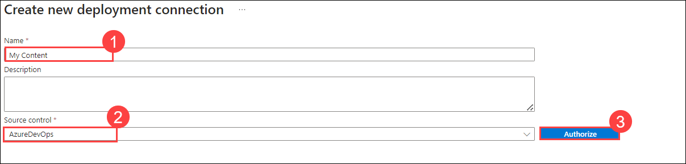

1. Provide the following details then click on **Create (6).**

    - Select the Organization you created earlier (which starts from **odluser**) **(1)**

    - Select the Project you created earlier, **MySentinelContent (2)**

    - Select the Repository you created earlier, **MySentinelContent (3).** Hint: You might need to scroll down within the drop-down to see the repository.

    - Select the Branch **main (4)**. **Hint:** You might need to scroll down within the drop-down to see the branch.

    - Select all content type **(5)**

      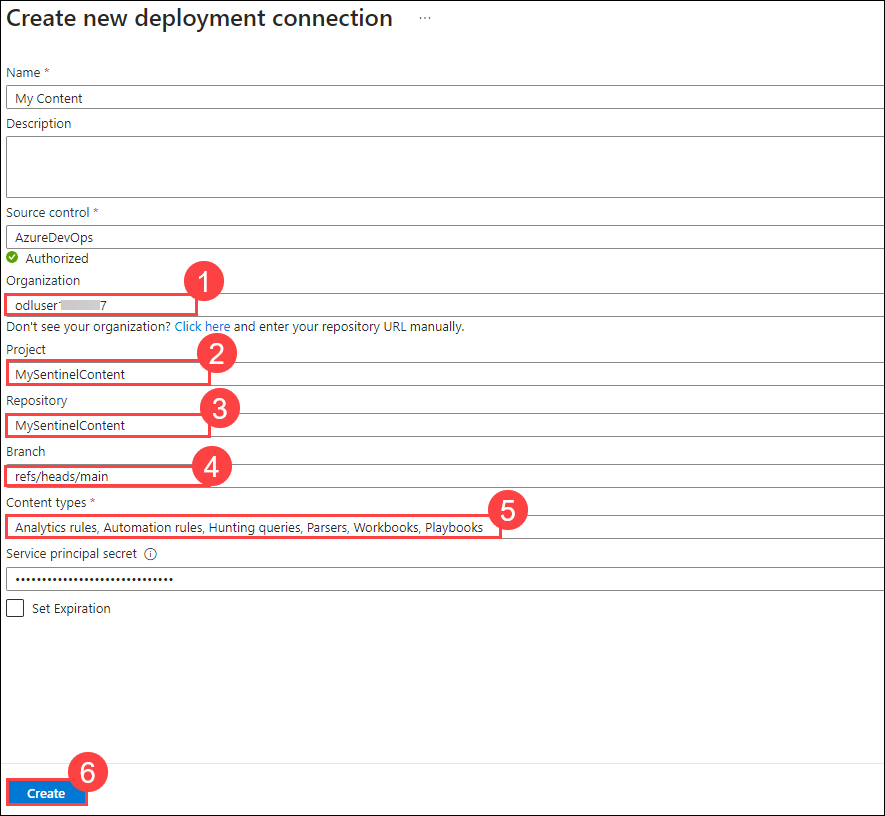

1. Go back to Microsoft Sentinel workspace if needed.

1. Go to the *Repositories (Preview)* page, select **Refresh**. Wait until *Last deployment status* is *Failed*.

    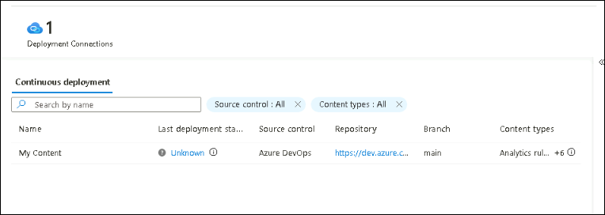
   
    >**Note:** The *Failed/Unknown* status is due to limitations in the hosted lab environment. You would normally see *Succeeded*. Then you can see in the *Analytics* the imported rule *Rule from Azure DevOps*.

## Review

In this exercise, you created and exported an analytical rule to detect security threats, set up an Azure DevOps environment, and connected Microsoft Sentinel to Azure DevOps to streamline security monitoring and incident management within your development pipeline.

## Proceed to the next lab.
