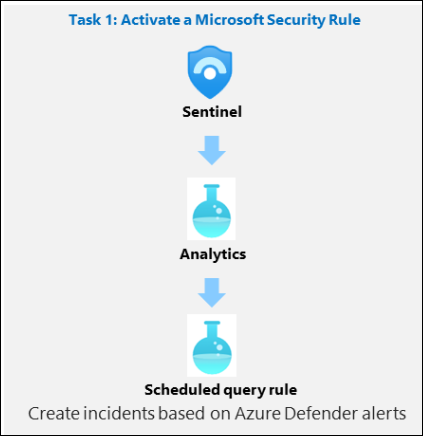
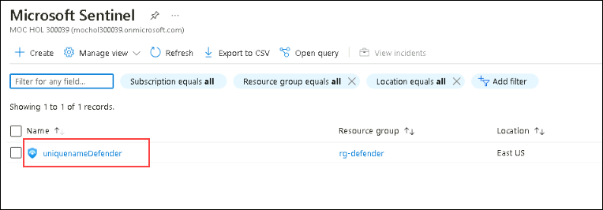
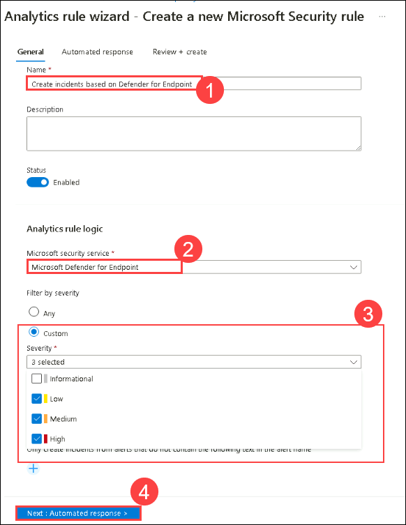

# Module 7 - Lab 1 - Exercise 1 - Modify a Microsoft Security rule

## Lab scenario

You are a Security Operations Analyst working at a company that implemented Microsoft Sentinel. You must learn how to detect and mitigate threats using Microsoft Sentinel.  You need to enable alerts from other Microsoft 365 and Azure services.  
     
### Task 1: Activate a Microsoft Security Rule

In this task, you will activate a Microsoft Security rule.

1. In the Search bar of the Azure portal, type *Sentinel*, then select **Microsoft Sentinel**.

1. Select the Microsoft Sentinel Workspace you created in the previous labs.

    

1. Select **Analytics** from the Configuration area.

1. Select the **+ Create** button from the command bar and select **Microsoft incident creation rule**.

1. Under *Name*, enter **Create incidents based on Defender for Endpoint**.

1. Scroll down and under *Microsoft security service* select **Microsoft Defender for Endpoint**.

1. Under *Filter by Severity*, select the *Custom* option and select **Low**, **Medium** and **High** for the severity level and go back to the rule.

    

1. Select the **Next: Automated response** button and then select the **Next: Review and create** button.

1. Review the changes made and select the **Save** button. The Analytics rule will be saved and incidents will be created if there is an Alert in Defender for Endpoint.

1. You will now have the one *Fusion* and two *Microsoft Security* alert types.
   
## Proceed to Exercise 2
