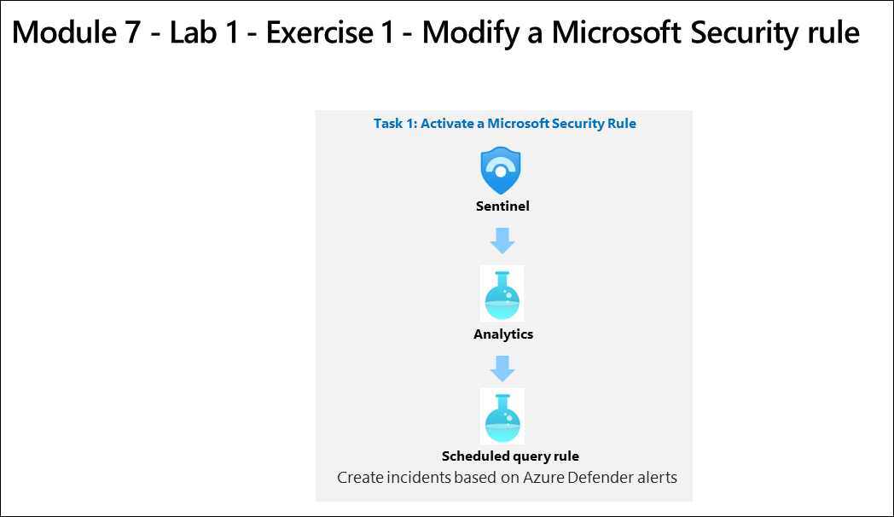

# Module 7 - Lab 1 - Exercise 1 - Activate a Microsoft Security rule

## Lab scenario

You are a Security Operations Analyst working at a company that implemented Microsoft Sentinel. You must learn how to detect and mitigate threats using Microsoft Sentinel. First, you need to filter the alerts coming from Defender for Cloud into Microsoft Sentinel, by Severity. 

>**Note:** An **[interactive lab simulation](https://mslabs.cloudguides.com/guides/SC-200%20Lab%20Simulation%20-%20Modify%20a%20Microsoft%20Security%20rule)** is available that allows you to click through this lab at your own pace. You may find slight differences between the interactive simulation and the hosted lab, but the core concepts and ideas being demonstrated are the same.

## Estimated timing: 180 minutes

### Task 1: Activate a Microsoft Security Rule

In this task, you will activate a Microsoft Security rule.

1. Sign in to the [Azure portal](https://portal.azure.com).

1. In the **Sign in** dialog box, copy and paste * Email/Username: <inject key="AzureAdUserEmail"></inject> and then select Next.

1. In the **Enter password** dialog box, copy and paste * Password: <inject key="AzureAdUserPassword"></inject> and then select **Sign in**.

1. In the Search bar of the Azure portal, type *Sentinel*, then select **Microsoft Sentinel**.

1. Select your Microsoft Sentinel Workspace you created in the previous labs.

   > **NOTE**: If not created follow the below steps:
 In the Search bar of the Azure portal, type *Log Analytics workspaces*, then select the same service name. Click on **create**.Select WIN-1 for the Resource group drop down. For the Name, enter **uniquenameDefender**.  Select **Review + Create**. Once the workspace validation has passed, select **Create**. Wait for the new workspace to be provisioned, this may take a few minutes. Go-to sentinel and click on **create** and select the created workspace and click on **add**.
        
1. Select **Analytics** from the Configuration area. By default, you will see the *Active rules*.

1. Select the + Create button from the command bar and select Microsoft incident creation rule.

1. Under Name, enter Create incidents based on Defender for Endpoint.

1. Scroll down and under Microsoft security service select Microsoft Defender for Endpoint. 

1. Scroll down the page and under "Analytics rule logic - Filter by Severity", select the *Custom* drop-down list.

1. Under Filter by Severity, select the Custom option and select Low, Medium and High for the severity level and go back to the rule.

1. Select the **Next: Automated response** button and then select **Next: Review + create** button.

1. Click on save

## Proceed to Exercise 2
