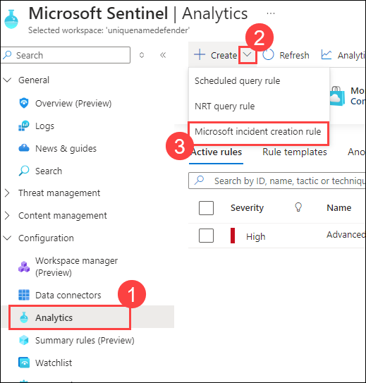
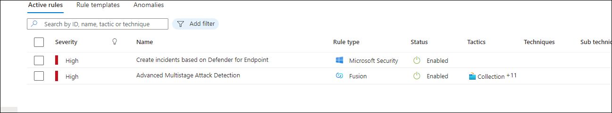

# Module 7 - Lab 1 - Exercise 1 - Modify a Microsoft Security rule

## Lab scenario

You are a Security Operations Analyst working at a company that implemented Microsoft Sentinel. You must learn how to detect and mitigate threats using Microsoft Sentinel. First, you need to filter the alerts coming from Defender for Cloud into Microsoft Sentinel, by Severity. 

>**Note:** An **[interactive lab simulation](https://mslabs.cloudguides.com/guides/SC-200%20Lab%20Simulation%20-%20Modify%20a%20Microsoft%20Security%20rule)** is available that allows you to click through this lab at your own pace. You may find slight differences between the interactive simulation and the hosted lab, but the core concepts and ideas being demonstrated are the same. 

## Objectives

After you complete this Exercise, you will be able to:

-   Task 1: Activate a Microsoft Security Rule
     
### Task 1: Activate a Microsoft Security Rule

In this task, you will activate a Microsoft Security rule.

1. Log in to WIN1 virtual machine as Admin with the password: **Pa55w.rd**.

    >**Note:** WIN1 virtual machine is the one that your using previously.

1. In the Microsoft Edge browser, navigate to the Azure portal at (https://portal.azure.com).

1. If your not signed in. In the **Sign in** dialog box, provide the **Email/Username:** <inject key="AzureAdUserEmail"></inject> and **Password:** <inject key="AzureAdUserPassword"></inject> then select  **Sign in**.

1. In the Search bar of the Azure portal, type *Sentinel*, then select **Microsoft Sentinel**.

    

1. Select the Microsoft Sentinel Workspace you created in the previous labs.

    

1. Select **Analytics (1)** from the Configuration area then click on  **+ Create (2)** drop down and then select **Microsoft incident creation rule (3)**.

    

1. Under *Name*, enter **Create incidents based on Defender for Endpoint**.

1. Scroll down and under *Microsoft security service* select **Microsoft Defender for Endpoint**.

1. Under *Filter by Severity*, select the *Custom* option and select **Low**, **Medium** and **High** for the severity level and go back to the rule.

    

1. Select the **Next: Automated response** button and then select the **Next: Review and create** button.

1. Review the changes made and select the **Save** button. The Analytics rule will be saved and incidents will be created if there is an Alert in Defender for Endpoint.

1. You will now have the one *Fusion* and two *Microsoft Security* alert types.

    
   
## Proceed to Exercise 2
