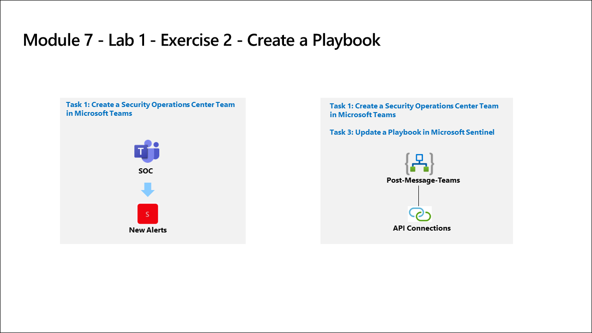
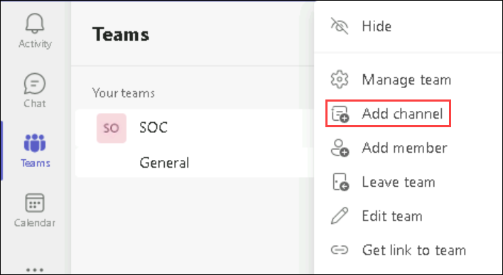

# Module 7 - Lab 1 - Exercise 2 - Create a Playbook

## Lab scenario

You're a Security Operations Analyst working at a company that implemented Microsoft Sentinel. You must learn how to detect and mitigate threats using Microsoft Sentinel. Now, you want to respond and re-mediate actions that can be run from Microsoft Sentinel as a routine.

With a playbook, you can help automate and orchestrate your threat response, integrate with other systems both internal and external, and can be set to run automatically in response to specific alerts or incidents, when triggered by an analytics rule or an automation rule, respectively. 

>**Note:** An **[interactive lab simulation](https://mslabs.cloudguides.com/guides/SC-200%20Lab%20Simulation%20-%20Create%20a%20playbook)** is available that allows you to click through this lab at your own pace. You may find slight differences between the interactive simulation and the hosted lab, but the core concepts and ideas being demonstrated are the same.

## Lab Objectives
  
After completing this lab, you will be able to:
- Task 1: Create a Security Operations Center Team in Microsoft Teams
- Task 2: Create a Playbook in Microsoft Sentinel
- Task 3: Update a Playbook in Microsoft Sentinel

## Estimated timing: 30 minutes

## Architecture Diagram

  

### Task 1: Create a Security Operations Center Team in Microsoft Teams.

In this task, you will create a Microsoft Teams team for use in the lab.

1. In the Edge browser, open a new tan and navigate to the Microsoft Teams portal at (https://teams.microsoft.com).

1. In the **Sign in** dialog box, copy and paste * Email/Username: <inject key="AzureAdUserEmail"></inject> and then select Next.

1. In the **Enter password** dialog box, copy and paste * Password: <inject key="AzureAdUserPassword"></inject> and then select **Sign in**.

1. Close any Teams pop-ups that may appear.

1. If not already selected, select **Teams** on the left menu, then at the bottom, select **Join or create a team**.

1. Select the **Create Team** button in the main window.

1. Select the **From scratch** button.

1. Select the **Private** button.

1. Give the team the name: **SOC** and select the **Create** button.

1. In the Add members to SOC screen, select the **Skip** button. 

1. Scroll down the Teams blade to locate the newly created SOC team, select the ellipsis **(...)** on the right side of the name and select **Add channel**.

        

1. Enter a channel name as *New Alerts* then select the **Add** button.

### Task 2: Create a Playbook in Microsoft Sentinel.

In this task, you will create a Logic App that will be used as a Playbook in Microsoft Sentinel.

1. Sign in to the [Azure portal](https://portal.azure.com).

1. In the **Sign in** dialog box, copy and paste * Email/Username: <inject key="AzureAdUserEmail"></inject> and then select Next.

1. In the **Enter password** dialog box, copy and paste * Password: <inject key="AzureAdUserPassword"></inject> and then select **Sign in**.

1. In the Search bar of the Azure portal, type *Sentinel*, then select **Microsoft Sentinel**.

1. Select your Microsoft Sentinel Workspace you created earlier.

1. On the left menu Select the **Community** page in the *Content management* area on the left side of the page.

1. Select the **Onboard community content** link on the right pane. This will open a new tab in the Edge Browser for Microsoft Sentinel GitHub content.

1. Select the **Solutions** folder.

1. Next select the **SentinelSOARessentials** folder, then the **Playbooks** folder.

1. Select the **Post-Message-Teams** folder.

1. In the readme.md box, go below the second *Quick Deployment* option **Deploy with incident trigger (recommended)** and select **Deploy to Azure** button.  

    **VERY IMPORTANT**: Be aware that they are two different Microsoft Sentinel triggers to use, Incident and Alert. Make sure you are selecting the Alert (second) one.

1. Make sure your Azure Subscription is selected.

1. For Resource Group, select **Create New** and select resource group from drop down *rg-playbooks* and select **OK**.

1. For region, select the appropriate region for your situation. The default region will likely be optimal.

1. Make sure the *Playbook Name* is "PostMessageTeams-OnIncident" and select **Review + create**.

1. Now select **create**.

    **Note:** Wait for the deployment to finish before proceeding to the next task. It may take a couple of minutes to deploy.

    > **Congratulations** on completing the task! Now, it's time to validate it. Here are the steps:
    > - Navigate to the Lab Validation Page, from the upper right corner in the lab guide section.
    > - Hit the Validate button for the corresponding task. You can proceed to the next task if you receive a success message.
    > - If not, carefully read the error message and retry the step, following the instructions in the lab guide.
    > - If you need any assistance, please contact us at labs-support@spektrasystems.com. We are available 24/7 to help you out.

### Task 3: Update a Playbook in Microsoft Sentinel.

In this task, you will update the new playbook you created with the proper connection information.

1. In the Search bar of the Azure portal, type *Sentinel*, then select **Microsoft Sentinel**.

1. Select your Microsoft Sentinel Workspace.

1. Select the **Automation** from the Configuration area and then select the **Active Playbooks** tab.

1. Select the **PostMessageTeams-OnIncident** playbook.

1. On the Logic App page for *PostMessageTeams-OnIncident*, in the center menu, select **Edit**.

1. Select the *first* block **Microsoft Sentinel alert(Preview)**.

1. Select the **Change connection** link.

1. Select **Add new** and select **Sign in**. In the new window, select your Azure subscription admin credentials when prompted.

1. Select the connection that has your Azure subscription admin credentials under *Display Name*. **Hint:** ODL_USER_ID@ZZZZZZ.onmicrosoft.com. The last line of the block should now read "Connected to your-admin-username".

1. Now select the *second* block **Connections**.

1. Select **Add new** and select your Azure subscription admin credentials when prompted. The last line of the block should now read "Connected to your-admin-username".

1. The block has now been renamed to **Post a message (V3)**, at the end of the *Team* field, select the **X** to clear the contents. The field will be changed to a drop-down with a listing of the available Teams from Microsoft Teams. Select **SOC**.

1. Do the same for the *Channel* field, select the **X** at the end of the field to clear the contents. The field will be changed to a drop-down with a listing of the Channels of the SOC Teams. Select **New Alerts**.

   

1. Select **Save** on the command bar.

The Logic App will be used in a future lab.

### Review
In this lab, you have completed the following:
-You have created a Security Operations Center Team in Microsoft Teams
- You have created a Playbook in Microsoft Sentinel
- You have updated a Playbook in Microsoft Sentinel

## Proceed to Exercise 3
