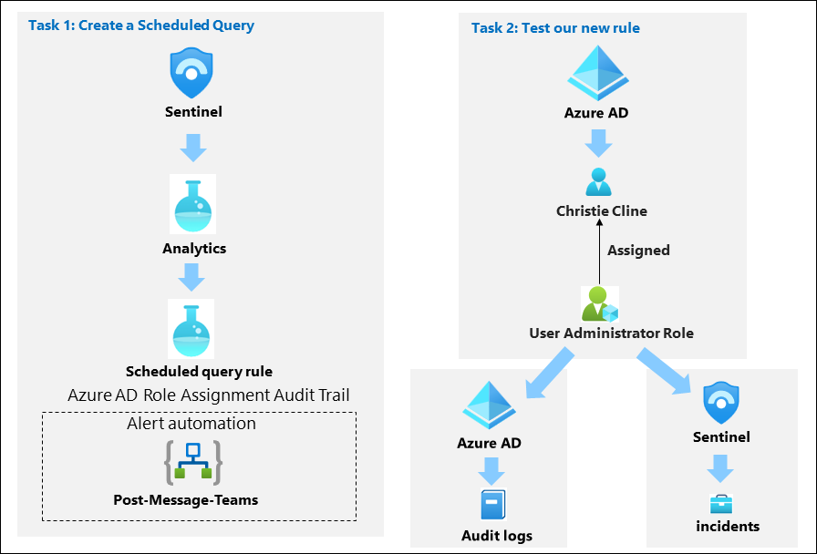
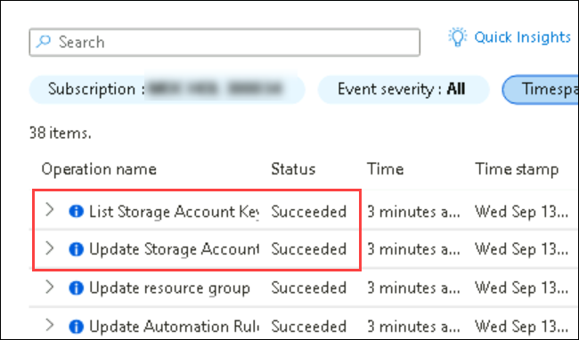

# Module 7 - Lab 1 - Exercise 3 - Create a Scheduled Query

## Lab scenario

You're a Security Operations Analyst working at a company that implemented Microsoft Sentinel. You must learn how to detect and mitigate threats using Microsoft Sentinel. After connecting your data sources to Microsoft Sentinel, you create custom analytics rules to help discover threats and anomalous behaviors in your environment.

Analytics rules search for specific events or sets of events across your environment, alert you when certain event thresholds or conditions are reached, generate incidents for your SOC to triage and investigate, and respond to threats with automated tracking and reMediation processes.

## Lab objectives
 In this lab, you will perform the following:
- Task 1: Create a Scheduled Query
- Task 2: Test the new rule
- Task 3: Create a Scheduled Query.
- Task 4: Test our new rule.

## Estimated timing: 40 minutes

## Architecture Diagram

  

### Task 1: Create a Scheduled Query.

In this task, you will create a scheduled query and connect it to the Teams channel you created in the previous exercise.

1. In the Search bar of the Azure portal, type *Sentinel*, then select **Microsoft Sentinel**.

2. Select your Microsoft Sentinel Workspace.

3. Select **Analytics** from the Configuration area.

4. Make sure that you are in the *Rule templates* tab in the command bar and search for the **New CloudShell User** rule.

5. From the rule summary blade, make sure you're receiving data by reviewing the green icon under *Data sources: Azure Activity*.

    >**Note:** If you do not see it in a connected state, follow the following steps:

### Task 2:  Connect the Azure Activity data connector

1. In the Microsoft Sentinel left menus, scroll down to the *Content management* section and select **Content Hub**.

1. In the *Content hub*, search for the **Azure Activity** solution and select it from the list.

1. On the *Microsoft Defender for Cloud* solution page select **Install**.

1. When the installation completes select **Manage**

    >**Note:** The *Azure Activity* solution installs the *Azure Activity* Data connector, 12 Analytic rules, 14 Hunting queries and 1 Workbook.

1. Select the *Azure Activity* Data connector and select **Open connector page**.

1. In the *Configuration* area under the *Instructions* tab, scroll down to "2. Connect your subscriptions...", and select **Launch Azure Policy Assignment Wizard>**.

1. In the **Basics** tab, select the ellipsis button (...) under **Scope** and select your "Azure Pass - Sponsorship" subscription from the drop-down list and click **Select**.

1. Select the **Parameters** tab, choose your *uniquenameDefender* workspace from the **Primary Log Analytics workspace** drop-down list. This action will apply the subscription configuration to send the information to the Log Analytics workspace.

1. Select the **Remediation** tab and select the **Create a remediation task** checkbox. This action will apply the policy to existing Azure resources.

1. Select the **Review + Create** button to review the configuration.

1. Select **Create** to finish.

1. It might take few minutes for the **Connected** status to appear.

## Task 3: Create a Scheduled Query.

1. Once, you've received data by reviewing the green icon under *Data sources: Azure Activity*.

1. Select **Create rule** to continue.

1. In the Analytics rule wizard, on the *General* tab, change the *Severity* to **Medium**.

1. Select **Next: Set rule logic >** button:

1. For the rule query, select **View query results**. You shouldn't receive any results nor any errors.

1. Close the *Logs* window by selecting the upper right **X** and select **OK** to discard to save changes to go back to the wizard.

1. Scroll down and under *Query scheduling* set the following:

    |Setting|Value|
    |---|---|
    |Run Query every|5 minutes|
    |Lookup data from the last|1 Days|

    >**Note:** We are purposely generating many incidents for the same data. This enables the Lab to use these alerts.

1. Under the *Alert threshold* area, leave the value unchanged since we want the alert to register every event.

1. Under the *Event grouping* area, leave the **Group all events into a single alert** as the selected option since we want to generate a single alert every time it runs, as long as the query returns more results than the specified alert threshold above.

1. Select the **Next: Incident settings >** button. 

1. On the *Incident settings* tab, review the default options.

1. Select the **Next: Automated response >** button.

1. On the *Automated response* tab under *Automation rules*, select **Add new**.

1. For the *Automation rule name*, enter **Tier 2**.

1. For the *Actions*, select **Assign owner**.

1. Then select **Assign to me**. Then select **+ Add action**.

1. Use the *And then* drop-down menus to select **Run playbook**

1. A second drop-down menu appears with an *Information (i)* message regarding playbook permissions and a **Manage playbook permissions link**

    >**Note:** The playbooks will appear grayed out in the drop-down list until permissions are configured.

1. Select the **Manage playbook permissions link**

1. On the *Manage Permissions* page, select the **RG-Playbooks** resource group you created in the previous lab, and select **Apply**.

1. From the drop-down menu, select the playbook **PostMessageTeams-OnIncident** you created in the previous exercise.

1. Select **Apply**

1. Select the **Next: Review and create >** button.
  
1. Select **Save**.

### Task 4: Test our new rule.

In this task, you will test your new scheduled query rule.

1. In the top bar of the Azure portal, Select the icon **>_** that corresponds to the Cloud Shell. You might need to select the ellipsis icon first **(...)** if your display resolution is too low.

1. Select **PowerShell** and then **Create storage**. Wait until the Cloud Shell is provisioned.

1. Close the Azure Cloud Shell window.

1. In the Search bar of the Azure portal, type *Activity* and then select **Activity Log**.

1. Make sure the following *Operation name* items appear: **List Storage Account Keys** and **Update Storage Account Create**. These are the operations that the KQL query you reviewed earlier will match to generate the alert. **Hint:** You might need to select **Refresh** to update the list.

    

1. In the Search bar of the Azure portal, type *Sentinel*, then select **Microsoft Sentinel**.

1. Select your Microsoft Sentinel Workspace.

1. Select the **Incidents** menu option under *Threat management*.

1. Select the **Auto-refresh incidents** toggle.

1. You should see the newly created Incident.

    >**Note:** The event that triggers the incident may take 30 or more minutes to process. Continue with the next exercise, you will come back to this view later.

1. Select the Incident and review the information in the right blade.

1. Go back to Microsoft Teams by selecting the tab in your Microsoft Edge browser. If you closed it, just open a new tab and type https://teams.microsoft.com. Go to the *SOC* Teams, select the *New Alerts* channel, and see the message post about the incident.

### Review
In this lab, you have completed the following:
- You have created a Scheduled Query.
- You have tested the new rule. 
