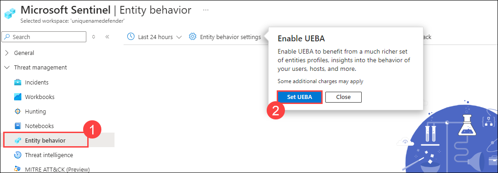
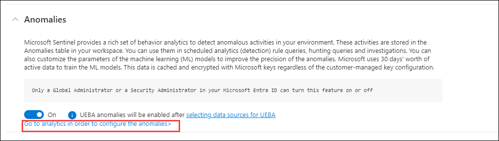
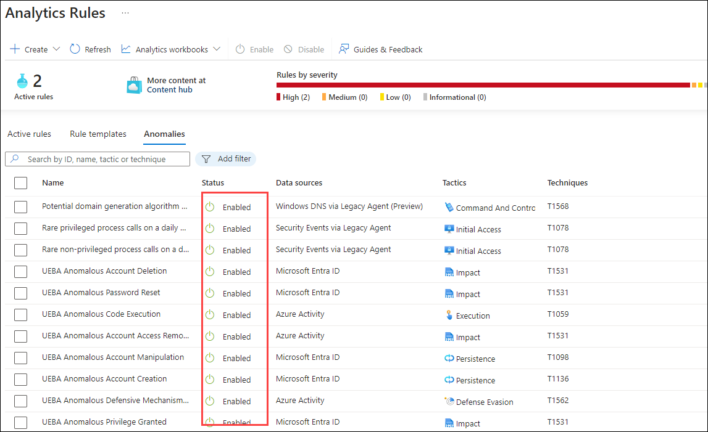
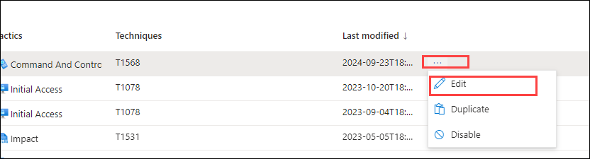
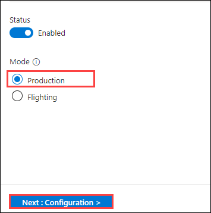
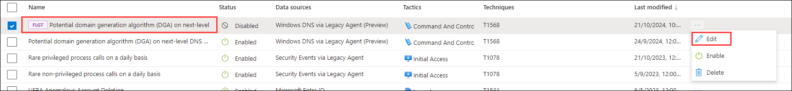
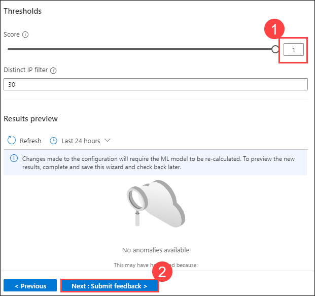

# Learning Path 7 - Lab 1 - Exercise 4 - Explore Entity Behavior Analytics

## Lab scenario

You are a Security Operations Analyst working at a company that implemented Microsoft Sentinel. You already created Scheduled and Microsoft Security Analytics rules. 

You need to configure Microsoft Sentinel to perform Entity Behavior Analytics to discover anomalies and provide entity analytic pages.

>**Note:** An **[interactive lab simulation](https://mslabs.cloudguides.com/guides/SC-200%20Lab%20Simulation%20-%20Explore%20entity%20behavior%20analytics)** is available that allows you to click through this lab at your own pace. You may find slight differences between the interactive simulation and the hosted lab, but the core concepts and ideas being demonstrated are the same. 

### Task 1: Explore Entity Behavior 

In this task, you will explore Entity behavior analytics in Microsoft Sentinel.

1. Log in to WIN1 virtual machine as Admin with the password: **Pa55w.rd**.

   >**Note:** WIN1 virtual machine is the same one that your using in Excercise 3. only need to login if your logged out otherwise no need to login again.

1. In the Edge browser, navigate to the Azure portal at https://portal.azure.com.

   >**Note:** If prompted to sign in, In the **Sign in** dialog box, copy and paste the **Username** and **Password** from the Environment tab and select **Sign in**.

1. In the Search bar of the Azure portal, type *Sentinel*, then select **Microsoft Sentinel**.

    

1. Select the Microsoft Sentinel Workspace you created in the previous labs.

    
   
1. Select the **Entity behavior (1)** page under the Threat management from the left pane and on the popup from *Entity behavior settings*, select **Set UEBA (2).**.

   

1. On the next page, select  **Set UEBA**.

1. Review the three pre-requisite steps to enable entity behavior analytics.

1. Close the *Entity behavior configuration* page by selecting the 'x' at the top right of the page.

1. Scroll down the *Settings* page and read through the *Anomalies* paragraph.

1. Select **Go to analytics in order to configure the anomalies**.

   

### Task 2: Confirm and review Anomalies rules

In this task, you will confirm Anomalies analytics rules are enabled.

1. You should be now at the *Analytics* page, *Anomalies* tab.

1. Confirm status column of the rules is *Enabled*.

   

1. Select any rule and then select **Edit** on the rule blade by clicking on the 3 dots **(...).**

   

1. Review the *General* tab information. Notice the *Mode* is **Production** and then select **Next: Configuration**.

   

1. Review the *Configuration* tab information. Notice that you cannot change the **Anomaly score Threshold**.

1. Then select **X** in the top right corner to exit the Analytics rule wizard.

1. Scroll right to the analytics rule you selected until see and select the ellipsis **(...)** icon.

1. Select **Duplicate** and scroll left to review the new rule with the **FLGT** tab at the beginning of the name.

1. Select **FLGT** rule and then select **Edit** on the rule blade.

   

1. Review the *General* tab information. Notice the *Mode* is **Flighting** and then select **Next: Configuration**.

1. Review the *Configuration* tab information. Notice that you can now change the **Anomaly score Threshold**.

1. Set the value to **1 (1)** and then select **Next: Submit Feedback > (2)**.

   

1. Select **Next: Review and Create** and then **Save** to update the rule.

    >**Note:** You can upgrade the **Flighting** rule to **Production** by changing the setting on this rule and saving the changes. The **Production** rule will become the **Flighting** rule afterwards.

## Proceed to Exercise 5
