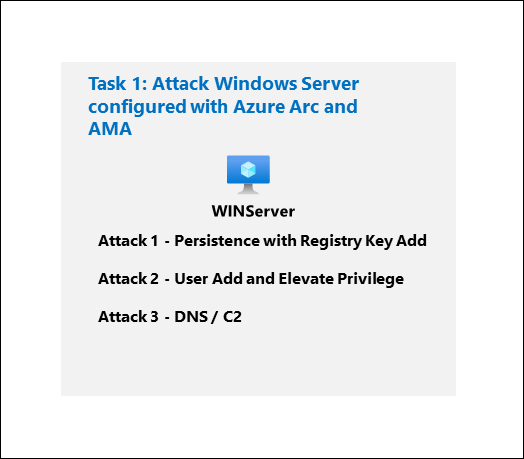
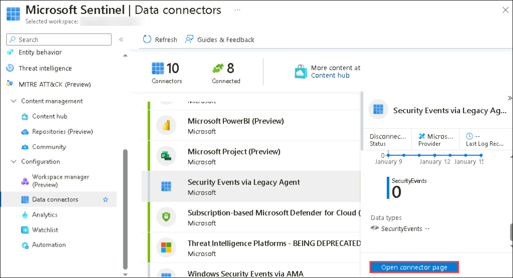
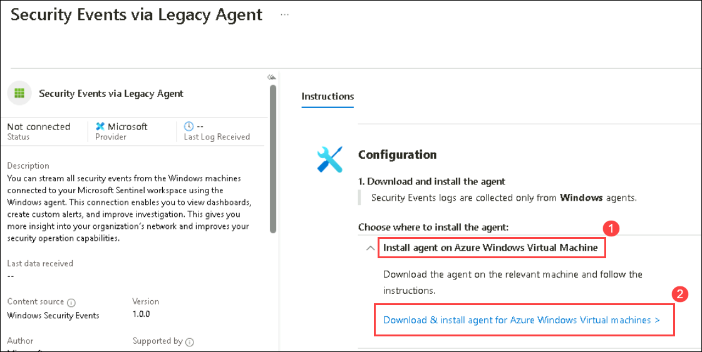
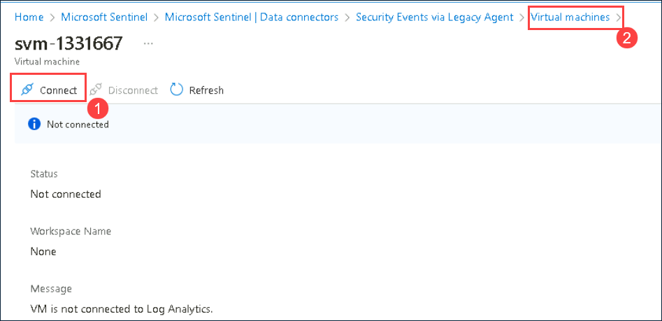
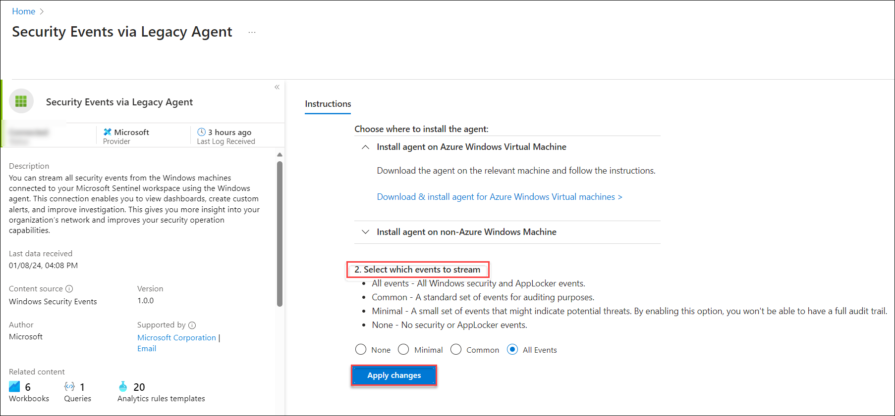
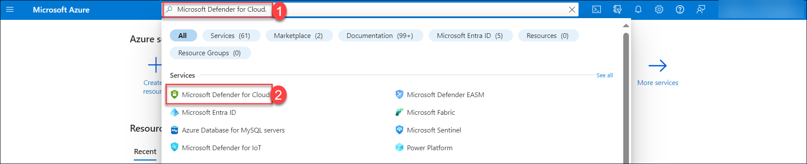
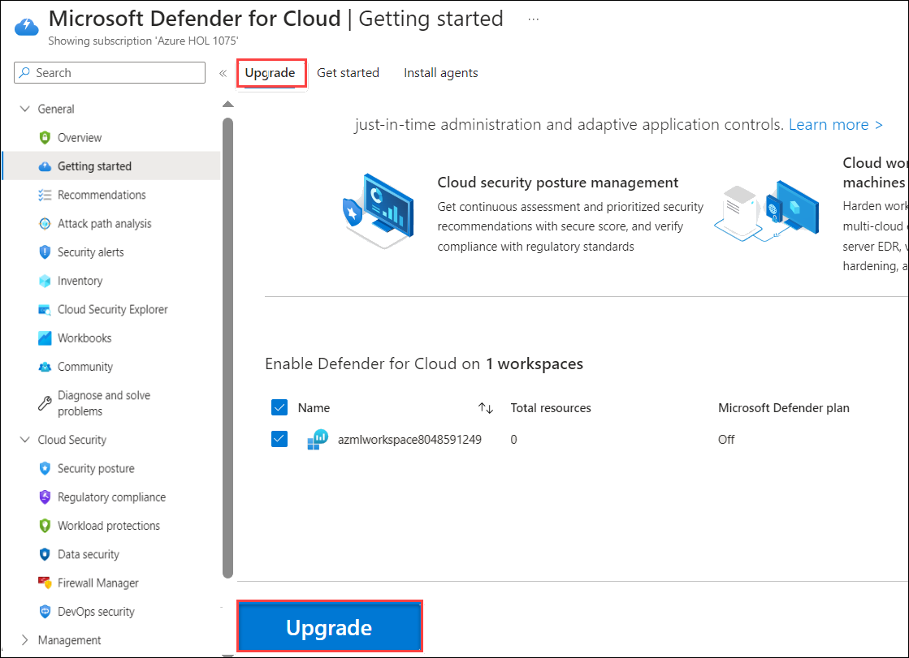
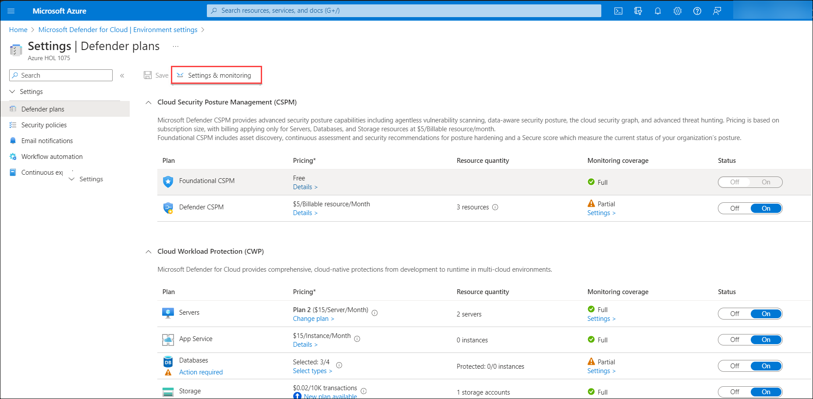
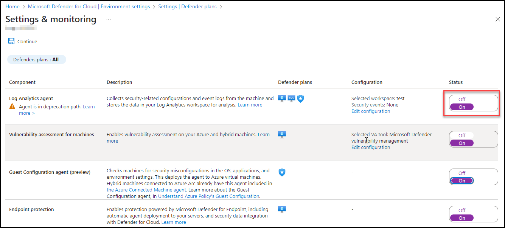

# Module 7 - Lab 1 - Exercise 6 - Conduct attacks

## Lab scenario

You are going to simulate the attacks that you will later use to detect and investigate in Microsoft Sentinel.

## Architecture Diagram



### Task 1: Connect the Windows security event connector

1. In the Search bar of the Azure portal, type *Microsft Sentinel*, then select **Microsoft Sentinel**.

1. Select the pre-created Sentinel **uniquenameDefender** from the available list.

1. Navigate to the left menu and go to the Content Management section; there, select Content Hub. On the Content Hub page, locate Windows Security Events, and then Select  it and verify if it is installed.

   

1. Navigate to Data Connectors from the left navigation pane. You should observe two options: Security Events Via Legacy Agent and Windows Security Event Via AMA.

1. Choose Security Events Via Legacy Agent, and then click on **Open connector page**.

   

1. In the configuration section, opt for **Install agent on Azure Windows Virtual Machine (1)**, and then choose **Download & Install agent for Azure Windows Virtual machines > (2)**.

   

1. Select the win1xxx virtual machine.

1. Click on **Connect**, once **Connected (1)**, select the **Virtual Machine (2)** link from the top.

   

1. On the virtual machine page select the win1-xxxx virtual machine and click on Connect and  wait until get connected.

1. Then, come back to the configuration and scroll down a bit. You can find Select which events to stream. Click on All Events. Click on Apply changes now. If you refresh the data connector page, you can see the status Connected for Security Events Via Legacy Agent.

    

### Task 2: Enable Microsoft Defender for Cloud

In this task, you will enable and configure Microsoft Defender for Cloud.

1. In the search bar of the Azure portal, type *Microsoft Defender for cloud (1)*, then select **Microsoft Defender for Cloud (2)**.

     

1. Click the left menu, and then click on **Getting Started**.

1. On the **Getting Started** page, under the **Upgrade** tab, ensure your subscription is selected, and then click the **Upgrade** button at the bottom of the page.

    

    >**Note:** Please wait for 2-5 minutes for the process to complete, as it may take some time. if you face some errors while upgrading the plan, please ignore and proceed with the next step.

4. In the left menu for Microsoft Defender for Cloud, under Management, select **Environment settings**.

1. Click on the subscription (or its equivalent name in your language). 

1. Review the Azure resources that are now protected with the Defender for Cloud plans.

1. Select the **Settings & monitoring** tab from the Settings area (next to Save).
 
     

1. Review the monitoring extensions and confirm that **Log Analytics agent/Azure Monitor agent** is **On**.

     

1. Select the newly created **Log Analytics workspace** which will gather all security events data of the machines to analyze. Click on **Apply** and **Continue**. Click on **Save** for the changes to take effect.

1. Close the settings page by selecting the 'X' on the upper right of the page to return to the **Environment settings**. Then, click on the '>' to the left of your subscription.

1. Select the Log Analytics workspace named **uniquenameDefender** to review the available options and pricing.

1. Select **Enable all plans** (to the right of Select Defender plan), and then choose **Save**. Wait for the *"Microsoft Defender plan for workspace loganalyticworkspace was saved successfully!"* notification to appear.

    >**Note:** If the page is not being displayed, refresh your Edge browser and try again.

1. Close the Defender plans page by selecting the 'X' in the upper right corner of the page to return to the **Environment settings**.


### Task 3: Persistence Attack with Registry Key Add

>**Important:** The next steps are done on a different machine than the one you were previously working on. Look for the Virtual Machine name references.

In this task, you will perform attacks on the host connected with Azure Arc that has the Azure Monitor Agent configured.

1. Login to the WINServer virtual machine as Admin with the password: **Pa55w.rd**.  

    >**Important:** The lab *SAVE* functionality can cause WINServer to become disconnected from Azure Arc. A reboot will solve the issue.  

1. Select **Start** in Windows. Then **Power**, next **Restart**.

1. Follow the instructions to log into WINServer again.

1. In the search of the taskbar, enter *Command*. A Command Prompt will be displayed in the search results. Right-click on the Command Prompt and select **Run as Administrator**. Select **Yes** in the User Account Control window that appears to allow the app to run.

1. In the Command Prompt, create a Temp folder in the root directory. Remember to press Enter after the last row:

    ```CommandPrompt
    cd \
    mkdir temp
    cd temp
    ```

1. Copy and run this command to simulate program persistence:

    ```CommandPrompt
    REG ADD "HKCU\SOFTWARE\Microsoft\Windows\CurrentVersion\Run" /V "SOC Test" /t REG_SZ /F /D "C:\temp\startup.bat"
    ```
### Task 4: Privilege Elevation Attack with User Add

1. Copy and run this command to simulate the creation of an Admin account. Remember to press Enter after the last row:

    ```CommandPrompt
    net user theusernametoadd /add
    net user theusernametoadd ThePassword1!
    net localgroup administrators theusernametoadd /add
    ```

### Task 5: Command and Control Attack with DNS

1. Copy and run this command to create a script that will simulate a DNS query to a C2 server:

    ```CommandPrompt
    notepad c2.ps1
    ```

1. Select **Yes** to create a new file and copy the following PowerShell script into *c2.ps1*.

    >**Note:** Pasting into the virtual machine file might not show the full script length. Make sure the script matches  the instructions within the *c2.ps1* file.

    ```PowerShell
    param(
        [string]$Domain = "microsoft.com",
        [string]$Subdomain = "subdomain",
        [string]$Sub2domain = "sub2domain",
        [string]$Sub3domain = "sub3domain",
        [string]$QueryType = "TXT",
        [int]$C2Interval = 8,
        [int]$C2Jitter = 20,
        [int]$RunTime = 240
    )
    $RunStart = Get-Date
    $RunEnd = $RunStart.addminutes($RunTime)
    $x2 = 1
    $x3 = 1 
    Do {
        $TimeNow = Get-Date
        Resolve-DnsName -type $QueryType $Subdomain".$(Get-Random -Minimum 1 -Maximum 999999)."$Domain -QuickTimeout
        if ($x2 -eq 3 )
        {
            Resolve-DnsName -type $QueryType $Sub2domain".$(Get-Random -Minimum 1 -Maximum 999999)."$Domain -QuickTimeout
            $x2 = 1
        }
        else
        {
            $x2 = $x2 + 1
        }    
        if ($x3 -eq 7 )
        {
            Resolve-DnsName -type $QueryType $Sub3domain".$(Get-Random -Minimum 1 -Maximum 999999)."$Domain -QuickTimeout
            $x3 = 1
        }
        else
        {
            $x3 = $x3 + 1
        }
        $Jitter = ((Get-Random -Minimum -$C2Jitter -Maximum $C2Jitter) / 100 + 1) +$C2Interval
        Start-Sleep -Seconds $Jitter
    }
    Until ($TimeNow -ge $RunEnd)
    ```

1. In the Notepad menu, select **File** and then **Save**. 

1. Go back to the Command Prompt window, enter the following command and press Enter. 

    >**Note:** You will see DNS resolve errors. This is expected.

    ```CommandPrompt
    Start PowerShell.exe -file c2.ps1
    ```

      >**Note:** You will see DNS resolve errors. This is expected.
      
      >**Important**: Do not close these windows. Let this PowerShell script run in the background. The command needs to generate log entries for some hours. You can proceed to the next task and next exercises while this script runs. The data created by this task will be used in the Threat Hunting lab later. This process will not create substantial amounts of data or processing.

## Proceed to Exercise 7
