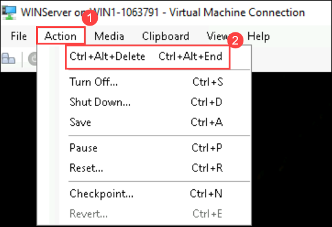

# LAB PREREQUISITES

## Estimated timing: 40 minutes

## Prerequisites to be completed before proceeding to further exercises

### Prerequisite 01

### Task 1: Connect a non-Azure Windows Machine

In this task, you will install Azure Arc and connect a non-Azure Windows virtual machine to Microsoft Sentinel.  

   >**Important:** The next steps are done in a different machine than the one you were previously working. Look for the Virtual Machine name references.

   >**Important:** The *Windows Security Events via AMA* data connector requires Azure Arc for non-Azure devices. 

 1. In the lab virtual machine, search for **Hyper-V Manager** from the bottom windows search bar and select to open.

 1. Select and right-click on the **WINSERVER** virtual machine and select **Start**, then again right-click on the **WINSERVER** virtual machine and select **connect**.
 
 1. Inside **WINSERVER** Click on **Action (1)** then click on **Ctrl+Alt+Delete (2)** to turn on WINSERVER.

    

 1. Enter the **Password** as `Password.1!!` when prompted.

 1. Open the Microsoft Edge browser inside **WINSERVER**.

 1. Open a browser and log into the Azure Portal at https://portal.azure.com with the credentials you have been using in the previous labs.

 1. In the **Sign in** dialog box, copy and paste in the **Username** <inject key="AzureAdUserEmail"></inject> and then select Next.

 1. In the **Enter password** dialog box, copy and paste in the Password <inject key="AzureAdUserPassword"></inject> and then select **Sign in**.

 1. On the **Stay signed in?** dialog box, select the Don’t show this again check box and then select **No**.

    >**Note:** If you are not able to copy-paste the username and password then:
    > - Go to Hyper-V manager.
    > - On the left-right click on **WINSERVER**.
    > - Click on Hyper-V settings.
    > - From there click on allow enhanced mode policy Under **Server** and enable the option.
    > -	Again, click on allow enhanced mode under **User** and enable the option. Restart the WINSERVER machine once to reflect the changes.

 1. In the Search bar of the Azure portal, type *Arc*, then select **Azure Arc**.

 1. On the left side navigation pane under **Azure Arc Resources** select **Machines** and then click on **+ Add/Create** then click on **Add a Machine**.

 1. Select **Generate script** in the **"Add a single server"** section.

     

 1. Select **Next** to get to the Resource details tab.

 1. Select the Resource group **RG-DEFENDER**

    >**Note:** If you haven't already created a resource group, open another tab and create the resource group and start over.
 
 1. Select a **east us** region  

 1. Review the *Server details* and *Connectivity method* options. Keep the default values and select **Next** to get to the Tags tab.

 1. Select **Next** to get to the Download and run script tab.

 1. Scroll down and select the **Download** button. **Hint:** If your browser blocks the download, take action in the browser to allow it. In Edge Browser, select the ellipsis button (...) if needed and then select **Keep**. 

 1. Right-click the Windows Start button and select **Windows PowerShell (Admin)**.

     

     >**Note:** You may need to search for **Windows PowerShell**. In the search box type in **PowerShell**. You should see the **Windows PowerShell App** appear. Select the **Run as Administrator** option.

 1. In case you get a UAC prompt, enter *Administrator* for "Username" and *Passw0rd!* for "Password", else skip to the next step.

 1. Enter: **cd C:\Users\Administrator\Downloads**

 1. Type **Set-ExecutionPolicy -ExecutionPolicy Unrestricted** and press enter.

 1. Enter **A** for Yes to All and press enter.

 1. Type **.\OnboardingScript.ps1** and press enter.  

    >**Important:** If you get the error *"The term .\OnboardingScript.ps1 is not recognized..."*, make sure you are doing the steps for Task 3 on the WINSERVER virtual machine. Another issue might be that the name of the file changed due to multiple downloads, search for *".\OnboardingScript (1).ps1"* or other file numbers in the running directory.

 1. Enter **R** to Run once and press enter (this may take a couple of minutes).

 1. The setup process will open a new Edge browser tab to authenticate the Azure Arc agent. Select your admin account, wait for the message "Authentication complete" and then go back to the Windows PowerShell window.

 1. When the installation finishes, go back to the Azure portal page where you downloaded the script and select **Close**. Close the **Add servers with Azure Arc** to go back to the Azure Arc **Servers** page.

 1. Select **Refresh** until **WIN-xxxx** name appears.

    >**Note:** This could take a few minutes.
    
 1. In the Search bar of the Azure portal, type *Log Analytics workspaces*, then select the same service name.

 1. Click on **create**

 1. Select **RG-DEFENDER** for the Resource group drop-down.

 1. For the Name, enter **uniquenameDefender**

 1. Select **Review + Create**.

 1. Once the workspace validation has passed, select **Create**. Wait for the new workspace to be provisioned, this may take a few minutes.

 1. In the Search bar of the Azure portal, type *Sentinel*, then select **Microsoft Sentinel**.

 1. Click on + Create.

 1. Next, in Add Microsoft Sentinel to a workspace page select the existing workspace that was created in the previous lab, then select **Add**. This could take a few minutes.

 1. Select the Microsoft Sentinel Workspace you created.
 
 1. Go to the content hub search for **Windows Security Events** and click on install. 

     
     

 1. Once the installation is completed, go to the data connector page and refresh you should find **Windows Security Events via AMA**

     

 1. Select the **Windows Security Events via AMA** connector and click on **Open connector page** on the connector information blade. 

 1. In the **Configuration** section, select the **+Create data collection rule**.

 1. Enter **WINSERVER** for Rule Name, then select **Next: Resources**.

 1. Expand the **Subscription** and the **RG-DEFENDER** (or the Resource Group you are created), then select **WIN-xxxx**. Then select **Next: Collect** and **Next: Review + Create**.

 1. Select **Create**.

1. Wait a few minutes and then select **Refresh** to see the new data collection rule listed.

> **Congratulations** on completing the task! Now, it's time to validate it. Here are the steps:

- Navigate to the Lab Validation Page, from the upper right corner in the lab guide section.
- Hit the Validate button for the corresponding task. If you receive a success message, you can proceed to the next task. 
- If not, carefully read the error message and retry the step, following the instructions in the lab guide.
- If you need any assistance, please contact us at labs-support@spektrasystems.com. We are available 24/7 to help you out.

**PROCEED TO NEXT EXERCISE**

=======
**PROCEED TO NEXT EXERCISE**

