# Module 8 - Lab 1 - Exercise 1 - Perform Threat Hunting in Microsoft Sentinel

   

## Lab scenario

You are a Security Operations Analyst working at a company that implemented Microsoft Sentinel. You have received threat intelligence about a Command and Control (C2 or C&C) technique. You need to perform a hunt and watch for the threat.

>**Important:** The log data used in the lab was created in the previous module. See **Attack 3** on WIN1 server in Exercise 5.

>**Note:** Because you already experienced the process of exploring data in a previous module, this lab provides a KQL statement to start with.

>**Note:** An **[interactive lab simulation](https://mslabs.cloudguides.com/guides/SC-200%20Lab%20Simulation%20-%20Perform%20threat%20hunting%20in%20Microsoft%20Sentinel)** is available that allows you to click through this lab at your own pace. You may find slight differences between the interactive simulation and the hosted lab, but the core concepts and ideas being demonstrated are the same. 

## Objectives

After you complete this Exercise, you will be able to:

-   Task 1: Create a hunting query
-   Task 2: Create a NRT query rule
-   Task 3: Create a Search job

### Task 1: Create a hunting query

In this task, you will create a hunting query, bookmark a result, and create a Livestream.

1. Log in to WIN1 virtual machine as Admin with the password: **Pa55w.rd**.  

1. In the Edge browser, navigate to the Azure portal at https://portal.azure.com.

   >**Note:** If prompted, in the **Sign in** dialog box, copy and paste the **Username** and **Password** from the Environment Tab and then select **Sign in**.

1. In the Search bar of the Azure portal, type *Sentinel*, then select **Microsoft Sentinel**.

1. Select your Microsoft Sentinel Workspace.

1. Select **Logs** 

1. Enter the following KQL Statement in the *New Query 1* space:

   >**Important:** Please paste any KQL queries first in Notepad and then copy from there to the *New Query 1* Log window to avoid any errors.

    ```KQL
    let lookback = 2d; 
    SecurityEvent 
    | where TimeGenerated >= ago(lookback) 
    | where EventID == 4688 and Process =~ "powershell.exe"
    | extend PwshParam = trim(@"[^/\\]*powershell(.exe)+" , CommandLine) 
    | project TimeGenerated, Computer, SubjectUserName, PwshParam 
    | summarize min(TimeGenerated), count() by Computer, SubjectUserName, PwshParam 
    | order by count_ desc nulls last 
    ```

    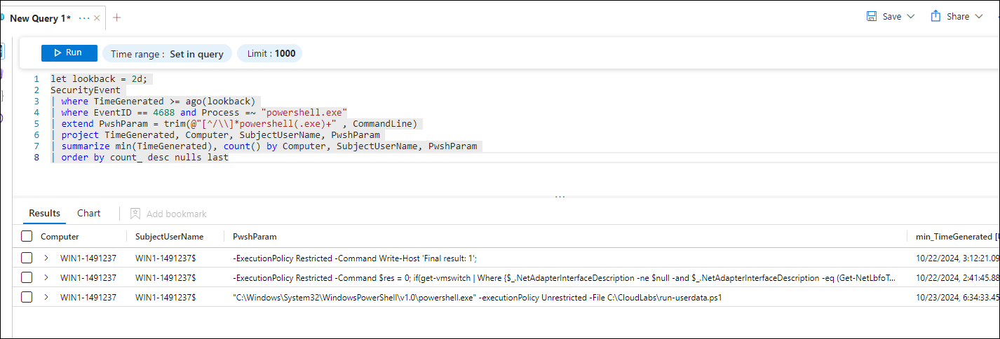

1. Review the different results. You have now identified PowerShell requests that are running in your environment.

1. Select the checkbox of the results that shows the *"-file c2.ps1"* **any of the files** **(1)** appeared in the result.

1. In the middle command bar, select the **Add bookmark (2)** button.

    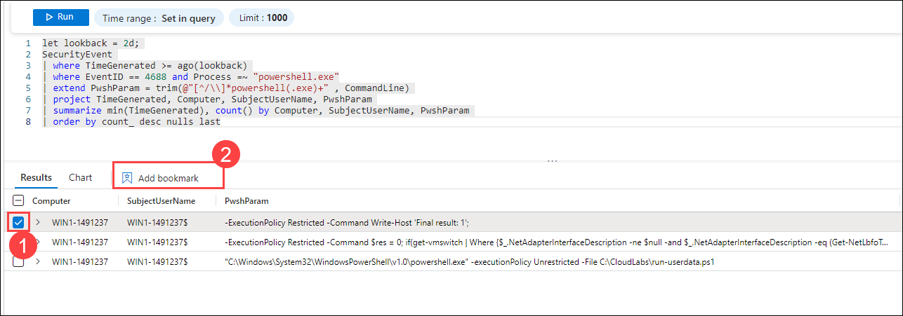

1. Select **+ Add new entity** under *Entity mapping*.

1. For *Entity* select **Host (1)**, then **Hostname (2)** and **Computer (3)** for the values.

1. For *Tactics and Techniques*, select **Command and Control (4)**.

1. The select **Create (5)**. We will map this bookmark to an incident later.

    

1. Close the *Logs* window by selecting the **X** in the top-right of the window and select **OK** to discard the changes. 

1. Select your Microsoft Sentinel workspace again and select the **Hunting (1)** page under the *Threat Management* area.

1. Select the **Queries (2)** tab and then **+ New Query (3)** from the command bar.

    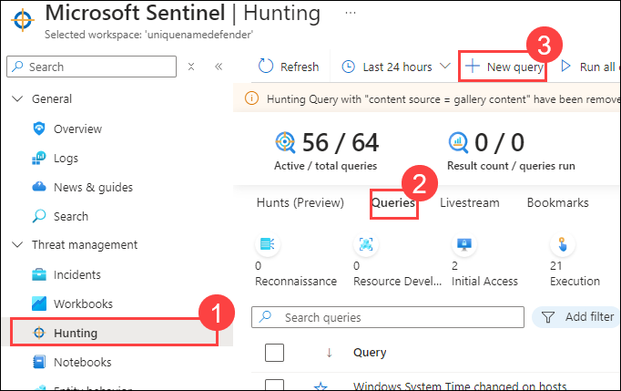

1. In the *Create hunting query* window, for the *Name* enter **PowerShell Hunt (1)**.

1. For the *hunting query* enter the following KQL statement: ***(2)**

    ```KQL
    let lookback = 2d; 
    SecurityEvent 
    | where TimeGenerated >= ago(lookback) 
    | where EventID == 4688 and Process =~ "powershell.exe"
    | extend PwshParam = trim(@"[^/\\]*powershell(.exe)+" , CommandLine) 
    | project TimeGenerated, Computer, SubjectUserName, PwshParam 
    | summarize min(TimeGenerated), count() by Computer, SubjectUserName, PwshParam 
    | order by count_ desc nulls last 
    ```

1. Scroll down and under *Entity mapping* select: **+ Add new entity** **(3)**

    - For the *Entity type* drop-down list select **Host**.
    - For the *Identifier* drop-down list select **HostName**.
    - For the *Value* drop-down list select **Computer**.

1. Scroll down and under *Tactics & Techniques* select **Command and Control (4)** and then select **Create (5)** to create the hunting query.

    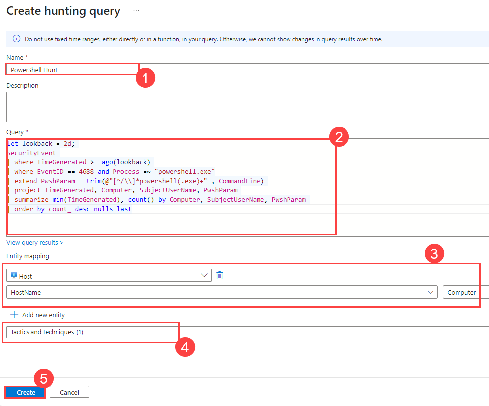

1. In the Microsoft Sentinel - **Hunting (1)** blade, search for the query you just created in the list, **PowerShell Hunt (2)**

1. Select **PowerShell Hunt** from the list.

1. Right-click the **PowerShell Hunt** query and select **Add to livestream (3)**. **Hint:** This also can be done by sliding right and selecting the ellipsis **(...)** at the end of the row to open a context menu.

    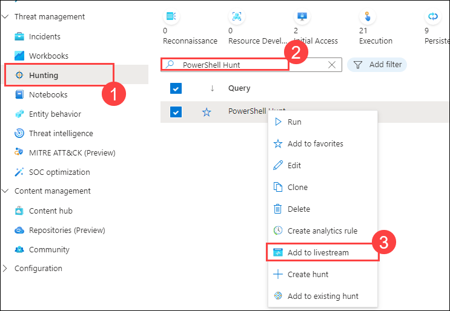

1. Review that the *Status* is now **Running (1)**. This will be running every 30 seconds in the background and you will receive a notification in the Azure Portal (bell icon) when a new result is found. 

1. Select the **Bookmarks (2)** tab in the middle pane.

    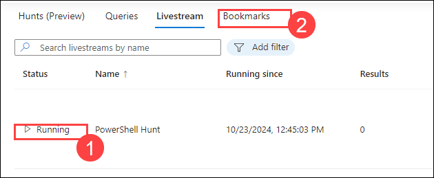

1. Select the bookmark you just created from the results list **(1).**

1. On the right pane, scroll down and select the **Investigate (2)** button. **Hint:** It might take a couple of minutes to show the investigation graph.

    

1. Explore the Investigation graph just like you did a the previous module. Notice the high number of *Related alerts* for *WINServer*.

1. Close the *Investigation* graph window by selecting the **X** in the top-right of the window. 

1. Hide the right blade by selecting the **>>** icon and then scroll right until you see the ellipsis **(...) (1)** icon and then select **Add to existing incident (2)**. All the incidents appear in the right pane.

    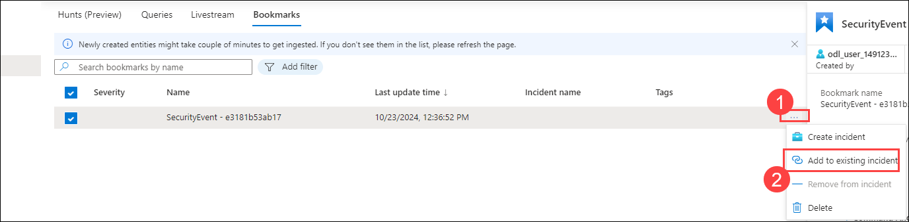

1. Select one of the incidents **(1)** and then select **Add (2)**. 

    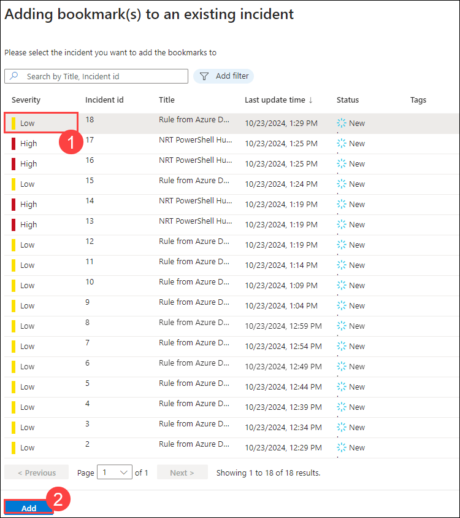

1. Scroll left to notice that the *Severity* column is now populated with the incident's data.

    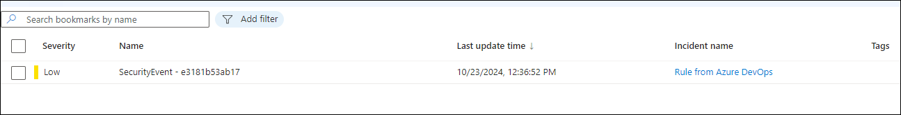

### Task 2: Create a NRT query rule

In this task, instead of using a LiveStream, you will create a NRT analytics query rule. NRT rules run every minute and lookback one minute. The benefit to NRT rules are they can use the alert and incident creation logic.

1. Select the **Analytics (1)** page under *Configuration* in Microsoft Sentinel. 

1. Select the **Create (2)** drop-down, then **NRT query rule (3)**.

    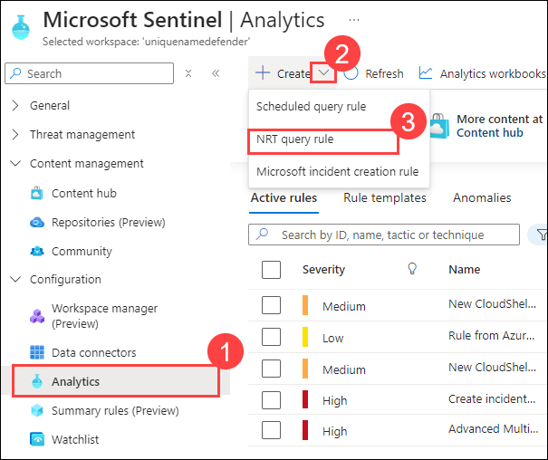

1. This starts the "Analytics rule wizard". For the *General* tab type and the elect **Next: Set rule logic > (5)** button. 

    |Setting|Value|
    |---|---|
    |Name|**NRT PowerShell Hunt (1)**|
    |Description|**NRT PowerShell Hunt (2)**|
    |MITRE ATT&CK|**Command and Control (4)**|
    |Severity|**High (3)**|

    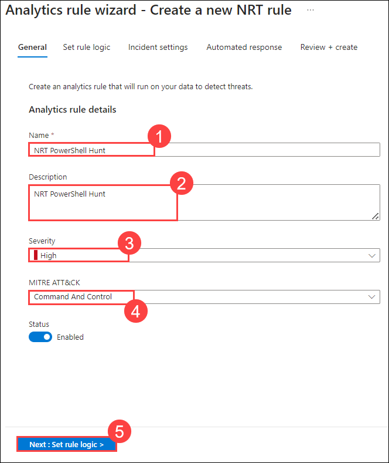

1. For the *Rule query* enter the following KQL statement: **(1)**

    ```KQL
    let lookback = 2d; 
    SecurityEvent 
    | where TimeGenerated >= ago(lookback) 
    | where EventID == 4688 and Process =~ "powershell.exe"
    | extend PwshParam = trim(@"[^/\\]*powershell(.exe)+" , CommandLine) 
    | project TimeGenerated, Computer, SubjectUserName, PwshParam 
    | summarize min(TimeGenerated), count() by Computer, SubjectUserName, PwshParam
    ```

1. Select **View query results >** to make sure your query does not have any errors.

1. Close the *Logs* window by selecting the **X** in the top-right of the window and select **OK** to discard the changes. 

1. Select **Test with current data** under *Results simulation*. Notice the expected number of *Alerts per day*.

    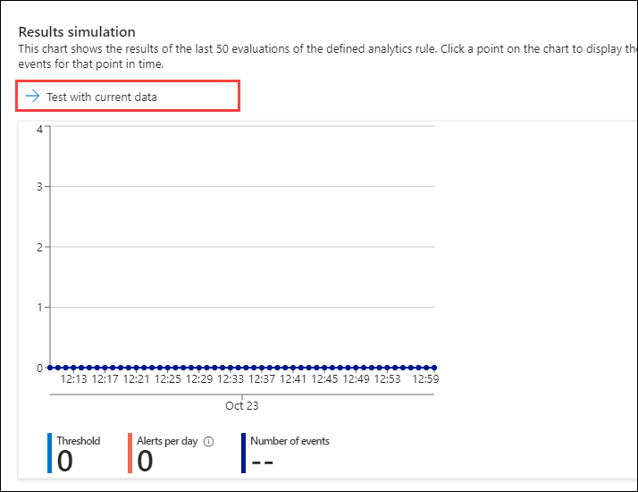
    

1. Under *Entity mapping* select: **+Add new entity** **(2).** 

    - For the *Entity type* drop-down list select **Host**.
    - For the *Identifier* drop-down list select **HostName**.
    - For the *Value* drop-down list select **Computer**.

1. Scroll down and select **Next: Incident settings> (3)** button.

    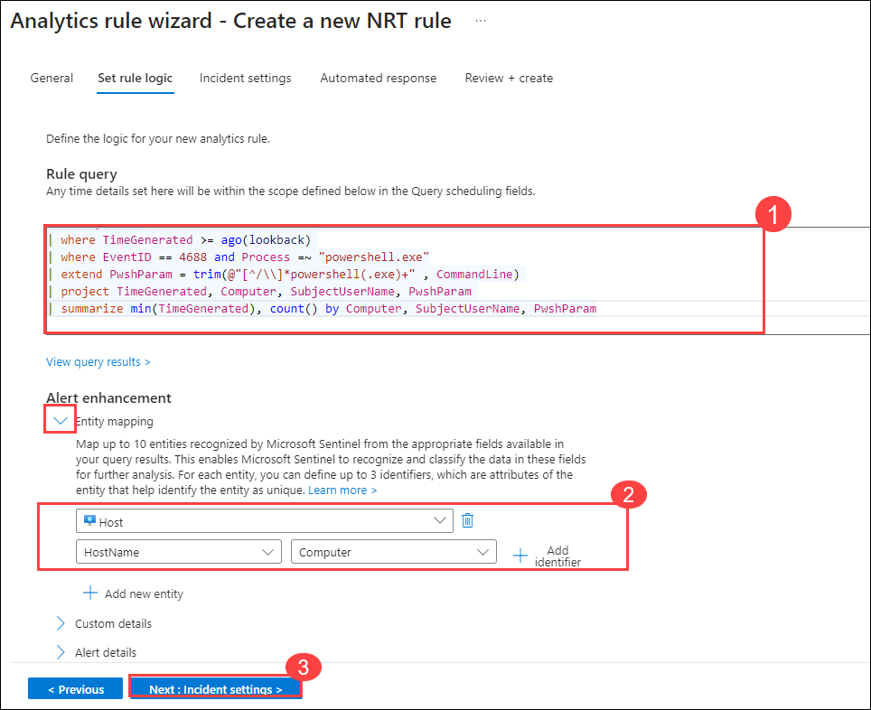

1. For the *Incident settings* tab, leave the default values and select **Next: Review and create >** button.

1. On the *Review and create* tab, select the **Save** button to create and save the new Scheduled Analytics rule.

### Task 3: Create a Search job

In this task, you will use a Search job to look for a C2.

>**Note:** The *Restore* operation incurs costs that can deplete your Azure Pass subscription credits. For that reason, you will not be performing the restore operation in this lab. However, you can follow the steps below to perform the restore operation in your own environment.

1. Select the **Search (1)** page under *General* in Microsoft Sentinel.

1. In the search box, enter **reg.exe (2)** and then select **Start (3)**.

    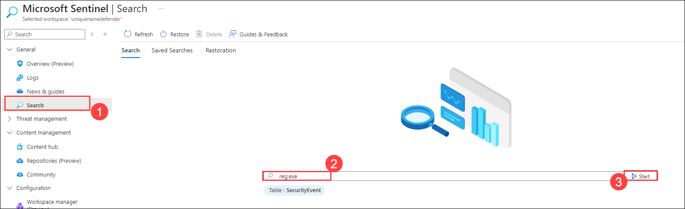

1. A new window running the query opens, make sure mode is set to **KQL**. Select the ellipsis icon **(...) (1)** from the top right and then toggle the **Search job mode (2)** and then select **Search job (3)** button from the command bar.

    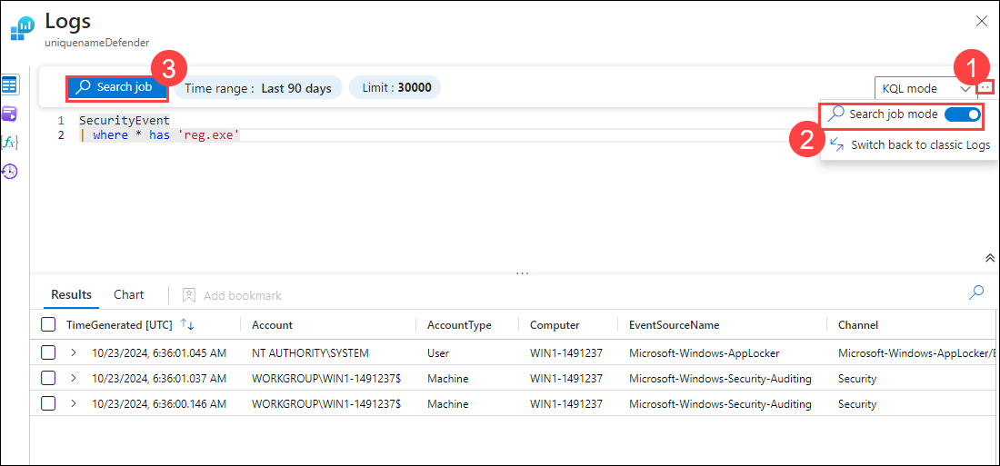

1. The search job creates a new table with your results as soon as they arrive If asked enter one **unique table name (1)**. The results can be consulted from the *Saved Searches* tab and then click on **Run a search job (2).**

    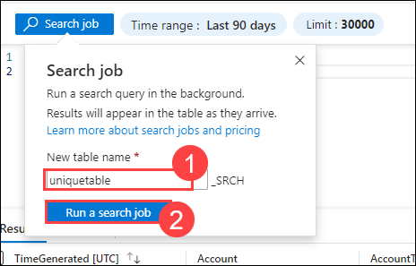

1. Close the *Logs* window by selecting the **X** in the top-right of the window and select **OK** to discard the changes.

1. Select the **Restoration (1)** tab from the command bar and then the **Restore (2)** button.

    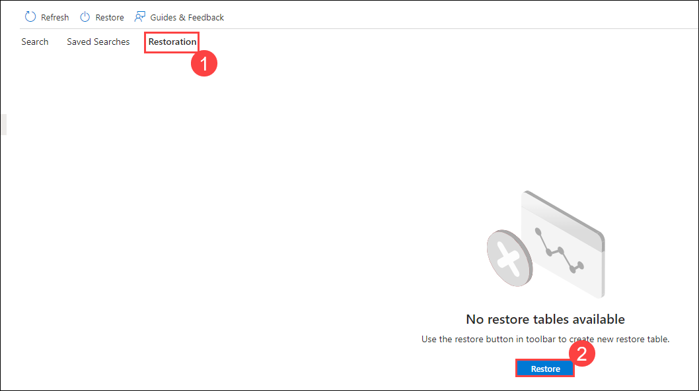

1. Under *Select a table to restore*, search for and select **SecurityEvent (1)** and Review the options available and then select the **Cancel (2)** button.

    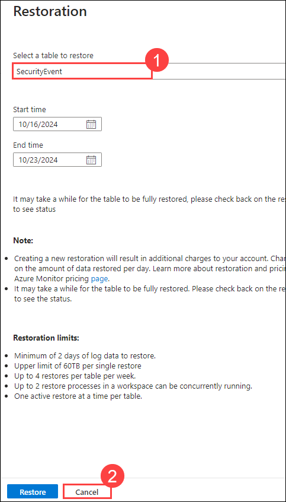

    >**Note:** If you were running the job, the restore would run for a couple of minutes and your data would be available in a new table.

## Review

In this exercise, you created a hunting query and a near real-time (NRT) query rule to actively search for security threats, followed by creating a search job to automate data retrieval and analysis.

## Proceed to Exercise 2
