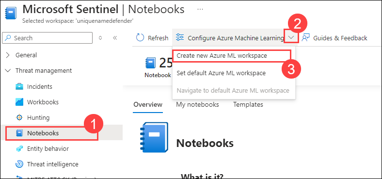
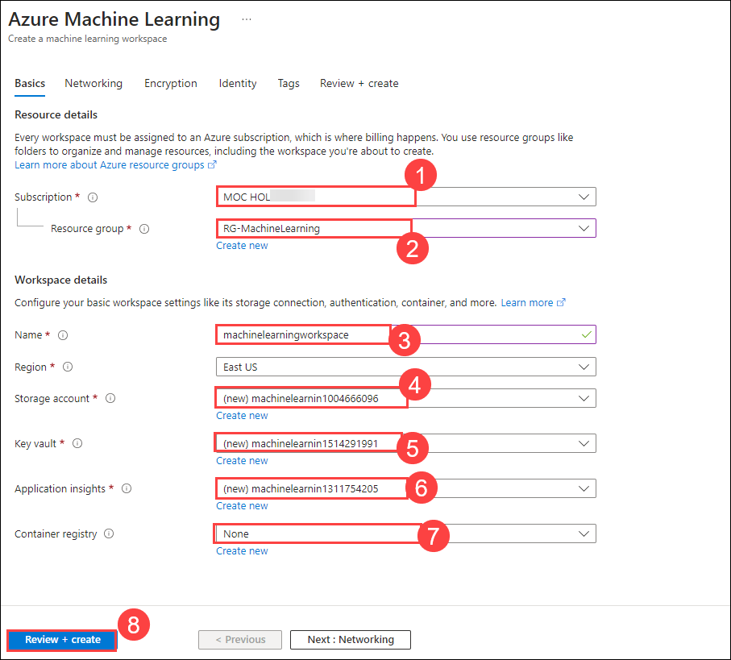
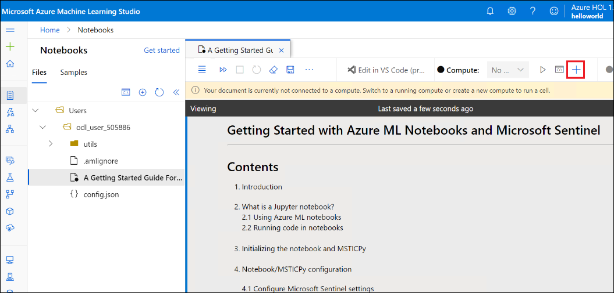
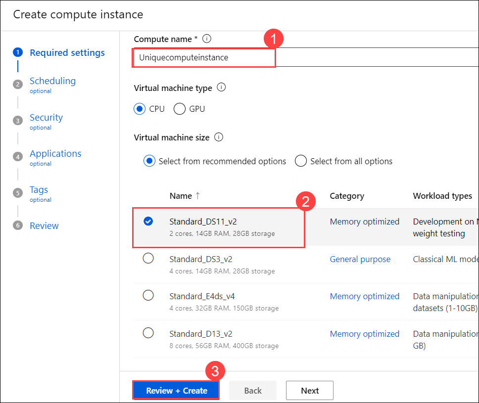
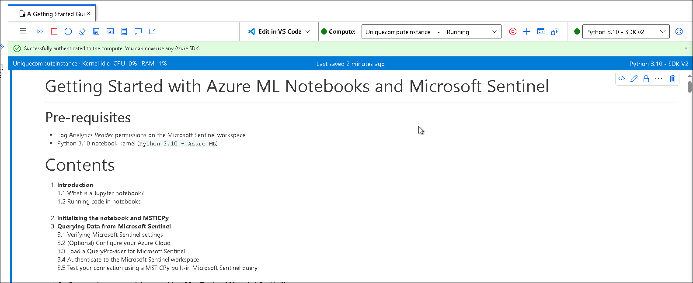

# Module 8 - Lab 1 - Exercise 2 - Threat Hunting using Notebooks with Microsoft Sentinel

## Lab scenario

You are a Security Operations Analyst working at a company that implemented Microsoft Sentinel. You need to explore the benefits of threat hunting with Microsoft Sentinel Notebooks.

## Objectives

After you complete this Exercise, you will be able to:

-   Task 1: Explore Notebooks

### Task 1: Explore Notebooks

In this task, you will explore using notebooks in Microsoft Sentinel.

1. In the Search bar of the Azure portal, type *Sentinel*, then select **Microsoft Sentinel**.

    

1. Select the Microsoft Sentinel Workspace you created in the previous labs.

    

1. In the Microsoft Sentinel Workspace, select **Notebooks (1)**.

1. Next, you need to select an AzureML Workspace. click on **Configure Azure Machine Learning (2)** drop down and then select  **Create new Azure ML workspace (3)** button in the command bar.

    

1. On the **Azure Machine Learning** page provide the following details.

    - In the Subscription box, leave the default subscription ***(1).**

    - Select **Create new** for the Resource group and enter *RG-MachineLearning* for the Name and select **OK**. **(2)**
    - Give your workspace a unique name **(3).**
    - Choose your Region (it should default with a reasonable option).
    - Keep the default Storage account **(4)**, Key vault **(5)**, and Application insights **(6)** information.
    - The Container registry option can remain as **None (7)** and at the bottom of the page, select **Review + create (8)**. 

      

        >**Note:** It may take a few moments to deploy the Machine Learning workspace. 

1. Then on the next page, select **Create**. 

1.	After the deployment is finished, return to the Microsoft Sentinel portal.

1. Select **Notebooks** and then select the **Templates** tab. 

1. Select **A Getting Started Guide for Microsoft Sentinel ML Notebooks (1)**. 

1. On the right pane, click on the **>> (2)** to expand and thenscroll down and select **Create from template (3)** button. Review the default option and select **Save**.

    

1. Select the **Launch notebook** button. Close any window that may appear in the Microsoft Azure Machine Learning Studio.

1. Next to the **Compute:** instance selector at the top of the screen, select the **+** symbol for **New Compute**.

    

1. Type a unique name for the **Compute name** (like **Uniquecomputeinstance (1)**) and select the first compute available since this is a lab environment **(2)** and then click **Review and Create (3)**

    

1. Select the **Create** button at the bottom of the screen. Close any feedback window that may appear. This will take a few minutes.

1. Once the Compute has been created and running, in the top right of the notebook, verify that the kernel to use is *Python 3.10 - AzureML*.

1. Clear all the results from the notebook by selecting the **Clear all outputs** from the command bar and follow the *Getting Started* tutorial. **Hint:** This can be found by selecting the ellipsis (...) from the command bar.

    

    

    **Note** If you cannot complete the steps above to access the notebook, you can view it on its GitHub page instead.  See the notebook file here: [Azure Sentinal Notebooks on GitHub](https://github.com/Azure/Azure-Sentinel-Notebooks/blob/8122bca32387d60a8ee9c058ead9d3ab8f4d61e6/A%20Getting%20Started%20Guide%20For%20Azure%20Sentinel%20ML%20Notebooks.ipynb) 

## Review

In this exercise, you explored notebooks to analyze and visualize security data using interactive code and queries.

## You have completed the lab.
