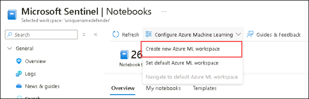
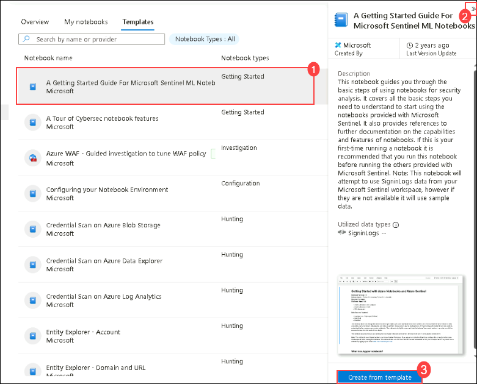
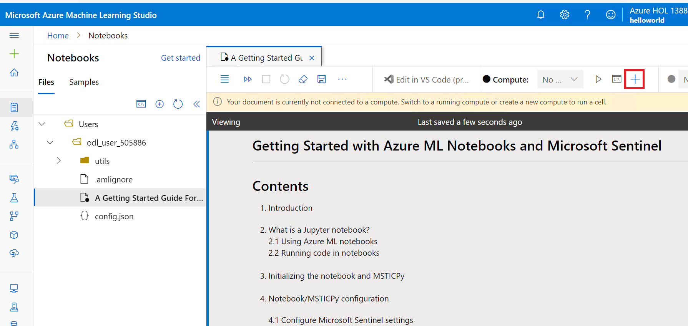
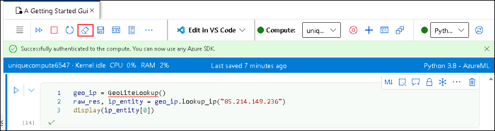
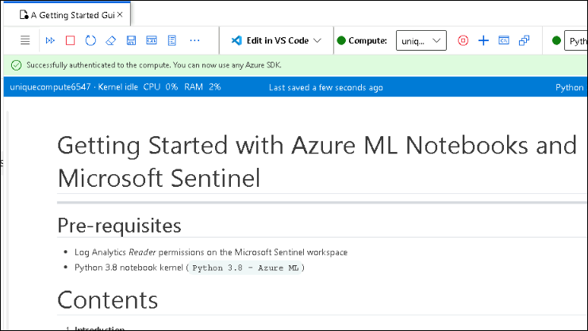

# Module 8 - Lab 1 - Exercise 2 - Threat Hunting using Notebooks with Microsoft Sentinel

## Lab scenario

You are a Security Operations Analyst working at a company that implemented Microsoft Sentinel. You need to explore the benefits of threat hunting with Microsoft Sentinel Notebooks.

### Task 1: Explore Notebooks

In this task, you will explore using notebooks in Microsoft Sentinel.

1. In the Search bar of the Azure portal, type *Sentinel*, then select **Microsoft Sentinel**.

1. Select your Microsoft Sentinel Workspace.

7. In the Microsoft Sentinel Workspace, select **Notebooks**.

8. Next, you need to select an AzureML Workspace. Select **Configure Azure Machine Learning** and then select  **Create new Azure ML workspace** button in the command bar.

    

9. In the Subscription box, select your subscription.

10. Select **Create new** for the Resource group and enter *RG-MachineLearning* for the Name and select **OK**. 

11.	In the Workspace details section do the following:

   - Give your workspace a unique name.
   - Choose your Region (it should default with a reasonable option)
   - Keep the default Storage account, Key vault, and Application insights information.
   - The Container registry option can remain as **None**.

12.	At the bottom of the page, select **Review + create**. Then on the next page, select **Create**. 

    >**Note:** It may take a few moments to deploy the Machine Learning workspace. 

13.	After the deployment is finished, return to the Microsoft Sentinel portal.

14. Select **Notebooks** and then select the **Templates** tab. 

15. Select **A Getting Started Guide for Microsoft Sentinel ML Notebooks**. 

16. On the right pane, scroll down and select **Create from template** button. Review the default option and select **Save**.

    

18. Select the **Launch notebook** button. Close any window that may appear in the Microsoft Azure Machine Learning Studio.

19. Next to the **Compute:** instance selector at the top of the screen, select the **+** symbol for **New Compute**.

      

20. Type a unique name for the *Compute name* and select the first compute available since this is a lab environment. 

21. Select the **Create** button at the bottom of the screen. Close any feedback window that may appear. This will take a few minutes.

22. Once the Compute has been created and running, in the top right of the notebook, verify that the kernel to use is *Python 3.8 - AzureML*.

23. Select the **Authenticate** button and wait for the authentication to complete.

24. Clear all the results from the notebook by selecting the **Clear all outputs** from the command bar and follow the *Getting Started* tutorial. **Hint:** This can be found by selecting the ellipsis (...) from the command bar.

    

    

    **Note** If you cannot complete the steps above to access the notebook, you can view it on its GitHub page instead.  See the notebook file here: [Azure Sentinal Notebooks on GitHub](https://github.com/Azure/Azure-Sentinel-Notebooks/blob/8122bca32387d60a8ee9c058ead9d3ab8f4d61e6/A%20Getting%20Started%20Guide%20For%20Azure%20Sentinel%20ML%20Notebooks.ipynb) 

## You have completed the lab.
