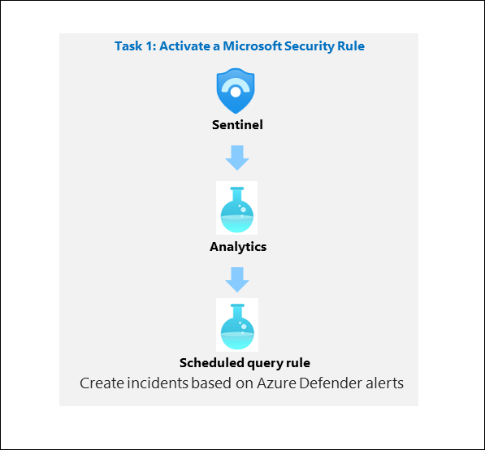

# Module 9 - Lab 1 - Exercise 1 - Modify a Microsoft Security rule

## Lab scenario

You are a Security Operations Analyst working at a company that implemented Microsoft Sentinel. You must learn how to detect and mitigate threats using Microsoft Sentinel. First, you need to filter the alerts coming from Defender for Cloud into Microsoft Sentinel, by Severity. 

>**Note:** An **[interactive lab simulation](https://mslabs.cloudguides.com/guides/SC-200%20Lab%20Simulation%20-%20Modify%20a%20Microsoft%20Security%20rule)** is available that allows you to click through this lab at your own pace. You may find slight differences between the interactive simulation and the hosted lab, but the core concepts and ideas being demonstrated are the same.

## Lab objectives

 In this lab, you will perform the following:
 - Task 1: Activate a Microsoft Security Rule

## Estimated timing: 20 minutes

## Architecture Diagram

  

### Task 1: Activate a Microsoft Security Rule

In this task, you will activate a Microsoft Security rule.

1. In the Search bar of the Azure portal, type **Log Analytics**, then select **Log Analytics workspaces**.

   

1. Select **+Create** from the command bar.

   

1. Select Resource Group **RG-Defender**  from the drop down.

1. For the Name, enter **uniquenameDefender**.

1. Select **Review + Create**.

   

1. Once the workspace validation has passed, select **Create**. Wait for the new workspace to be provisioned, this may take a few minutes.

    
 
1. In the Search bar of the Azure portal, type **microsoft sentinel**, then select **Microsoft Sentinel**.

   

1. Select **+Create** from the command bar.

 1. Select the newly created workspace and click on **Add**.
  
    

1. Select your Microsoft Sentinel Workspace that you created in the previous lab.
        
1. Select **Analytics** from the Configuration area. By default, you will see the *Active rules*.

1. Select the **+ Create** button from the command bar and select the **Microsoft incident creation rule**.

1. Under Name, enter **Create incidents based on Defender for Endpoint**.

1. Scroll down and under Microsoft security service select **Microsoft Defender for Endpoint**. 

1. Under Filter by Severity, select the **Custom** option select Low, Medium, and High for the severity level.

1. Select the **Next: Automated response** button and then select **Next: Review + create** button.

1. Click on **save**.

### Review
In this lab, you have successfully activated a Microsoft Security Rule.

## Select **Next** to continue to Lab 2.
