# Module 9 - Lab 1 - Exercise 3 - Create a Scheduled Query from a template

## Lab scenario

You're a Security Operations Analyst working at a company that implemented Microsoft Sentinel. You must learn how to detect and mitigate threats using Microsoft Sentinel. After connecting your data sources to Microsoft Sentinel, you create custom analytics rules to help discover threats and anomalous behaviors in your environment.

Analytics rules search for specific events or sets of events across your environment, alert you when certain event thresholds or conditions are reached, generate incidents for your SOC to triage and investigate, and respond to threats with automated tracking and reMediation processes.

>**Important:** The lab exercises for Learning Path #9 are in a *standalone* environment. If you exit the lab before completing it, you will be required to re-run the configurations again.

## Lab objectives
 In this lab, you will perform the following:
- Task 1: Create a Scheduled Query
- Task 2: Edit your new rule
- Task 3: Test your new rule

## Estimated timing: 40 minutes

## Architecture Diagram

  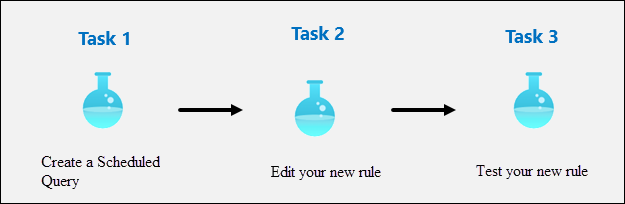

### Task 1: Create a Scheduled Query.

In this task, you will create a scheduled query and connect it to the Teams channel you created in the previous exercise.

1. In the Search bar of the Azure portal, type *Sentinel*, then select **Microsoft Sentinel**.

1. Select your Microsoft Sentinel Workspace.

1. In the Microsoft Sentinel left menus, scroll down to the *Content management* section and select **Content Hub**.

1. In the *Content hub*, search for the **Azure Activity** solution and select it from the list.
    
1. On the Azure Activity solution page select **Install**.

1. When the installation completes, go to Data connectors page in Microsoft Sentinel. The *Azure Activity* solution installs the *Azure Activity* Data connector, 12 Analytic rules, 14 Hunting queries and 1 Workbook.

1. Select the *Azure Activity* Data connector and select **Open connector page**.

1. In the *Configuration* area under the *Instructions* tab, scroll down to "2. Connect your subscriptions...", and select **Launch Azure Policy Assignment Wizard>**.

1. In the **Basics** tab, select the ellipsis button (...) under **Scope** and select your subscription from the drop-down list and click **Select**.

1. Select the **Parameters** tab, choose your *uniquenameDefender* workspace from the **Primary Log Analytics workspace** drop-down list. This action will apply the subscription configuration to send the information to the Log Analytics workspace.
    
1. Select the **Remediation** tab and select the **Create a remediation task** checkbox. This action will apply the policy to existing Azure resources.

1. Select the **Review + Create** button to review the configuration.

1. Select **Create** to finish.

1. It might take few minutes for the **Connected** status to appear.

1. Select **Analytics** from the Configuration area.

1. Make sure that you are in the *Rule templates* tab in the command bar and search for the **New CloudShell User** rule.

1. From the rule summary blade, make sure you're receiving data by reviewing the green icon under *Data sources: Azure Activity*.

    >**Note:** If you do not see it in a connected state, follow the below Task to **connect to Azure Activity data connector**:
    
1. Select **Create rule** to continue under Rule templates in the Analytics tab.

   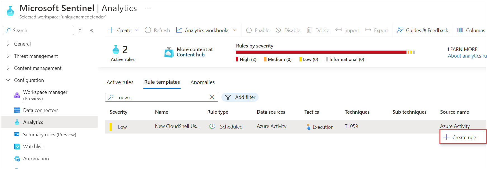

1. In the Analytics rule wizard, on the *General* tab, change the *Severity* to **Medium (1)**.

1. Select **Next: Set rule logic > (2)** button:

   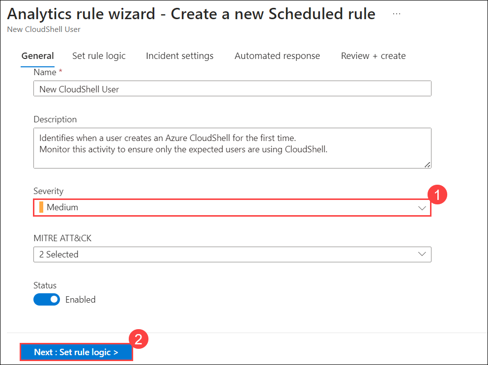

1. For the rule query, select **View query results**. You shouldn't receive any results nor any errors.

   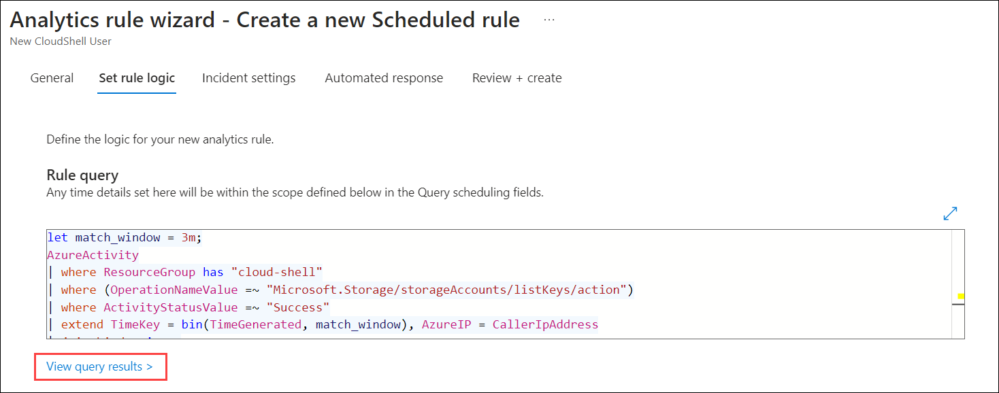

1. Close the *Logs* window by selecting the upper right **X** and select **OK** to discard to save changes to go back to the wizard.

1. Scroll down and under *Query scheduling* set the following:

    |Setting|Value|
    |---|---|
    |Run Query every|5 minutes **(1)**|
    |Lookup data from the last|1 Days **(2)**|

    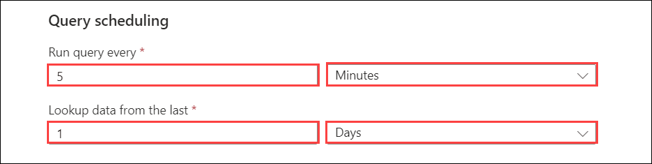

    >**Note:** We are purposely generating many incidents for the same data. This enables the Lab to use these alerts.

1. Under the *Alert threshold* area, leave the value unchanged since we want the alert to register every event.

1. Under the *Event grouping* area, leave the **Group all events into a single alert** as the selected option since we want to generate a single alert every time it runs, as long as the query returns more results than the specified alert threshold above.

1. Select the **Next: Incident settings >** button.

1. On the *Incident settings* tab, review the default options.

1. Select the **Next: Automated response >** button.

1. Select the **Next: Review and create >** button.
  
1. Select **Save**.

### Task 2: Edit your new rule

In this task, you will modify the New CloudShell User rule in Microsoft Sentinel by configuring automated responses.

1. In the Search bar of the Azure portal, type *Sentinel*, then select **Microsoft Sentinel**.

1. Select your Microsoft Sentinel Workspace.

1. Select **Analytics** from the Configuration area.

1. Make sure that you are in the *Active rules* tab in the command bar and select the **New CloudShell User** rule.

1. Right click the rule and select **Edit** from the *pop-up* menu.

   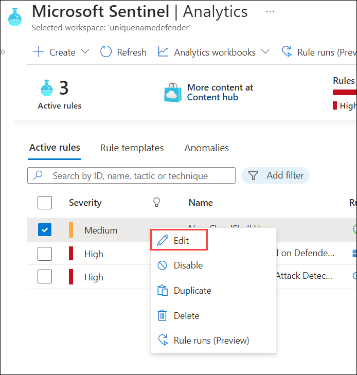

1. Select the **Next: Set rule logic >** button.

1. Select the **Next: Incident settings >** button.

1. Select the **Next: Automated response >** button.

1. On the *Automated response* tab under *Automation rules*, select **+ Add new**.

   >**Note:** If you are unable to add a new Automation Rule, follow these steps:  
   > 1. Open a new tab and navigate to your **Sentinel workspace**.  
   > 2. Go to the **Automation** section and click on **+ Create**, then select **Automation Rule**.  
   > 3. Enter the required details as specified from step 10 to step 13.  
   > 4. Once completed, return to the previously open page and click **Refresh**.  
   > 5. You should now see the newly created Automation Rule under **Automated Response**.

1. For the *Automation rule name*, enter **Tier 2**.

1. For the *Actions*, select **Assign owner**.

1. Then select **<inject key="AzureAdUserEmail"></inject>**.

   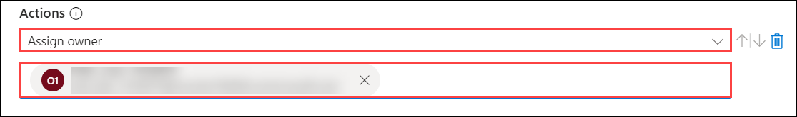

1. Select **Apply**.

1. Select the **Next: Review and create >** button.

   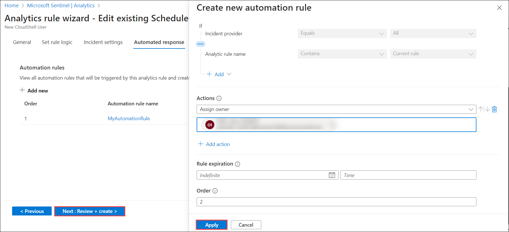
  
1. Select **Save**.

### Task 3: Test your new rule

In this task, you test your new scheduled query rule.

1. In the top bar of the Azure portal, Select the icon **>_** that corresponds to the Cloud Shell. You might need to select the ellipsis icon first **(...)** if your display resolution is too low.

   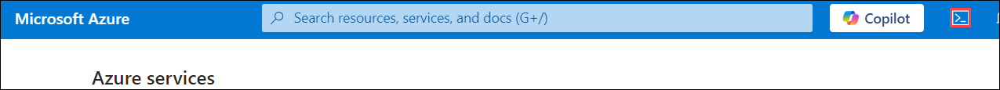

1. In the *Welcome to Azure Cloud Shell* window, select **Powershell**.

   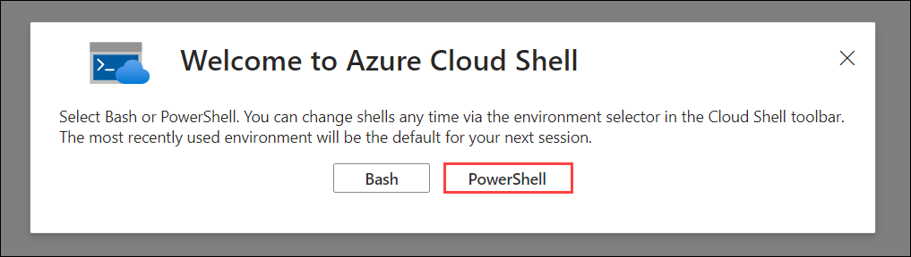

1. On the *Getting started* page, select **Mount storage account**, and then select your **Subscription** from the *storage account subscription* drop-down menu item and select the **Apply** button.

    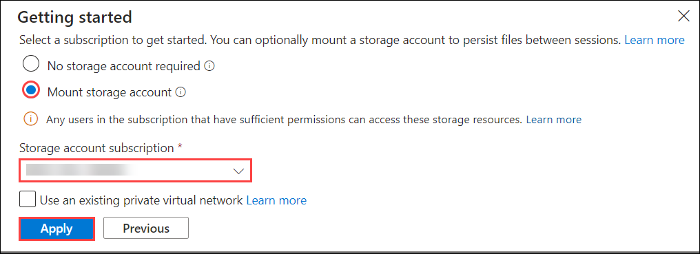

    >**Important:** Do not select the *No storage account required* radio button option. This wil cause the incident creation to fail.

1. On the *Mount storage account* page, select **We will create a storage account for you**, and then select **Next**.

   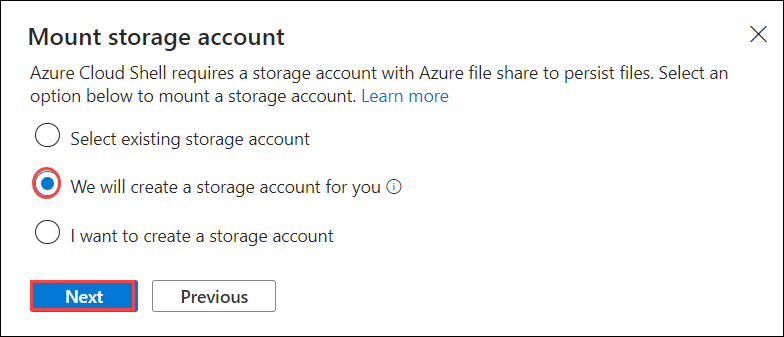

1. Wait until the Cloud Shell is provisioned, then close the Azure Cloud Shell window.

1. In the Search bar of the Azure portal, type *Activity* and then select **Activity Log**.

1. Make sure the following *Operation name* items appear: **List Storage Account Keys** and **Update Storage Account Create**. These are the operations that the KQL query you reviewed earlier will match to generate the alert. **Hint:** You might need to select **Refresh** to update the list.

    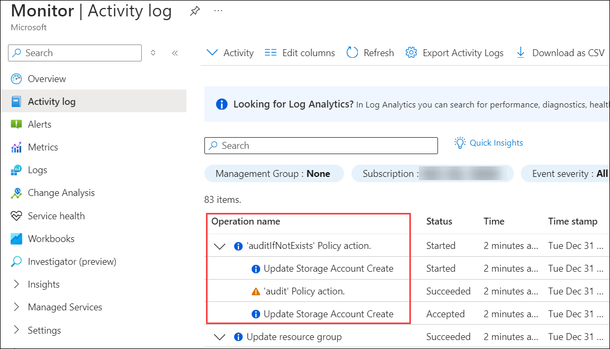

1. In the Search bar of the Azure portal, type *Sentinel*, then select **Microsoft Sentinel**.

1. Select your Microsoft Sentinel Workspace.

1. Select the **Incidents** menu option under *Threat management*.

1. Select the **Auto-refresh incidents** toggle.

    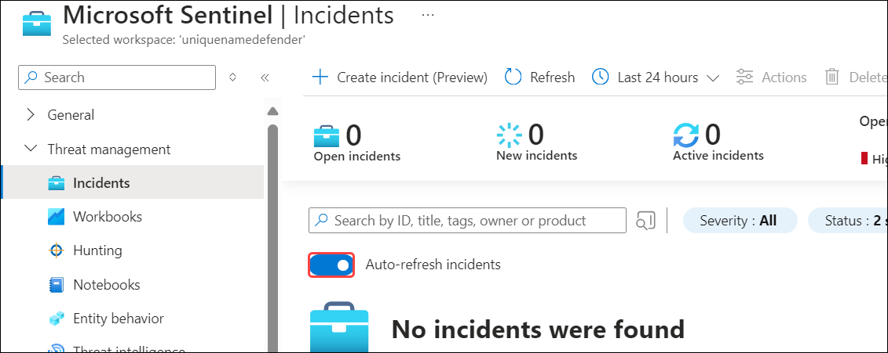

1. You should see the newly created Incident.

    >**Note:** The event that triggers the incident may take 5+ minutes to process. Continue with the next exercise, you will come back to this view later.

1. Select the Incident and review the information in the right blade.

   > **Congratulations** on completing the task! Now, it's time to validate it. Here are the steps:
   > - Hit the Validate button for the corresponding task. You can proceed to the next task if you receive a success message.
   > - If not, carefully read the error message and retry the step, following the instructions in the lab guide.
   > - If you need any assistance, please contact us at labs-support@spektrasystems.com. We are available 24/7 to help you out.

   <validation step="3e75085e-0e87-4db0-a6ad-9facbd092df7" />

### Review
In this lab, you have completed the following:
- You have created a Scheduled Query.
- You have edited the Scheduled Query
- You have tested the new rule. 

## Select **Next** to continue to Lab 4.
