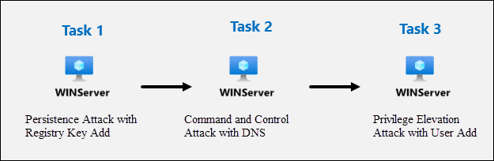

# Module 9 - Lab 1 - Exercise 6 - Conduct attacks

## Lab scenario

You are going to simulate the attacks that you will later use to detect and investigate in Microsoft Sentinel.

>**Important:** The lab exercises for Learning Path #9 are in a *standalone* environment. If you exit the lab before completing it, you will be required to re-run the configurations again.

## Lab objectives
 In this lab, you will perform the following:
- Task 1: Persistence Attack with Registry Key Add 
- Task 2: Command and Control Attack with DNS
- Task 3: Privilege Elevation Attack with User Add

## Estimated timing: 30 minutes

## Architecture Diagram

  

### Task 1: Persistence Attack with Registry Key Add 

In this task, you will simulate a persistence attack by adding a registry key that ensures a program runs each time the system starts.

1. Select **Start** in Windows. Then **Power**, next **Restart**.

1. Follow the instructions to log into WINServer again.

1. In the search of the task bar, enter *Command*. Command Prompt will be displayed in the search results. Right-click on the Command Prompt and select **Run as Administrator**. Select **Yes** in the User Account Control window that appears to allow the app to run.

1. In the Command Prompt, create a Temp folder in the root directory. Remember to press Enter after the last row:

    ```CommandPrompt
    cd \
    mkdir temp
    cd temp
    ```

1. Copy and run this command to simulate program persistence:

    ```CommandPrompt
    REG ADD "HKCU\SOFTWARE\Microsoft\Windows\CurrentVersion\Run" /V "SOC Test" /t REG_SZ /F /D "C:\temp\startup.bat"
    ```

### Task 2: Privilege Elevation Attack with User Add

In this task, you will simulate a privilege elevation attack by creating a new admin user on the system. This exercise demonstrates how an attacker could escalate their privileges on a machine by adding a new user to the Administrators group.

1. Copy and run this command to simulate the creation of an Admin account. Remember to press Enter after the last row:

    ```CommandPrompt
    net user theusernametoadd /add
    net user theusernametoadd ThePassword1!
    net localgroup administrators theusernametoadd /add
    ```
    >**Note:** If you face any issues during copy-paste, copy the prompt to a notepad and try pasting it to the cmd.

### Task 3: Command and Control Attack with DNS

In this task, you will simulate a DNS-based Command and Control (C2) attack by creating a PowerShell script. This simulated attack will continuously generate DNS queries to a C2 server.

1. Copy and run this command to create a script that will simulate a DNS query to a C2 server:

    ```CommandPrompt
    notepad c2.ps1
    ```

1. Select **Yes** to create a new file and copy the following PowerShell script into *c2.ps1*.

    >**Note:** Pasting into the virtual machine file might not show the full script length. Make sure the script matches  the instructions within the *c2.ps1* file.

    ```PowerShell
    param(
        [string]$Domain = "microsoft.com",
        [string]$Subdomain = "subdomain",
        [string]$Sub2domain = "sub2domain",
        [string]$Sub3domain = "sub3domain",
        [string]$QueryType = "TXT",
        [int]$C2Interval = 8,
        [int]$C2Jitter = 20,
        [int]$RunTime = 240
    )
    $RunStart = Get-Date
    $RunEnd = $RunStart.addminutes($RunTime)
    $x2 = 1
    $x3 = 1 
    Do {
        $TimeNow = Get-Date
        Resolve-DnsName -type $QueryType $Subdomain".$(Get-Random -Minimum 1 -Maximum 999999)."$Domain -QuickTimeout
        if ($x2 -eq 3 )
        {
            Resolve-DnsName -type $QueryType $Sub2domain".$(Get-Random -Minimum 1 -Maximum 999999)."$Domain -QuickTimeout
            $x2 = 1
        }
        else
        {
            $x2 = $x2 + 1
        }    
        if ($x3 -eq 7 )
        {
            Resolve-DnsName -type $QueryType $Sub3domain".$(Get-Random -Minimum 1 -Maximum 999999)."$Domain -QuickTimeout
            $x3 = 1
        }
        else
        {
            $x3 = $x3 + 1
        }
        $Jitter = ((Get-Random -Minimum -$C2Jitter -Maximum $C2Jitter) / 100 + 1) +$C2Interval
        Start-Sleep -Seconds $Jitter
    }
    Until ($TimeNow -ge $RunEnd)
    ```

1. In the Notepad menu, select **File** and then **Save**. 

1. Go back to the Command Prompt window, enter the following command and press Enter. 

    >**Note:** You will see DNS resolve errors. This is expected.

    ```CommandPrompt
    Start PowerShell.exe -file c2.ps1
    ```

    >**Important:** Do not close these windows. Let this PowerShell script run in the background. The command needs to generate log entries for some hours. You can proceed to the next task and next exercises while this script runs. The data created by this task will be used in the Threat Hunting lab later. This process will not create substantial amounts of data or processing.

## Review
In this lab, you have completed the following:
- Persistence Attack with Registry Key Add 
- Command and Control Attack with DNS
- Privilege Elevation Attack with User Add

## Select **Next** to continue to Lab 7.
