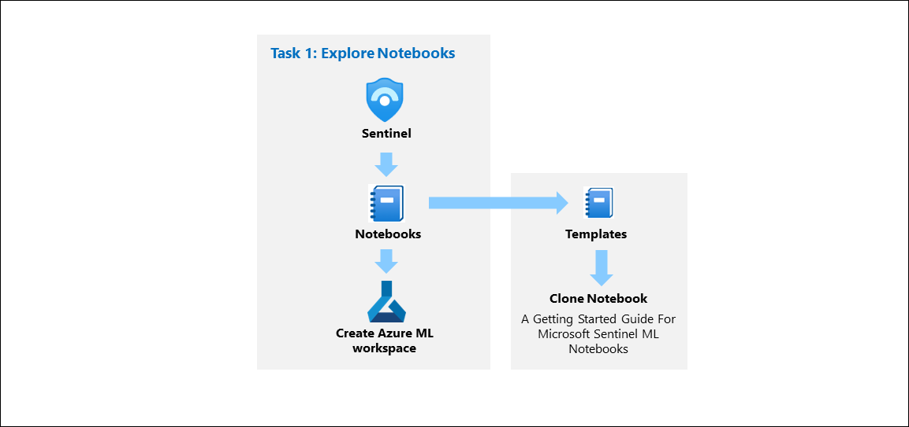
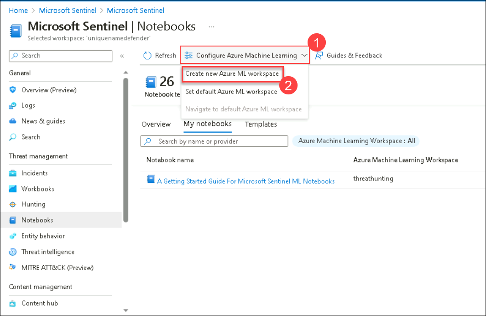
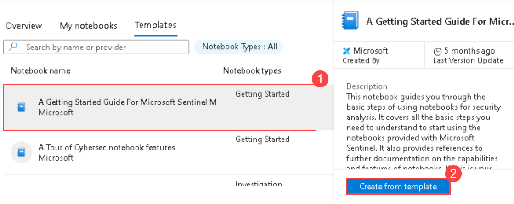
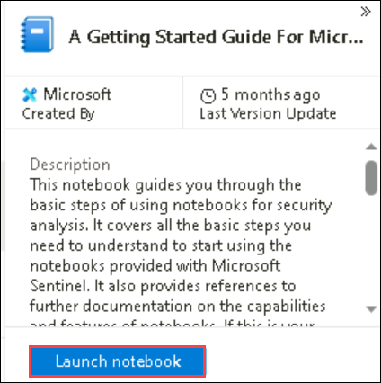
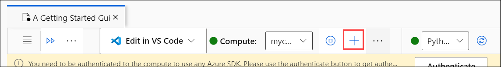
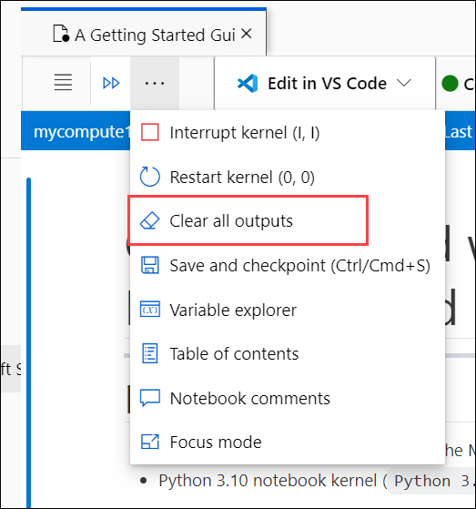
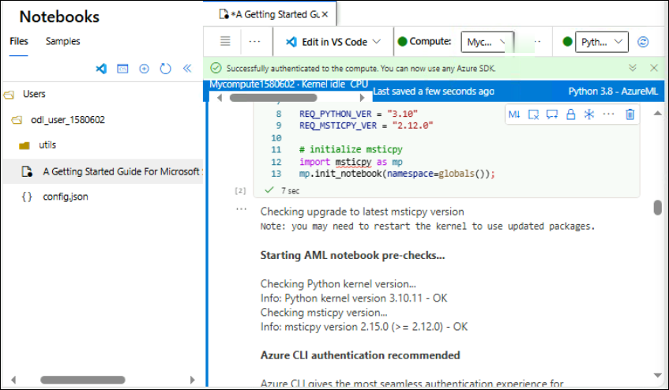

# Module 10 - Lab 1 - Exercise 2 - Threat Hunting using Notebooks with Microsoft Sentinel

## Lab scenario
You are a Security Operations Analyst working at a company that implemented Sentinel. You need to explore the benefits of threat hunting with Microsoft Sentinel Notebooks.

>**Important:** The lab exercises for Learning Path #10 are in a *standalone* environment. If you exit the lab before completing it, you will be required to re-run the configurations again.

## Lab objectives
 In this lab, you will Understand the following:
  -  Task 1: Explore Notebooks

## Estimated time: 30 minutes

## Architecture Diagram

 

### Task 1: Explore Notebooks

In this task, you will explore using notebooks in Microsoft Sentinel.

1. In the Microsoft Sentinel Workspace, select **Notebooks** under the *Threat management* area.

1. Next, you need to create an AzureML Workspace. Select **Configure Azure Machine Learning (1)** and then select the **Create new Azure ML workspace (2)** button in the command bar.

     

1. In the Subscription box, select your subscription.

1. Select **Create new** for the Resource group and enter *RG-MachineLearning* for the Name and select **OK**. 

1. In the Workspace details section do the following:

     - Give your workspace a unique name.
     - Leave **East US** as the default value for *Region*.
     - Keep the default Storage account, Key vault, and Application insights information.
     - The Container registry option can remain as **None**.

1. At the bottom of the page, select **Review + Create**. When you see the *"Validation passed"* message, select **Create**. 

     >**Note:** It may take a few minutes to deploy the Machine Learning workspace.

1. After *Your deployment is complete* message appears, return to the Microsoft Sentinel portal.

1. Select **Notebooks** again and then select the **Templates** tab from the middle command bar. 

1. Select **A Getting Started Guide for Microsoft Sentinel (1)** ML Notebooks. 

1. On the right pane, scroll down and select **Create from template (2)** button. Review the default options and then select **Save**.

   

1. Once the saving is done, select the **Launch notebook** button. This will take you to the Microsoft Azure Machine Learning Studio.

    

1. Select **Close** if an informational window appears in the Microsoft Azure Machine Learning Studio.

1. In the command bar, to the right of the **Compute instance:**  selector, select the **+**. **Hint:** It might be hidden inside the ellipsis icon **(...)**.

     

     >**Note:** You can have more screen space by hiding the Azure ML Studio left blade by selecting the 3 lines on the top left, as well as the Notebooks Files by selecting the **<<** icon.

1. Enter **Mycompute<inject key="DeploymentID" enableCopy="false"/>** in the **Compute name** field. This will identify your compute instance.

1. Scroll down and select **Standard_DS11_v2**. 
**Hint:** Workload type: Development on Notebooks and lightweight testing.

1. Select the **Review + Create** button at the bottom of the screen, then scroll down and select **Create**. Close any feedback window that may appear. This takes a few minutes, you'll see a notification (bell icon) when it's done and the *Compute instance* left icon turns from blue to green.

1. Once the Compute has been created and running, verify that the kernel to use is *Python 3.8 - AzureML*. **Hint:** This is shown in the right of the command bar.

1. Select the **Authenticate** button and wait for the authentication to complete.

1. Clear all the results from the notebook by selecting the **Clear all outputs** from the command bar and following the *Getting Started* tutorial. **Hint:** This can be found by selecting the ellipsis (...) from the command bar.

   

1. Review section *1 Introdution* in the notebook and proceed to section *2 Initializing the notebook and MSTICPy*.

1. In section *2 Initializing the notebook and MSTICPy*, review the content on initalizing the notebook and installing the MSTICPy package.

1. Run the *Python code* to initialize the cell by selecting the **Run cell** button (Play icon) to the left of the code.

1. It should take approximately 15 seconds to run. Once it's done, review the output messages and disregard any warnings about the Python kernel version. The code ran successfully if *msticpyconfig.yaml* was created in the *utils* folder in the *file explorer* pane on the left. It may take another 30 seconds for the file to appear.

   

    >**Hint:** You can clear the output messages by selecting the ellipsis (...) on the left of the code window for the *Output menu* and selecting the *Clear output* (square with an x*) icon.

1. Select the **msticpyconfig.yaml** file in the *file explorer* pane on the left to review the contents of the file and then close it.

1. Proceed to section *3 Querying data with MSTICPy* and review the contents. Don't run the *Multiple Microsoft Sentinel workspaces* code cell as it fails, but the other code cells can be run successfully.

>**Note:** If you cannot complete the steps above to access the Notebook, you can follow it on its GitHub viewer page instead. [Getting Started with Azure ML Notebooks and Microsoft Sentinel](https://nbviewer.org/github/Azure/Azure-Sentinel-Notebooks/blob/master/A%20Getting%20Started%20Guide%20For%20Azure%20Sentinel%20ML%20Notebooks.ipynb) 

>**Note:** If you cannot complete the steps above to access the Notebook, you can follow it on its GitHub viewer page instead. [Getting Started with Azure ML Notebooks and Microsoft Sentinel](https://nbviewer.org/github/Azure/Azure-Sentinel-Notebooks/blob/master/A%20Getting%20Started%20Guide%20For%20Azure%20Sentinel%20ML%20Notebooks.ipynb) 

## Review
In this lab, you have completed the following:
-  In this Lab, we successfully explored AZURE ML Notebooks.

## You have completed the lab.
