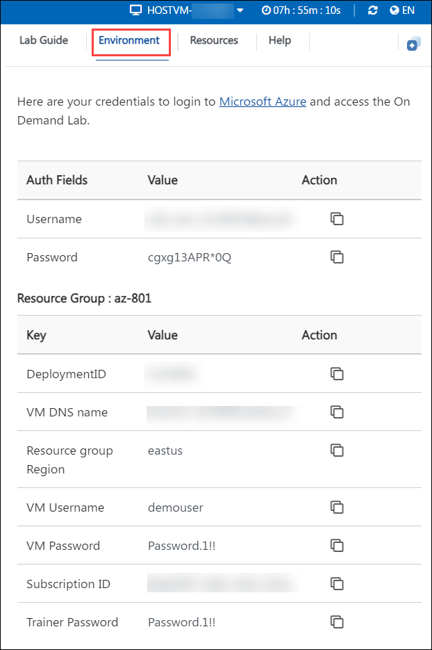
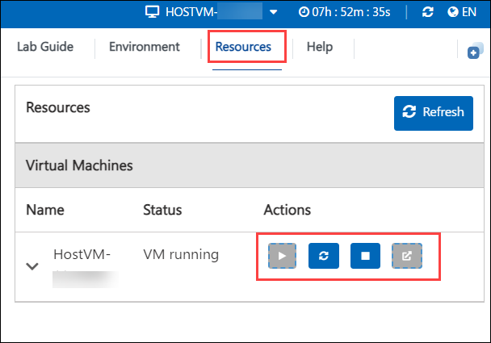
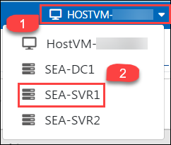

# Getting Started

1. Once the environment is provisioned, a virtual machine (JumpVM) on the left and lab guide on the right will get loaded in your browser. Use this virtual machine throughout the workshop to perform the lab.

    

1. To get the lab environment details, you can select the **Environment Details** tab.

    

1. You can also open the Lab Guide on a separate full window by selecting the **Split Window** button from the bottom right corner.

    

1. To hide the lab guide, click on **>** symbol and to expose the lab guide, click on **<** symbol.   

1. Also, you can **start, stop and restart** the virtual machines from the **Resources** tab.

    

1. To Switch between the Virtual Machines, select the required VM from the dropdown.

    

1. Click on **Next** from the bottom right and follow the instructions to perform the lab.

    
